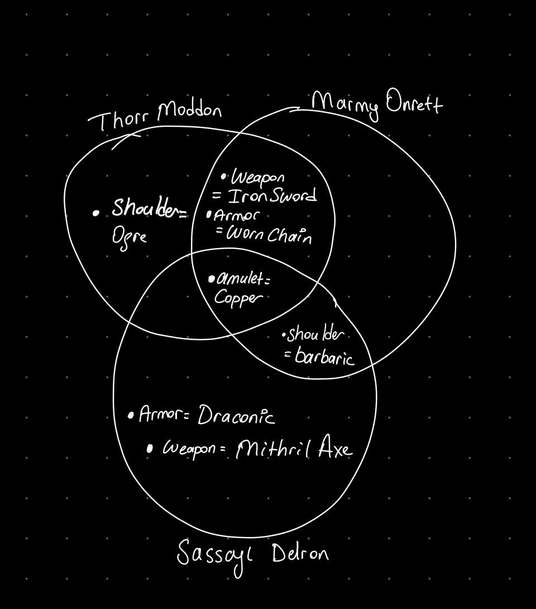
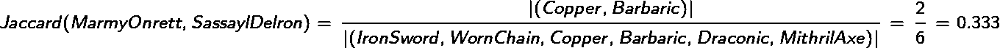

# NFT 估值最重要的工具，雅克卡距离

> 原文：<https://medium.com/coinmonks/the-most-important-tool-for-nft-valuation-the-jaccard-distance-ea1848689f34?source=collection_archive---------8----------------------->

不可替代的代币，或 NFT，以光速进入我们的生活，显然，2021 年是 NFT 令人敬畏的一年。数字所有权的概念为广泛的用例提供了创新的解决方案，如游戏、艺术、体育、娱乐、媒体和房地产。因此，NFT 的炒作在 2021 年和 2022 年达到了惊人的程度。

> [不可替代令牌(NFTs)](https://blog.liquid.com/what-is-nft) 使得通过[智能合约](https://blog.liquid.com/what-are-smart-contracts)来标记和证明现实世界或数字资产的所有权成为可能。[【1】](https://blog.liquid.com/nft-use-cases)

Google trends results of ‘NFT’ [[2]](https://trends.google.com/trends/explore?date=2020-01-01%202022-11-13&q=NFT)

一个 **NFT 收藏**是一个艺术家发布的各种数字资产，范围可能从单个令牌到多个令牌。它包含了有限数量的独立的非艺术作品，这些作品都符合相同的艺术风格，但有轻微的变化和差异，可能相互矛盾，但仍然很有吸引力。

一个很好的例子是 NFT 最受欢迎和最有价值的收藏之一 [Bored Ape 游艇俱乐部](https://opensea.io/collection/boredapeyachtclub)。这个特别的系列由以太坊区块链上的 10，000 个独特的不可替换的代币组成，描绘了具有各种特征的猿猴化身。例如，只有 5%无聊的猿类有红色的皮毛，3%有运动机车背心。无聊猿的特征越稀少，它在市场上的价格就越高。

BAYC, Bored Ape Yacht Club banner

本质上，使 NFT 在收藏中相对有价值的是它所具有的独特属性。这基本上意味着，任何衡量 NFT 的独特性或稀有性的标准都可以很容易地确定它是否定价过高、过低或合理。

然而，稀有性并没有一个简单明了的数学定义。有不同的方法，如基于分布的方法和基于距离的方法。我个人认为，每种不同的方法都有其优缺点。出于完全相同的原因，最著名的 NFT 市场 OpenSea 创建了自己的稀有度计算协议。[open rary](https://support.opensea.io/hc/en-us/articles/9517355517843-What-is-OpenRarity-)旨在为 NFT 稀有度带来一个全行业的定义。

基于我们过去对相当多的 NFT 收藏品的经验，我们决定使用 **Jaccard 距离**作为我们的工具，因为这是计算稀有度分数最可靠的方法。

在本文中，我们将探讨 Jaccard 距离，它是如何用于 NFT 稀有度计算的，以及使用这一指标的一些优点和缺点。

你可以在我的 Github 账号中找到我在这篇文章中使用的笔记本和数据。

 [## GitHub-mkaanerkoc/nft-稀有度:NFT 稀有度计算的实验工作

### 此时您不能执行该操作。您已使用另一个标签页或窗口登录。您已在另一个选项卡中注销，或者…

github.com](https://github.com/mkaanerkoc/nft-rarity) 

# 雅克卡距离

Jaccard 距离是衡量两组数据相似性的一种简单而有效的方法。它基于集合交集和并集的概念，可用于比较任意两组数据，无论其大小或复杂程度如何。

要使用 Jaccard 距离，只需比较两组数据，并计算两组数据中共有的项目占集合项目总数的比率。这个比率被称为 Jaccard 指数，可以用百分比或小数值来表示。指数越接近 1(或 100%)，两组数据越相似。

Jaccard index formula

例如，假设有三个 MMORPG 角色，他们身上有以下类型的设备:

**人物 1，索尔·莫顿**

*   武器:铁剑
*   防弹衣:磨损的锁链
*   肩膀:食人魔
*   护身符:铜

**角色 2，玛米·翁雷特**

*   武器:铁剑
*   防弹衣:磨损的锁链
*   肩膀:野蛮
*   护身符:铜

**人物 3，萨塞尔·德隆**

*   武器:秘银斧
*   防弹衣:龙
*   肩膀:野蛮
*   护身符:铜

Venn diagram of characters

只看他们的装备，你能猜出哪个角色比其他角色更稀有吗？

要回答这个问题，我们首先需要计算每个字符的成对 Jaccard 距离。

每当萨塞尔·德隆被计算在内时，Jaccard 指数似乎都会显著下降。这意味着萨塞尔·德隆比其他角色有更少的共同特征或属性。它还没有告诉我们稀有的顺序，但至少我们可以用这个例子作为基本事实的参考。请注意，每种装备类型，如武器和防弹衣，都被同等考虑，因为它们与权重 1 相加。

# 履行

## 带 Scipy 的 Jaccard 距离

尽管 Jaccard 索引公式看起来很容易从头实现，但我们将使用 **Scipy** 包来计算 Jaccard 距离。如果已经实现了，除非需要，否则为什么还要费心去实现同样的功能呢？

让我们看看我们将使用的功能；

**scipy . spatial . distance . pdist**

n 维空间中观测值之间的成对距离。[3]

参数:

*   **X，**array _ like:n 维空间中 m 个原始观测值的 m 乘 n 数组。
*   **公制，** str，或函数，可选。要使用的距离度量。距离函数可以是' braycurtis '，' canberra '，' chebyshev '，' cityblock '，' correlation '，' cosine '，' dice '，' euclidean '，' hamming '，' **jaccard 【T7 '，' jensenshannon '，' kulczynski1 '，' mahalanobis '，' matching '，' minkowski '，' rogerstanimoto '，' russellrao '，' seuclidean '，' sokalmichener '，' sokalsneath '，' sqeuclidean '，' yule '。**

退货:

*   Y，ndarray。为每个和(其中)返回压缩距离矩阵 y，其中 m 是原始观测值的数量。度量`dist(u=X[i], v=X[j])`被计算并存储在条目`m * i + j - ((i + 2) * (i + 1)) // 2`中。

**scipy . space . distance . squareform**

将向量形式的距离向量转换成正方形形式的距离矩阵，反之亦然。[4]

参数:

*   **X，** array_like。精简的或冗余的距离矩阵。

返回

*   **Y，** ndarray:如果传递的是精简距离矩阵，则返回冗余距离矩阵，如果传递的是冗余距离矩阵，则返回精简距离矩阵。

在我们将这些方法应用到整个 NFT 系列之前，我想先用上面的人物来演示一个简单的例子。这样，验证我们是否正确使用了 scipy 函数就容易多了。

请注意，我使用了特定的格式来描述每个字符的名称和属性。这只是为了让我们的示例抱怨我们稍后将使用的 NFT 元数据格式。这样，我们可以使用相同的功能，无需任何修改。🤗

计算 Jaccard 距离的工作流程包括 4 个步骤；

*   将收藏元数据转换为熊猫。数据帧
*   计算独热编码属性数据帧
*   计算 Jaccard 距离矩阵
*   计算每个 NFT 的 Jaccard 距离的平均值并排序。

下面的函数创建熊猫。来自集合元数据的数据帧。应该注意的是，它为每个<trait_type value="">对分配一个唯一的 ID。</trait_type>

the function creates DataFrame from NFT attributes JSON

这是我们的数据框架在第一步之后的样子。

Scipy **pdist** 函数需要布尔向量格式的 Jaccard 距离的输入参数。布尔向量在机器学习领域也被称为[一键编码](https://en.wikipedia.org/wiki/One-hot)特征向量。下面的函数计算独热编码属性数据帧；

one-hot encoding

我们来看看输出；

one-hot encoded attributes of characters

总的来说，我们在 3 个游戏角色中有 7 个不同的独特属性。ID#0，也就是 Thorr Moddon，有属性穿戴链、铁剑和食人魔护身符，所以只有这些属性栏是**真**而其余的是**假。**你也可以自己验证其他角色。

因为我们有我们的角色的属性在一个热编码格式中，我们可以继续进行 Jaccard 距离矩阵的计算。

Jaccard distance matrix calculation

**pdist** 函数返回压缩的距离矩阵。因此，我们使用 **squareform** 函数将其转换回一个冗余的距离矩阵，以便于可视化距离。

让我们将结果与我们的地面实况参考进行比较。

*   0 号(Thorr Moddon)和 1 号(Marmy Onrett)之间的距离为 0.6 ✅
*   #1 (Marmy Onrett)和#2 (Sassayl Delron)之间的距离为 0.33 ✅
*   #0 (Thorr Moddon)和#2 (Sassayl Delron)之间的距离为 0.14 ✅

恭喜你！我们成功地使用 scipy 函数计算了 Jaccard 距离，并根据我们的地面实况参考进行了验证。下一步也是最后一步是根据字符与其他字符的 Jaccard 距离对字符进行排序。

为了对字符的稀有程度进行排序，我们需要找到一个单一的标量度量。因为我们计算成对距离，所以我们可以计算每个字符成对距离的平均值。**请注意，Jaccard 分数越少的角色越稀有。**

rarity scores of each character

并归一化稀有度分数

normalized rarity scores

上述结果告诉我们，最罕见的人物是萨塞尔·德隆。第二个罕见的是 Thorr Moddon，最不罕见的是 Marmy Onrett。只看他们的文氏图，你能解释为什么稀有度计算会产生合理的结果吗？

## 将 Jaccard 距离应用于 NFT 集合

当我们验证了我们的算法可以生成可用于稀有度评分的结果时，我们确实可以用真实的 NFT 收集数据进行扩展。

NFT 收集的数据存储在远程服务器上，大部分时间可以通过 HTTP/HTTPS 或 IPFS 等协议进行访问。集合中的每个 NFT 项目都有一个惟一的 ID，我们将用它来请求元数据。

我选择了 [Bored Ape 游艇俱乐部](https://opensea.io/collection/boredapeyachtclub)、[月鸟](https://opensea.io/collection/proof-moonbirds)和[志那都红豆](https://opensea.io/collection/azuki)系列作为本文其余部分的例子。

那些不想获取 NFT 元数据的人可以直接使用。我的 GitHub 存储库中的 json 文件。

获取 NFT 集合数据从查找连续存储所有 NFTs 元数据的基本 URL 开始。要找到这一点，收藏的智能合同是最好的可信的真相来源。我们可以在 OpenSea 上找到该系列的智能合同地址。

BAYC collection’s OpenSea page

一旦我们让 etherscan.io 页面加载了集合的智能契约，我们就可以检查 **Read 契约**来找到基本 URL。

BAYC collection smart contract

大多数情况下，有一个名为 **tokenURI** 或 **baseURL** 的方法返回连接的基本 URL。在 BAYC 的例子中，是 **baseURI。**

read contract of the BAYC collection

月鸟系列略有不同，但本质上是相同的。它没有任何返回基本 URL 的函数。相反，它有一个函数将 NFT ID 作为参数，并将整个 URL 返回给相应的 NFT 元数据。我们可以使用这个函数并获取前缀作为基本 URL。

read contract of the Moonbirds collection

**HTTPS 对 IPFS**

您可能还注意到，BAYC 部署在 IPFS 服务器上，而 Moonbirds 部署在 HTTPS 服务器上。IPFS 是 Web3 存储和访问数据的方式。它完全分布在网络上，我们不像在 HTTPS 那样通过地址访问数据，而是通过散列从网络上请求数据。它在类比上更接近 Torrent。由于这种差异，我们从 IPFS 读取数据的方式不像从 HTTPS 服务器读取那样简单。

Infura 来找我们帮忙了！Infura 是我们的应用程序和以太网之间的网关。与运行本地以太坊节点来与网络通信相比，这无疑是一个更好的选择。关于 IPFS 和 Infura 的更多详细信息，请查看下面的文章。

 [## IPFS 简介

### 在 Infura 的四年多时间里，我们一直致力于为开发者提供一个简化的以太坊和…

blog.infura.io](https://blog.infura.io/post/an-introduction-to-ipfs)  [## 什么是 Infura

### 在本文中，我将向社区介绍什么是 Infura 以及它是如何工作的。因为大多数初学者和…

medium.com](/what-is-infura/what-is-infura-59dbdd778455) 

**批量请求**

每个 NFT 系列里面都有数千个 NFT。然而，为了成功计算稀有度分数，我们需要获得每一项的元数据。如果你有几个项目的数据缺失，你的稀有性分析将不会考虑它们，你很有可能会得到糟糕的稀有性分数。

发送数以千计的 HTTP 请求并不是我们想按顺序做的事情。我们可以利用异步机制来提高软件的效率。我在我的另一篇文章中解释了这一点，我不会再讨论同样的话题。如果你真的想自己去获取 NFT 收集的数据，我建议你先读读这本书。

 [## 如何用 Python 中的 aiohttp & asyncio 发送批量 HTTP 请求

### 通过 HTTP 请求获得更高的性能

medium.com](/@mkaanerkoc/how-to-send-bulk-http-requests-with-aiohttp-asyncio-in-python-62aee008e057) 

我使用了上面文章中使用的笔记本中的**get _ collection _ attributes _ async**函数。

**稀有度计算&分析管道**

我将我们到目前为止计算稀有度分数的每一步都抽象为高级函数， **calculate_jaccard_score，**和 **rarity_score_pipeline。**

让我们为 BAYC、Moonbirds 和志那都红豆系列执行我们的管道。

**分析 BAYC 系列**

rarity results of the BAYC collection

IDs of the top 10 rare NFTs in the BAYC collection

**分析月鸟系列**

rarity results of the Moonbirds collection

IDs of the top 10 rate NFTs in the Moonbirds collection

**分析志那都红豆系列**

rarity results of the Azuki collection

IDs of the top 10 rare NFTs in the Azuki collection

**结果**

厉害！我们的原型代码非常适合不同的 NFT 收藏。看起来每个系列都有不同的稀有度分布。BAYC 具有正偏态分布，而 Moonbirds 具有负偏态分布，而志那都红豆具有累骆驼形分布。(这是我刚编的)。在购买 NFT 之前，你最好检查一下你想出价的 NFT 在藏品稀有度分布中的位置。例如，你不会想买恰好在曲线正中间的 NFT。(或者在志那都红豆分布的骆驼身体部分，lol)

# 结论

Jaccard distance 是我用来交易 NFT 的另一个强大工具。它提供了一个快速有效的分析 NFT 价格的公平性。有许多网站提供稀有分数，其中大多数使用不同的算法来计算分数，如双重排序，性状计数和百分比加权。因此，在排序中发现微小的差异是完全没有问题的。但总的来说，你应该会看到类似的结果。

到目前为止，我认为 Jaccard 距离的唯一缺点是对丢失的数据非常敏感。即使 10.000 大小的集合中缺少 5 个 NFT 元数据，也可能会生成完全不同的结果。根据我的经验，基于百分比的稀有度计算对缺失数据更稳健。然而，在任何情况下，缺失数据对于稀有度计算都是危险的。因此，请确保您的数据获取机制能够恢复丢失的数据。

在我的实验中我意识到的另一件事，我认为它可以通过对不同的属性类型应用不同的权重来改进。例如，拥有稀有盔甲可能比拥有稀有护身符更好。在我们今天的实现中，我们假设所有的属性类型都对整体稀有性有同等的贡献。

如果你喜欢这个内容，并想了解更多关于其他稀有度计算算法，请通过电子邮件或评论告诉我。我很想写更多关于稀有性分析的文章。

感谢您阅读文章。如果你有任何问题/建议，请轰炸评论区。直到下一次，保持头脑清醒！

“fluffy gangster monsters rapping at hiphop concert, crowd gone crazy, neon lights, realistic photo”

 [## NFT-稀有/JAC card _ distance . ipynb at main mkaanerkoc/NFT-稀有

### NFT 稀有度计算的实验工作。通过在…上创建帐户，为 mkaanerkoc/nft-rarity 开发做出贡献

github.com](https://github.com/mkaanerkoc/nft-rarity/blob/main/jaccard_distance.ipynb) 

# 参考

1.  [https://blog.liquid.com/nft-use-cases](https://blog.liquid.com/nft-use-cases)
2.  【https://trends.google.com/trends/explore? 日期= 2020-01-01% 202022-11-13&q = NFT
3.  [https://docs . scipy . org/doc/scipy/reference/generated/scipy . spatial . distance . pdist . html](https://docs.scipy.org/doc/scipy/reference/generated/scipy.spatial.distance.pdist.html)
4.  [https://docs . scipy . org/doc/scipy/reference/generated/scipy . spatial . distance . squareform . html](https://docs.scipy.org/doc/scipy/reference/generated/scipy.spatial.distance.squareform.html)

> 交易新手？尝试[加密交易机器人](/coinmonks/crypto-trading-bot-c2ffce8acb2a)或[复制交易](/coinmonks/top-10-crypto-copy-trading-platforms-for-beginners-d0c37c7d698c)