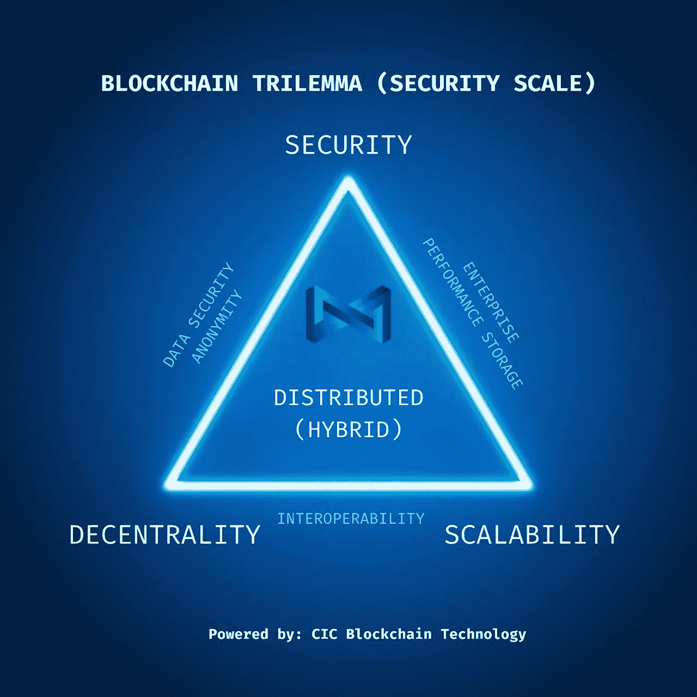

# 世界上最智能的智能合同平台

> 原文：<https://medium.com/coinmonks/the-most-intelligent-smart-contract-platform-in-the-world-f2473ab830cb?source=collection_archive---------2----------------------->

Pronounced Kick (CIC) Chain

区块链是一个巨大的分散式数字分类账，在计算机网络的节点间共享。区块链将信息存储在被称为块的数字记录中。这一革命性的技术进步确保了数据记录的可靠性和安全性，并且无需第三方即可产生信任。目前可用的区块链存在一些已知的问题，CIC 链不仅要解决这些问题，还要帮助大规模采用。

成功总是需要更大的努力温斯顿·丘吉尔，1940 年

为了理解是什么让[的 CIC 链](https://medium.com/u/f3354b7470ef?source=post_page-----f2473ab830cb--------------------------------)如此不同和智能，我们需要分解几个概念来更好地理解它们，并有一个总体的概述。让我们从区块链的名字开始。

> 从顶级交易者那里复制交易机器人。免费试用。

# 为什么是中投链？

中投链是我们区块链的名字。不过，代表中投链条的原生币叫疯狂互联网币。选择这个名字是为了醒目和突出。"它旨在留下持久的印象——一见难忘。"杰瑞德·罗宾逊

几乎不可能忘记中投链这个名字。这是对 meme coin 投资者的一个眨眼，甚至是点头。尽管如此，我们拥有的技术和力量不仅可以打破密码和 defi 空间，还可以对其进行革新和开拓。这枚硬币的名字大胆无畏，反映了该团队对这款区块链的宏伟目标。这项技术强大、安全、快速且功能多样，将吸引各类加密货币投资者和开发者。

# 超级账本贝苏、IBFT 和孔森斯法定人数公司

Hyperledger Foundation 是一个非营利组织，拥有大量资源和框架基础设施，旨在帮助和协助开源区块链项目周围的稳定生态系统。它们是许多不同的企业级区块链软件项目的所在地。开发人员社区为用户创建了各种项目来构建或部署区块链解决方案。这不仅仅是针对供应商或初创企业的；它也可用于商业用途。

许多组织希望在分布式目录或数据库中共享他们的数据，但是在所有者和用户之间总是存在信任问题。区块链技术允许以透明、安全的方式进行直接交易，从而在以点对点网络的效率运行的系统中建立信任。

对于企业来说，使用这种技术可以从根本上改变他们开展业务的方式。如果它被用作企业软件解决方案，它将在以前不存在的地方实现信任，并消除低效。这使得适当的安全措施和信任成为企业和组织利用区块链技术所必需的。

> “这些技术是核心、跨行业系统的构建模块，只会在规模和复杂性以及效率和价值方面进行扩展。由于 Hyperledger 技术是通过协作设计和治理构建的开源代码库，企业已经将其作为构建区块链解决方案的可信基础设施。”[https://www.hyperledger.org](https://www.hyperledger.org)

Hyperledger BESU 项目是唯一一个基于以太坊的开源客户端，旨在对公共和私人许可网络用例都是企业友好的。它允许开发人员使用基于以太坊的工具构建私有应用程序。它包括各种不同的共识协议，如…

*   QBFT(专用网络的企业级授权证明)
*   IBFT 2.0(授权证明-现有专用网络)(在 CIC 链中使用)
*   利害关系证明
*   Ethash
*   小团体(权威的证明)

> “Quorum Blockchain Service (QBS)是一项全面管理的分类账服务，让企业能够大规模发展和运营区块链网络。加快您的端到端区块链应用程序的开发，而没有管理基础架构的麻烦。”
> 
> https://consensys.net/quorum/qbs/

构建区块链并非易事，当您整合企业时，您必须启动和管理跨越多个组织云的网络。有一个对成功发射至关重要的操作顺序。它不仅仅是简单地设置节点标识、连接节点和启用用户权限。一旦你建立了你的网络，它必须是最新的和维护的。这就是 Quorum 区块链服务如此重要的原因。

QBS 是一种完全托管的区块链服务，允许企业配置、部署和管理其网络，形成了云中区块链应用的基础。

CIC Chain 的架构将 Hyperledger BESU 和 Quorum 纳入其框架。在企业级环境中，人们期望它了解链中的参与者。BESU 和 Quorum 都使用权限层，只允许被认可的已知节点加入网络。参与企业级区块链的每个组织都希望他们的交易不被其他用户或组织知道。BESU 和 Quorum 对于私有事务都有独特的功能。每个用户的公钥只能看到交易。BESU 和 Quorum 上都有一个独立的模块，它将对交易数据进行加密，并与网络层上的目标地址共享。Quorum 并不是绝对可靠的，它确实有一个缺陷，那就是一致性的问题。这就是 BESU 介入并利用隐私小组解决问题的地方。让我们看一个什么是一致性问题的示例…

Jared 为 Ados 和 Mary 部署了一个合同，并将其设为私有。契约有一个增量函数，当调用该函数时，X 的值(初始值= 1)增加 5。Ados 调用该增量函数，并且仅对 Mary 保密该事务。X 的值现在是 6，但是，由于该事务是只与 Mary 进行的，所以对于 Jared 来说，X 的值仍然是 1。

与 BESU 隐私组，不缺乏一致性。企业使用组织层级。所有的企业平台都应该能够提供一个支持相似层次结构的框架。Quorum 使用智能合约逻辑在以太坊上实现了一个框架。然而，BESU 在这方面有所欠缺。虽然是以太坊客户端，但是不能提供框架层次结构。将 Quorum 并入 BESU 链解决了这个问题。

# IBFT-伊斯坦堡拜占庭容错

伊斯坦布尔拜占庭容错是另一种共识机制，它确保区块链上发生的交易有一个单一的、一致同意的订单，并提供结算终结。IBFT 属于《行动纲领》协商一致议定书家族。它旨在确保立即结束。验证器以循环方式选择其中一个作为提议者。然后提案人会提出一个全新的区块提案。消息被发送出去(预先准备)，一旦消息被接收，验证器进入“预先准备”状态，然后发送一个名为“准备”的新消息。这是为了确保所有的验证器都在相同的序列和相同的回合上工作。然后，验证器进入“准备好”状态，并发出一条名为“提交”的消息。这是为了让每个人都知道，它已经接受了建议的块，并将被添加到链中。一旦其他验证器收到消息，它们就进入一种被称为“已提交”的状态，并且该块被添加到链中。这个过程是最终的，不能分叉。

> *“为了防止故障节点生成与主链不同的链，每个验证器在将 2F + 1 接收的提交签名插入到链中之前，将其附加到报头中的额外数据字段。因此，块是可自我验证的，并且也可以支持轻客户端。但是，动态额外数据会导致块哈希计算出现问题。因为来自不同验证器的同一个块可以有不同的提交签名集，所以同一个块也可以有不同的块散列。为了解决这个问题，我们通过排除提交签名部分来计算块散列。因此，我们仍然可以保持块/块哈希的一致性，并将一致性证明放在块头中。”*
> 
> [T3【https://github.com/ethereum/EIPs/issues/650】T5](https://github.com/ethereum/EIPs/issues/650)

# 超分类帐结构

企业级分布式总账平台 Hyperledger Fabric 为各种行业的各种用例提供了灵活性和适应性。通过即插即用组件，如共识、隐私和成员服务，模块化架构允许广泛的企业用例。Hyperledger 面料的一些令人惊叹的功能包括……。

许可建筑

高度模块化

可插入的共识

开放式智能合同模型—灵活安装任何所需的解决方案模型(帐户模型、UTXO 模型、结构化数据、非结构化数据等)。)

终结/确认的低延迟

灵活的数据隐私方法:使用“渠道”进行数据隔离，或使用私人数据“集合”在需要知道的基础上共享私人数据

多语言智能合约支持:Go、Java、JavaScript

支持 EVM 和可靠性

专为持续运营而设计，包括滚动升级和不对称版本支持

智能合同的治理和版本控制

灵活的认可模式，可在所需组织间达成共识

可量化数据(基于键的查询和 JSON 查询)

Fabric 为私人交易和机密合同提供了一个可扩展的安全平台。DLT 将帮助私营部门建立信任、透明度和问责制。除了适用于所有行业，Fabric 还将为他们提供模块化和灵活的设计，允许在保持匿名性的同时实现最佳扩展。

CIC Chain 设计了混合区块链，采用了 Hyperledger BESU、Fabric 和 ConsenSys Quorum 的最佳产品。集成所有分布式分类帐技术，并协同一致地操作它们，以优化 CIC 链，不仅为公共部门，而且为需要最高等级安全性和基于许可的网络的私人商业组织提供开发和安全性。

# 介绍 Tessera

> “在 Besu 中，隐私是指在相关参与者之间保持交易私密的能力。其他参与者无法访问交易内容或参与者列表。”-https://besu . hyperledger . org/en/stable/private-networks/concepts/privacy/

Hyperledger BESU 和 ConsenSys Quorum 无缝协作，优势互补。通过使用隐私事务管理器来应用隐私。Tessera 是一个模块，用于确保来自 Quorum/BESU 节点的每个事务(无论是发送的还是接收的)都有相应的 Tessera 节点。一旦事务通过 Quorum/BESU 节点传递到 Tessera 节点，该事务就被加密并分发给参与的 Tessera 节点。多租户允许多个参与者访问相同的 Quorum/BESU 和 Tessera 节点，但具有单独的状态。公有国家和私有国家仍然是分开的。Tessera 还有另一个功能，称为对等点发现。通过对等点发现，Tessera 节点共享对等点 URL 列表以及这些对等点的公钥。现在，加入网络的节点可以看到网络中的其他节点，以及其他参与者的公钥。

> **Besu 和 Tessera 节点都有标识它们的公钥/私钥对。向 Tessera 节点发送私有事务的 Besu 节点用 Besu 节点私有密钥签署该事务。在用于* `*eea_sendRawTransaction*` *的 RLP 编码的事务字符串中指定的* `*privateFrom*` *和* `*privateFor*` *参数是发送和接收事务的 Tessera 节点的公钥。"-https://besu . hyperledger . org/en/stable/private-networks/concepts/privacy/private-transactions/*

Tessera 由两个具有不同功能的元素组成。

*   事务管理程序
*   Enclave(本地和远程 HTTP)

事务管理器用于创建与其他事务管理器的对等网络。它将密钥管理和数据加密或解密分配给 enclave。与数据库交互以检索或存储数据。

飞地是指定用于安全处理的区域。它类似于一台复杂的设备，其内容是处理命令和数据的直接结果。飞地保护其内部的数据免受恶意攻击。本地 enclave 与事务管理器做同样的工作，但是保持逻辑上的分离。远程 HTTP enclave 通过 HTTP 提供 RESTFUL 端点，并且独立于事务管理器运行。

# 阿帕奇卡夫卡

> 超过 80%的财富 100 强公司信任并使用卡夫卡。
> 
> Apache Kafka 是一个开源的分布式事件流平台，被数千家公司用于高性能数据管道、流分析、数据集成和任务关键型应用程序。"-https://kafka.apache.org

简单来说，Apache Kafka 是一套用于事件流的工具。这是一种在不同应用程序之间传输数据流的极好方式。它通常用于连接分布式系统中的不同元素。卡夫卡是容错的。如果某些模块出现故障，它将继续运行，并保持所需的必要扩展。可以把它想象成一个消息传递系统，它能够以网络的吞吐量将消息传递给同一区域内或跨不同地理区域的各种不同的集群机器。存储的数据包含在一个安全、持久、分布式、容错的集群中。通过弹性扩展和收缩存储和处理，可以扩展深不可测的数据量、数 Pb 的信息和难以想象的分区数量。这就是使用阿帕奇卡夫卡的力量。

# 库伯内特还是 K8

> “Kubernetes 是一个开源的容器编排引擎，用于自动化容器化应用程序的部署、扩展和管理。开源项目由云本地计算基金会(CNCF)主持。”-https://kubernetes . io/docs/home/

Kubernetes 是一个开源平台，用于管理容器化的工作负载和服务，有助于明确的报表配置和自动化。在使用虚拟机或容器部署之前，应用程序是在物理服务器上处理的。这并不是没有错，而且存在资源分配问题。如果几个应用程序在一台服务器上运行，有时一个应用程序会占用大部分资源。这将意味着其他程序现在将缺乏必要的资源，并且不会相应地执行。解决方案是在不同的服务器上运行其他程序。然而，这样做不仅没有利用资源的潜力，而且在财政上也很昂贵。

这就是引入虚拟化的原因。在单个服务器上使用虚拟机(VM)使程序能够在 VM 之间隔离，并保持不同的安全级别。应用程序信息不能被另一个应用程序公开访问，因为它是通过在自己的虚拟机环境中运行来隔离的。虚拟环境允许资源得到最佳利用，并提供更好的可扩展性。它的成本效益，并允许程序更新或添加很容易。每个虚拟机都独立地被视为运行所有所需组件及其操作系统和虚拟硬件的全功能机器。

时代变了，使用的技术也变了，容器也引入了。它们类似于虚拟机，但具有不同的属性。与虚拟机相比，容器是轻量级的，拥有自己的文件系统、内存、分配的 CPU 等等。它们不是固定的永久性基础设施，可以跨云和操作系统移植。使用容器是运行应用程序的可靠方式。如果一个容器出现故障，另一个容器需要启动，Kubernetes 将确保在出现故障时不会停机。K8 的(Kubernetes)为您提供了运行分布式系统的必要框架，重点是高弹性。

> “Kubernetes 为您提供:

*   ***服务发现和负载均衡*** *Kubernetes 可以使用 DNS 名称或使用它们的 IP 地址来公开容器。如果容器的流量很高，Kubernetes 可以对网络流量进行负载平衡和分配，从而使部署稳定。*
*   ***存储编排*** *Kubernetes 允许您自动挂载您选择的存储系统，例如本地存储、公共云提供商等等。*
*   ***自动化部署和回滚*** *您可以使用 Kubernetes 描述您部署的容器的期望状态，它可以以可控的速率将实际状态更改为期望状态。例如，您可以自动化 Kubernetes 来为您的部署创建新的容器，删除现有的容器，并将它们的所有资源应用到新的容器中。*
*   ***自动装箱*** *你为 Kubernetes 提供了一个节点集群，它可以使用这个集群来运行容器化的任务。您告诉 Kubernetes 每个容器需要多少 CPU 和内存(RAM)。Kubernetes 可以在节点上安装容器，以充分利用资源。*
*   ***自我修复*** *Kubernetes 重启失败的容器，替换容器，杀死对用户定义的健康检查没有响应的容器，并且在它们准备好服务之前不向客户端通告它们。*
*   ***秘密和配置管理:*** *Kubernetes 让您存储和管理敏感信息，如密码、OAuth 令牌和 SSH 密钥。您可以部署和更新机密和应用程序配置，而无需重新构建容器映像，也无需在堆栈配置中暴露机密。"-https://kubernetes . io/docs/concepts/overview/*

# 码头工人

在开发周期中，必须完成许多不同的任务。对于开发人员来说，这些任务可能是单调重复的。Docker 消除了繁琐的任务，有助于简化流程。这使您能够实现快速、高效和可转移的应用程序开发，同时保持易用性，以获得更好的体验和简化的方法。Docker 与各种开发工具协同工作，并有效地简化了应用程序的打包，以便在 Kubernetes 或 AWS ECS 等任何环境中作为可移植的容器映像文件运行。通过 Docker Hub 和 Docker Hub 审计日志，可以与其他开发人员协作，并基于具有跟踪历史的角色实现开发人员访问的个性化。

> “轻松交付多个应用程序，并让它们在您的所有环境中以相同的方式运行，包括设计、测试、试运行和生产—桌面或云原生环境。
> 
> 在不同的容器中用不同的语言独立地部署您的应用程序。降低语言、库或框架之间冲突的风险。
> 
> 使用 Docker Compose CLI 的简单性加快开发，只需一个命令，就可以在本地和云上使用 AWS ECS 和 Azure ACI 启动您的应用程序。“-https://www.docker.com

使用 Docker 的著名公司包括但不限于以下公司…

*   网飞
*   砖坯黏土
*   贝宝
*   美国电话电报公司(American Telephone and Telegraph Company)
*   威瑞森
*   目标
*   朗讯健康

# Bonsai 尝试 Hyperledger BESU 的存储格式

对可伸缩性的真正测试取决于您的节点是否能够处理主网上的高需求事务。具有讽刺意味的是，main net 的需求比大多数企业的可伸缩性需求更大。这意味着大量的使用和大量的数据，我们需要一种能够满足高需求的存储格式。大多数以太坊主网客户端使用一个称为“尝试森林”的系统来存储复杂和重要的状态(状态被定义为在特定时间描述某个系统的一组变量)。随着越来越多的使用，状态增长，随着它的增长，数据结构形成了一棵树。随着状态的增长，数据量也在增长，不仅使数据与网络同步变得越来越困难，而且归档数据也变得越来越困难。这些是存储的数据类型…

*   交易数据
*   账户信息
*   智能合同的更改
*   [计]元数据

在正常情况下，存储和开销成本会不断累积，运行节点的成本会非常高。需要读写的数据越多，意味着网络需要的时间越长。Hyperledger BESU 的一个已知问题是节点的大小和性能问题。当我们谈到节点大小时，我们指的是节点在区块链过程中使用的磁盘空间量。这就是盆景尝试的用武之地。

它被称为 Bonsai trie(发音为 Tree ),因为它的灵感来自真正的盆景树，所以它本质上是以叶子为中心的，围绕这个想法的一切都可以与盆景树相媲美。Bonsai 尝试用于帮助控制节点大小。本质上，Bonsai trie 是 BESU 的一种新的存储格式。

盆景尝试将树叶和树枝分开存放。值由 trie 树叶表示，分支表示如何获得值或 trie 树叶。树叶是由地址组织的。分支是按照树本身的位置存储的，而不是按照内容存储的。这样做的目的是，按位置存储将缩短加载时间，并对数据库缓存产生直接影响。当通过地址组织分支时，这创建了隐式修剪。当某个分支节点在某个位置被更改时，您将覆盖它，而不是编写单独的副本。这被称为保持修剪良好，这只是意味着停止随机分支生长出新的三叶值。这导致为 trie 树叶写入新值。这些就是 Bonsai trie 格式的优点。

按位置存储意味着我们不能回到过去，所以在没有设计选择的情况下，我们不能回头证明任何历史状态或访问历史状态。在这种情况下，我们需要回滚/前滚块，或者因为大多数人从不同的时间点寻找块信息，所以设计了 trie 日志存储。每个块转换将 trie leave 变化存储在 trie 日志中。这包括读取和写入的值。trie 日志不仅允许 trie 回滚，还允许它前进到不同的日志状态。这是 trie 日志强大功能的优势之一。缺点是因为我们没有见证分支，我们不能证明这是唯一的执行方法。我们有结果，但缺少与之匹配的证据(散列)。但是，使用 trie 日志，您可以回滚足够的时间来生成必要的证据。

Bonsai 在其存储和 trie 日志中只保留最新的 trie 或值。trie 日志提供了一个较小的变更存储，所以当我们需要它们时，它们可以用来显示完整的尝试历史，而不仅仅是最新的。这大大减少了存储空间，并有助于节点更快地读取关于当前状态的数据。访问区块链的最新数据更加快捷高效。隐式树修剪提供了更快的节点同步。

# 以太坊虚拟机

> 以太坊虚拟机(EVM)是执行代码和执行机器之间的一个抽象层次。需要这一层来提高软件的可移植性，并确保应用程序相互分离，并与其主机分离。”路易特·霍兰德

智能合同可以用多种语言编写。Solidity 是基于现有的各种编程语言设计的。相似的语言结构使它很容易适应开发者。作为开发者的首要语言，基于可靠性的智能合约不能被 EVM 执行。Solidity 编程被转换成机器代码，称为操作码。一旦这个过程完成，它们就被编码成字节码，然后由以太坊虚拟机执行。

CIC Chain 使用它的 EVM 版本 CICstarter。这使得开发人员能够利用 CICstarter，使用同样熟悉的基于 Solidity 的应用程序来构建他们的分散式应用程序。它不止于 EVM 工具。开发者甚至可以使用 JavaScript、Web3js 甚至 Python 来构建任何接受数字支付的东西。

# 共识协议——折射证明——压印技术

区块链证明的一个已知障碍是可伸缩性。折射证明就是为了解决这个问题而发展起来的。

> “CIC 采用了我们最先进的‘Imprism’技术。它快速、强大、可靠且可扩展。”贾里德·鲁滨逊首席执行官 CIC 实验室有限公司

Imprism technology (PoR)是一种先进的共识协议，它充分利用了 Stake Authority 的证据，并通过其内置的折射机制对其进行了改进。利用这种最先进的共识模型，不仅一切效率提高了 90%,而且整个过程无疑是快速的。Imprism 技术使用的能量比传统的共识协议少得多。它不会牺牲效率、速度或安全性，同时保持支持增加的事务负载或高事务吞吐量的能力。

一个普通的三棱镜可以将白光分成或者说折射成它的基本颜色，也就是光谱。换句话说，折射的证明是关于区块链如何折射或把数据分成更小的碎片，并同时把它们分散到几个方向。一旦折射发生，数据将永远存储在区块链上。较小的数据片段被折射并拆分到几个节点上。这一过程需要的资源少得多，并且简化了数据的存储方式。因为要做的工作少得多，这使得整个过程的效率提高了 90%。这项技术降低了节点和整个链的总能耗和物理需求。所有的信息仍然保存在区块链上。fraction 流程允许您在需要时只访问您需要的部分，而不会影响速度、安全性或可伸缩性，同时保持分散性。

当区块链上发生交易时，它会创建一个唯一的加密哈希代码。这个哈希码是一个加密的消息，将会显示为“0x3af42t54”，这个哈希码以加密的格式存储交易的必要信息。随着区块链的发展和用户的增多，交易的数量也会增加。这意味着每笔交易将生成更多的密码，因此随着时间的推移，将使用越来越多的数据。Imprism 智能地减少了存储这些加密数据的空间。哈希代码“0x3af42t54”被更改为更易于管理的“0x”。从表面上看，似乎没有多少信息。这是因为它在被存储之前已经被折射并且同时被组织成更小的相关数据片段。

> “这是一个非常复杂的系统，它减少了在每个地方存储每个交易的完整大图的需要— Imprism 只在信息需要的确切位置保存它需要的确切信息，从而大大减少了能源和时间的浪费，并防止网络随着增长而拥塞。”Jared Robinson 首席执行官 CIC 实验室有限公司

如果不使用 Imprism 技术，当前的系统将使用比“0x”长得多的字符串。因为它很长，并且没有对信息进行分段，所以检索与之相关的相关数据也需要更多的时间。过程越长，需要的资源就越多。因此不能使当前的系统非常理想。

终结性用于衡量在区块链上验证交易的速度。一旦交易被验证，它是不可变的，这意味着它永远不会被更改或改变。如果你正在购物，并去购买，最终将是你的付款被接受和处理的时间。反过来，你购买的企业需要在尽可能短的时间内准确地知道你从他们那里买了什么。印记技术也包含了瞬间终结。这意味着交易立即得到确认，然后发送到区块链进行处理。Imprism 的设计考虑了可扩展性、速度、成本、安全性和寿命。在高峰期，你永远不会等待，也不必支付昂贵的 GWEI 或汽油费。CIC Chain 的阻塞时间目前是基本交易 1 秒，智能合约交易 5 秒。这意味着所有转移都将在各自的类别中完成和存储。当没有块被创建时，我们有一个独特的功能，称为生态块。这将使封锁时间达到 60 秒。Eco block 大大减少了资源的使用，证明了我们减少碳足迹的承诺。借助 Imprism 技术的力量，这一切都是可能的。

# ISO20022

image rights belong to [https://www.iso20022.org](https://www.iso20022.org)

ISO20022 是由国际标准化组织创建的。

> “该组织引入了 ISO 20022，作为一种在金融机构之间开发报文的标准方法。事实上，世界各地的机构对这些信息使用自己不同的编码语言，这可能使国际转账成为一个非常混乱和无组织的过程。”金融。Yahoo.com

CIC Chain 尚未公开验证，但是，它不仅使用企业级安全性，而且可以用 XML 编程语言进行通信。这意味着中投币可以与金融机构直接沟通。开发人员可以为公共和私人用例创建定制的分散式财务应用程序。ISO20022 合规性将有助于整合全球金融机构目前使用的各种报文传送语言。CIC Chain 将能够与他们中的任何一个进行通信。

# 道与中投的分权

我们有技术，但是我们打算如何确保我们是分散的？我们的链是非常不同的，我们的验证器，主要由 CIC 实验室管理，是为了保持链的安全。他们无法控制链条的运行。我们的验证者只是签署交易，仅此而已。关于块验证和共识的传统观念并不适用。我们的分散化来自于我们的分散化自治组织(DAO)，这是一种没有中央权威的结构，由投资者组成，他们都致力于为组织的最佳利益而行动。Dao 用于通过投票进行选择，并在某些区块链和硬币/代币持有者中流行。现在让我们更进一步，分散到地址级别。要参加 CIC DAO，您至少需要投入一千个 CIC 币才有资格投票。赌注多少无所谓，但参与的最低是一千个硬币。你只能投一票。如果你下注 200 万个硬币，而其他人下注 1000 个硬币，这都没有关系，你们两个都只有一票。对鲸鱼垄断投票的恐惧不会发生，每个参与者都将被赋予平等的权利。中投道将负责连锁的治理，这包括 60%的硬币供应。

# 区块链三元悖论

有一种流行的观点认为，你不能用区块链技术满足所有三个兴趣点。据说不牺牲一个问题就无法解决另一个问题。使用不同的协议和系统不仅使我们能够适应大规模采用率，还能适应当时所需的高度。这并没有牺牲安全性或分散性。CIC Chain & Imprism technology 不仅解决了它，而且它还成为了区块链技术进化的基础。CIC 链是一种新的 Dao 控制的混合第 1 层区块链。一个具有无限潜力，将有助于大规模采用。CIC 链不能分叉，并且可以在不中断链的情况下升级。

构建一个区块链并不是一件容易的事情，正如你所看到的，需要使用几个复杂的应用程序。将每个架构组件整合到 CIC 链的框架中对于网络的长期成功和可持续性至关重要。上述模块都无缝集成到 CIC 基础设施中，以确保全球最复杂、最智能的智能合约平台。这就是中投公司如何解决区块链三难问题的，现在你已经了解了被称为中投公司的现代技术奇迹。

如果你想了解更多关于中投链的信息，请查看他们的官方媒体账号[中投链](https://medium.com/u/f3354b7470ef?source=post_page-----ee76b4235d93--------------------------------)。

以下是他们白皮书和网站的官方链接。

[中投白皮书](http://cicchain.gitbook.io/)

[中投网站](https://cicchain.net/)

[中投链接树](https://linktr.ee/cicchain)

*任何书面材料均不构成财务建议，也不应被误解为财务建议。在购买或投资之前，请务必咨询财务顾问。本文中的信息仅供参考，不得误解。*

*   如果你喜欢这篇文章，请考虑关注我，留下一个好的评论和一些掌声。谢谢你的时间。

# 另外，阅读

*   [如何在 Uniswap 上交换加密？](https://coincodecap.com/swap-crypto-on-uniswap) | [A-Ads 评论](https://coincodecap.com/a-ads-review)
*   [加密货币储蓄账户](/coinmonks/cryptocurrency-savings-accounts-be3bc0feffbf) | [YoBit 审核](/coinmonks/yobit-review-175464162c62)
*   [Botsfolio vs nap bots vs Mudrex](/coinmonks/botsfolio-vs-napbots-vs-mudrex-c81344970c02)|[gate . io 交流回顾](/coinmonks/gate-io-exchange-review-61bf87b7078f)
*   [CoinFLEX 评论](https://coincodecap.com/coinflex-review) | [AEX 交易所评论](https://coincodecap.com/aex-exchange-review) | [UPbit 评论](https://coincodecap.com/upbit-review)
*   [AscendEx 保证金交易](https://coincodecap.com/ascendex-margin-trading) | [Bitfinex 赌注](https://coincodecap.com/bitfinex-staking) | [bitFlyer 审核](https://coincodecap.com/bitflyer-review)