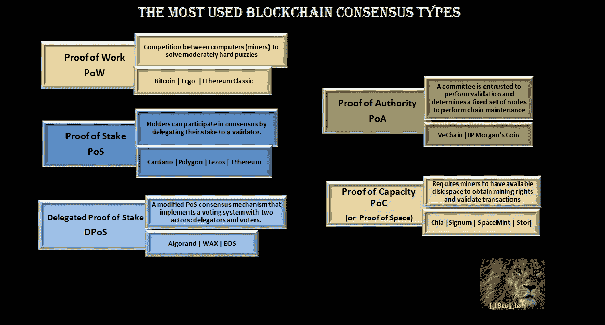

# 最常用的区块链共识类型

> 原文：<https://medium.com/coinmonks/the-most-used-blockchain-consensus-types-9fbc00fbf032?source=collection_archive---------30----------------------->

B 锁链技术是一个分布式系统，它允许随着时间的推移以有序的方式创建数字总账，基于几个参与者的共识，他们是构成网络的节点。

这种共识是通过非常复杂的编码(加密)实现的，这种编码为网络提供了安全性，随着时间的推移以不变性记录系统的交易。

每个新事务都包含在一个块中，直到达到一定的容量限制，然后该块被添加到链中，跟随前一个块，从而随着时间的推移以有序的方式构建链，因为它们是伪造的。

> 如果你想知道更多关于区块链的特色，我在最后给你留下一篇文章。

在本文中，我将向您介绍区块链共识机制，这是一种编码协议，作为操作的基础软件，类似于区块链的操作系统。

有许多不同的协议，每一种都提供不同级别的安全性、可伸缩性和分散性。反过来，每种共识都有不同的版本，由每个区块链项目来实现。

为了使网络可持续发展，有一个经济激励，共识参与者从区块链获得加密货币作为奖励。

我将提到最常用的共识机制，以及它们的主要优缺点。

## 工作证明

工作证明是第一个区块链共识机制，由创始人中本聪用于比特币，于 2009 年开始活动。

PoW 是基于计算机之间的竞争来解决一种数学算法。网络中的每个节点，称为矿工，试图找到解决方案，以打造一个新的区块。

在最著名的区块链中，Ergo 和 Ethereum Classic 也使用 PoW。

**优势**:攻击 PoW 控制 51%的 hash 力，接管网络，需要很高的计算能力。

**缺点**:需要高功耗和特殊硬件来解决测试。

## 利害关系证明

利益证明(PoS)是一种较新的共识机制，由 Peercoin 于 2012 年推出，通过该机制，加密货币持有人可以作为验证者节点参与共识，或者作为将资金委托给这些验证者以在共识中授权他们的持有人。

卡尔达诺、以太坊和 Tezos 是最受欢迎的 PoS 区块链。

**优点**:验证器不需要专门或昂贵的设备来设置节点，网络节能。

**缺点**:在一些区块链中，可能会有资金集中的趋势，从而使共识中的一些参与者拥有更大的权力，这可以通过良好的激励设计(博弈论)来缓解，如 Cardano，它可以减少一定数量的过度授权的奖励。在一些 PoS 共识机制中，验证者和委托者必须锁定他们的资产才能操作(质押)，但这不适用于 Cardano。

## 委托股权证明

委托利益证明(DPoS)是一种改进的 PoS 共识机制，它实现了一个由两个参与者组成的投票系统:代表和投票者。投票者贡献他们的资产并选举代表来验证网络中的交易。代表保持验证者身份的能力取决于他或她的声誉。犯错误或表现出不良意图的代表可以被替换。

Wax 和 EOS 是 dpo 区块链。我们也可以把 Algorand 看作是 DPoS 的一个变种，它有 PPoS(纯利害关系证明)机制。

**优势**:在 DPOS 网络中，由于验证者数量有限，交易速度很快，允许更快达成共识，同时通过投票保持良好的安全性。任何行为可疑的代表都可以被立即报告。这也是一个非常节能的网络。

**缺点**:代理共谋可能导致 51%的攻击，因为更少的验证者导致这些网络更加集中。

## 权威证明

授权证明(PoA)是一种共识模型，可能更适合专用网络。不是重新考虑链的数字资产，而是委托一个委员会来执行验证。

PoA 共识机制确定一组固定的节点来执行链的维护，这些节点获得验证事务的专有权利。

Vechain 和私人网络，如 JP 摩根的 coin systems，使用这种机制。

**优点**:该模型节能高效，不需要昂贵的硬件或高计算能力，在验证竞争中摩擦小，速度相当快。

**缺点**:去中心化是最弱的一点。成为验证者需要大量的资本，使得大多数人很难参与到这个过程中。

## 能力证明

容量证明(PoC)，也称为空间证明，要求矿工有可用的磁盘空间来获得授权并能够验证事务。类似于 PoW，但不是计算能力，生产新区块的权利是按比例分配给每个矿工贡献给系统的空间。

最著名的区块链有奇亚、希格诺、Spacemint 和 Storj。

**优势**:区块链矿业不需要高功耗，不需要复杂的设备，兼容任何标准硬盘。

**缺点**:需要更高容量的存储，以增加矿工验证区块的机会。

[什么是区块链？](https://liberlion.medium.com/what-is-blockchain-f63007bea920)

【liberlion.com 

> 加入 Coinmonks [电报频道](https://t.me/coincodecap)和 [Youtube 频道](https://www.youtube.com/c/coinmonks/videos)了解加密交易和投资

# 另外，阅读

*   [TraderWagon 回顾](https://coincodecap.com/traderwagon-review) | [北海巨妖 vs 双子星 vs BitYard](https://coincodecap.com/kraken-vs-gemini-vs-bityard)
*   [Exness 回顾](https://coincodecap.com/exness-review)|[moon xbt Vs bit get Vs Bingbon](https://coincodecap.com/bingbon-vs-bitget-vs-moonxbt)
*   [如何开始通过加密贷款赚取被动收入](https://coincodecap.com/passive-income-crypto-lending)
*   [加密货币储蓄账户](/coinmonks/cryptocurrency-savings-accounts-be3bc0feffbf) | [加密交易机器人](/coinmonks/crypto-trading-bot-c2ffce8acb2a)
*   [BigONE 交易所评论](/coinmonks/bigone-exchange-review-64705d85a1d4) | [CEX。IO 审查](https://coincodecap.com/cex-io-review) | [交换区审查](/coinmonks/swapzone-review-crypto-exchange-data-aggregator-e0ad78e55ed7)