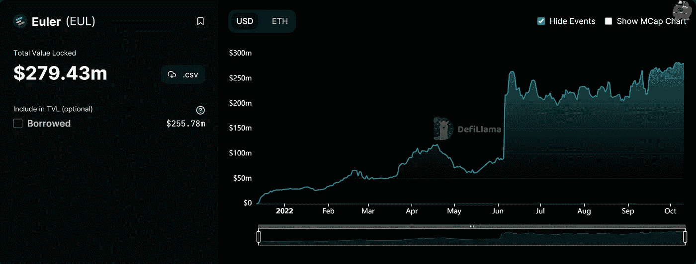
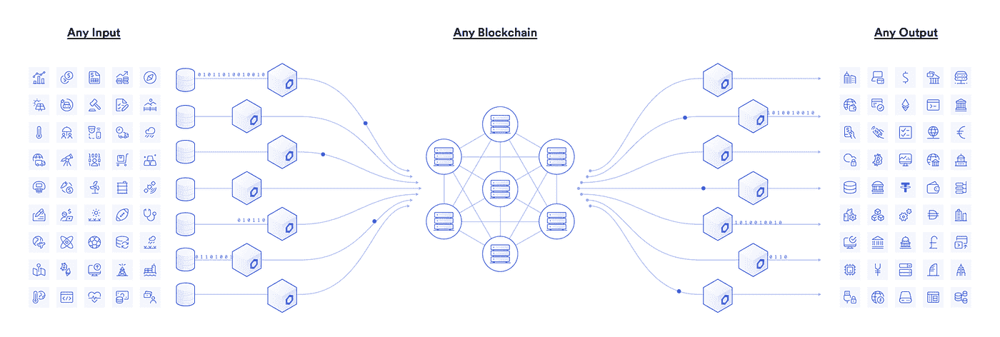
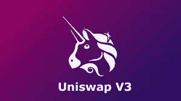
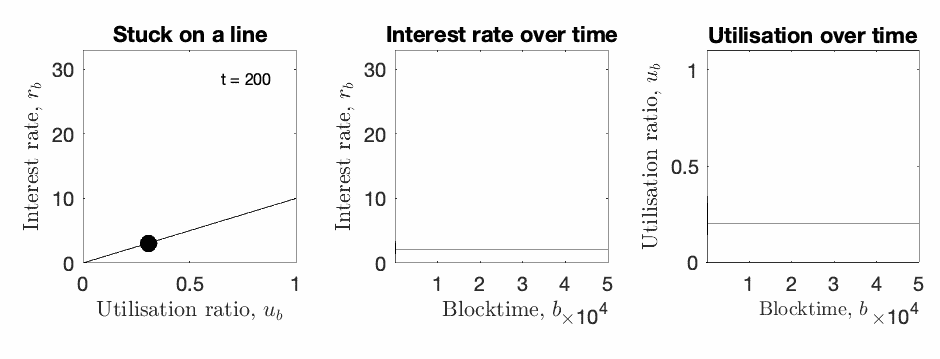
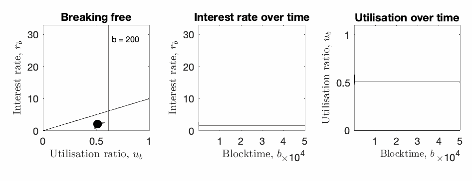

# DeFi 中借贷的新时代

> 原文：<https://medium.com/coinmonks/the-new-era-of-lending-and-borrowing-in-defi-910e57da1204?source=collection_archive---------21----------------------->

Euler Finance 是一个定制的无许可借贷协议，旨在帮助用户借出和借入比以往更多的基于以太坊的令牌。

于 2021 年 12 月推出，这是一个在货币市场推出协议的不稳定时机。但此后证明了自己的价值，他们在 TVL 筹集了 2.8 亿美元。

DeFi Llama

## 这听起来像是一种波动和复合……那么欧拉有什么不同呢？

这些协议为用户提供了对少数最具流动性的 ERC20 令牌的借贷能力。然而，像 Aave 和 Compound 这样的协议并不是为了处理与借贷非流动或不稳定资产相关的风险而设计的，因此依赖于许可上市系统来保护其用户免受与这些资产相关的风险。但 Euler 允许用户为任何以太坊 ERC20 令牌创建自己的市场，并具有由控制理论支持的创新反应利率模型，可减少快速移动市场中的治理干预需求。

## 为什么 Aave 和 Compound 不能列出世界上所有的符号？

他们使用链环神谕。

## 什么是区块链神谕？

区块链甲骨文是将区块链与外部系统连接起来的实体，从而使智能合约能够基于现实世界的输入和输出来执行。价格神谕提供了各种基于以太坊的代币之间的汇率。

Chainlink oracle

## 那么是什么让欧拉金融与众不同呢？

风险框架。

用户可以在 UniswapV3 协议上创建自己的借贷市场，而不是使用 Chainlink oracles。

**列出任何资产—** 由 [Uniswap 的](https://uniswap.org/)分散时间加权平均价格甲骨文提供支持，Euler 允许用户为几乎任何以太坊 ERC20 令牌创建自己的借贷市场。

Uniswap 的 oracles 现在集成起来更容易、更便宜。V3 oracles 能够按需提供过去 9 天内任何时段的时间加权平均价格(TWAPs)。这消除了集成器检查历史值的需要。

**风险最小化—** Euler 根据用户希望借入和用作抵押品的资产的风险状况，定制用户的借贷能力，从而确保协议的安全性。

为了启用无许可列表功能，Euler 让其用户决定列出哪些资产，这些资产分为三层。

*   隔离层(isolation-tier)——资产可用于普通借贷，但不能用作抵押来借入其他资产，只能隔离借入。这意味着，它们不能与使用同一批抵押品的其他资产一起借入。例如，如果用户将和戴作为抵押品，并且他们想要借入隔离层资产 ABC，那么他们只能*借入 ABC。如果他们以后想借用另一个令牌，XYZ，那么他们只能这样做，使用欧拉一个单独的帐户。*
*   跨层—资产可用于普通借贷，不能用作借入其他资产的抵押品，但可以与其他资产一起借入。例如，如果用户将和戴作为抵押品，并且他们想要借用跨层资产和，那么他们可以通过 Euler 上的单个账户来这样做。
*   抵押品层——资产可用于普通借贷、交叉借贷，并且可以用作抵押品。例如，用户可以从单个账户存入担保资产戴和，并使用它们来借入担保资产 UNI 和 LINK。

**反应式利率—** 由控制理论支持的利率模型确保欧拉上的货币市场实时适应波动的市场条件，而无需治理干预。

## 复利利率

Introducing Euler

## 欧拉利率

Introducing Euler

*总而言之，欧拉有着和 AAVE 相似的复合的基本局限性。但最重要的不是你能借什么或借什么，而是你能借什么作为抵押。*

如果你喜欢在 Twitter 上阅读，请查看我下面的帖子:

> 交易新手？尝试[加密交易机器人](/coinmonks/crypto-trading-bot-c2ffce8acb2a)或[复制交易](/coinmonks/top-10-crypto-copy-trading-platforms-for-beginners-d0c37c7d698c)