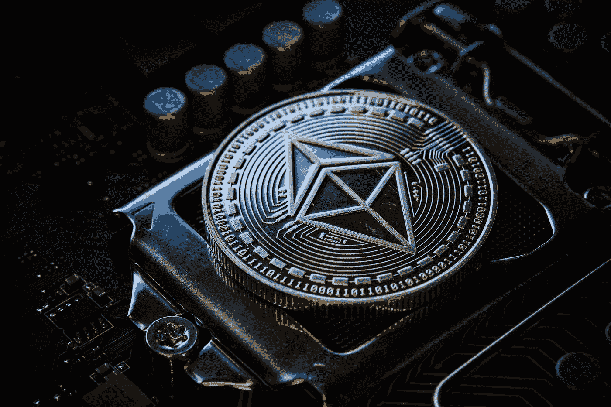

# 以太坊合并后的下一个大问题

> 原文：<https://medium.com/coinmonks/the-next-big-questions-after-the-ethereum-merge-5b0dd0f1d83f?source=collection_archive---------20----------------------->

Photo by [Michael Förtsch](https://unsplash.com/es/@michael_f?utm_source=medium&utm_medium=referral) on [Unsplash](https://unsplash.com?utm_source=medium&utm_medium=referral)

早上七点钟，T2 向每个人道别

最终，期待已久的合并发生了，而且成功了。感谢项目背后富有弹性的团队。合并发生在周四(15/09/033)或周三(14/09/022)的早些时候，这取决于您所在的时区。合并完美完成，开启了以太坊的股权证明时代，并永久性地改变了以太坊的创建方式和以太坊网络交易的验证方式。

随着合并的完善，以太坊现在已经取消了对其区块链进行加密挖掘的能源密集型过程(工作证明)，而是引入了“赌注”(股权证明)，要求以太网持有者将其资产抵押/抵押给网络，以换取被动收益。这意味着以太坊现在比以前少用了 99.95 的能量。这对环境和以太坊组织来说是一个巨大的胜利。

> **现在合并已经完成，下一步是什么？许多问题突然出现了！EthereumPoW (ETHW)的问题？什么是分片？合并后以太坊会有多分散？以及下一次升级是什么。这篇文章将试图回答这些问题，并评论它将如何影响一般的加密空间。**

## **以太 mPoW (ETHW)**

合并之前的假设是，合并之后可能有也可能没有分叉。(fork 是一个新的链/令牌，诞生于一次重大升级)。

EthereumPoW 是以太坊网络的工作证明(PoW)区块链的复制品，因为它在过渡到利益证明(PoS)共识机制之前。这种区块链是由无法通过以太坊的新协议赚取奖励的矿业集团支持的。

ETHW 是一种新的加密货币，是以太坊从工作证明升级到利益证明的结果。它可以用于支付交易费用，赚取采矿奖励，以及从基于 EthereumPoW 平台构建的去中心化应用程序(dApps)购买商品和服务。这种加密货币现在的交易价格约为 6.56 美元(截至本文撰写之时)，投资者目前可以在包括 FTX 和 Bybit 在内的主要交易所交易该资产。

## **什么是分片？**

分片是计算机科学中的一个常见概念，它是一种水平分割数据库以分散负载的方法。目的是减少网络拥塞，增加每秒交易量。在以太坊环境中，“分片将通过在整个网络上分担处理汇总所需的大量数据的负担，与第 2 层汇总协同工作”。(汇总是当今存在的“第 2 层”技术。)

根据 Ethereum.org 的说法，Sharding 可能在 2023 年的某个时候上市。它将为以太坊提供更多存储和访问数据的能力，但不会用于执行代码。

**为什么要分片？**

*   如果你想让事情去中心化，分片是一个很好的扩展方式。
*   有了分片，验证器将不再需要自己存储所有这些数据。
*   分片最终会让你在个人笔记本或手机上运行以太坊。
*   将增加安全性，因为网络越分散，对表面区域的攻击就越小。
*   会降低硬件要求，让您自己运行客户端。
*   分片提供了数据存储需求的安全分布，使汇总更加便宜，并使节点更易于操作

欲了解更多关于分片的信息，[请访问](https://ethereum.org/en/upgrades/sharding/#:~:text=In%20an%20Ethereum%20context%2C%20sharding,and%20increase%20transactions%20per%20second.)

## **合并后的分权问题。**

去中心化的想法是 crypto 和 Web3 作为一个整体的主要目的，这已经不是什么新闻了。但是，随着以太坊取消了矿工的工作证明共识机制，并采用了股份证明，验证者现在将被要求在他们有资格验证交易之前，向网络抵押或质押至少 32 个以太网。这使得较小的团体有必要创建股份池，将他们的 ETH 组合起来成为验证者，或者加入一个提供股份的交易所。现在大约有价值 210 亿美元的以太坊被下注。

因为股权证明更多地依赖于用户购买、持有和押注大量的 ETH。一些分析家将这次合并描述为走向集中化的一步。令人担忧的是，一个或两个中央组织将能够控制谁处理事务，处理哪些事务，以及将来进行哪些升级。

最近的一份 Dune Analytics 报告证实，以太坊的两个最大股东目前是拥有 416 万 ETH (30.1%)的利多和拥有 200 万 ETH (14.5%)的比特币基地。归类为“其他”的其余股东拥有 365 万 ETH (26.5%)。

## **上海以太坊什么时候更新？**

上海的更新被认为是以太坊网络的下一个重大更新。升级预计将在 2023 年的某个时候进行。刚刚结束的以太坊合并受到如此多的关注，上海的更新似乎有点不为人知。以下是上海更新需要了解的内容。

根据 Tim Beiko(以太坊的核心开发者之一)的说法，上海更新将解决围绕以太坊的 3 个重大问题。这些问题包括:EVM 对象格式的变化、信标链撤销和第 2 层费用降低。我们来进一步解释一下；

*   EVM 对象格式将代码从数据中分离出来。这对链上验证器非常有帮助。
*   对于信标链撤回延迟，更新将允许以太坊持有者撤回他们存放的以太网，这在以前是不可能的。
*   最后，对于第二层费用的减少，升级引入的变化将有效地降低以太坊流行的天然气价格。将通过均衡块大小和扩展块的呼叫数据功能来进行修改。

## **结论**

虽然以太坊的合并是成功的，但这些和许多其他问题将继续影响围绕以太坊及其生态系统的讨论。

我希望你从这篇文章中得到价值。别忘了在评论区留下你的想法。

注:此处 A.M 代表合并后，B.M 代表合并前。

本文仅供参考，绝不应被视为财务建议。

> 交易新手？试试[密码交易机器人](/coinmonks/crypto-trading-bot-c2ffce8acb2a)或者[复制交易](/coinmonks/top-10-crypto-copy-trading-platforms-for-beginners-d0c37c7d698c)