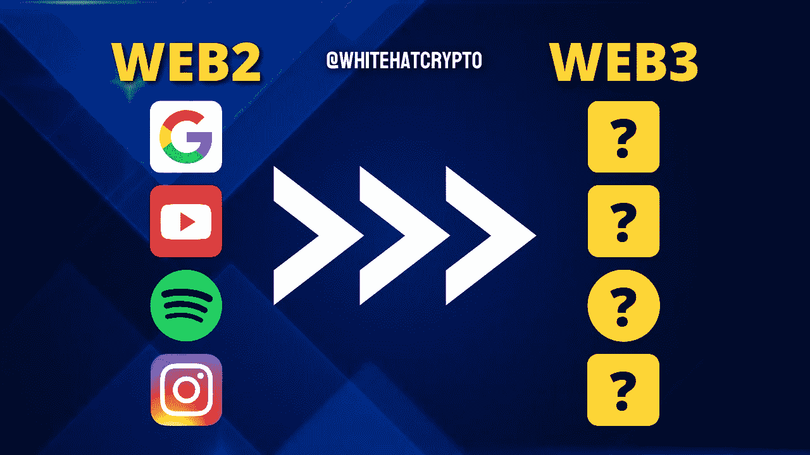
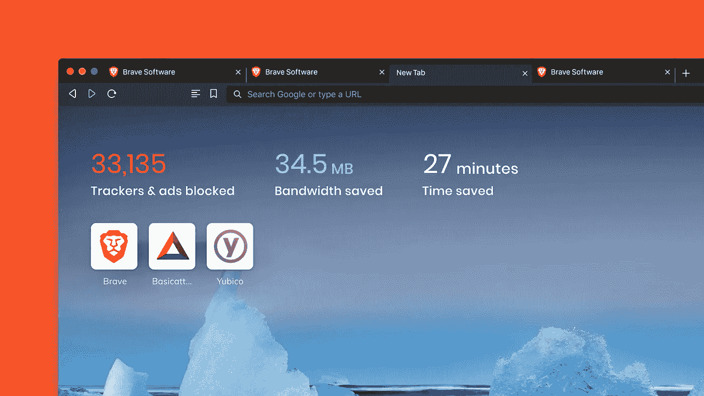
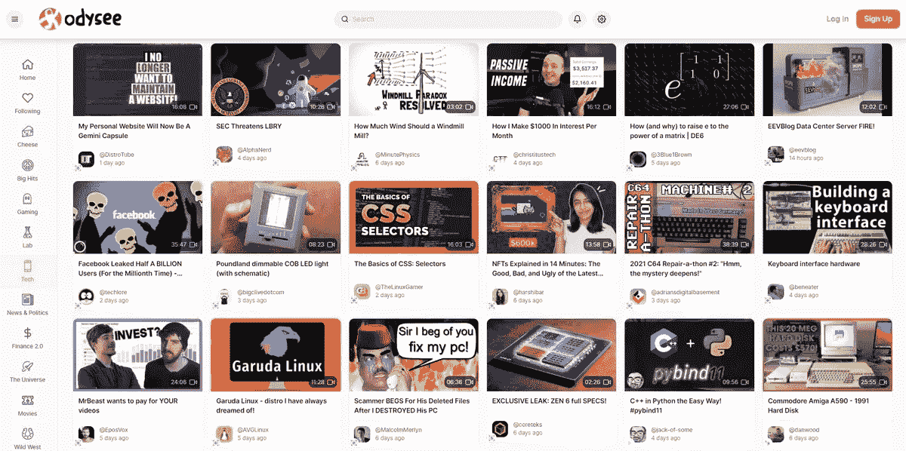
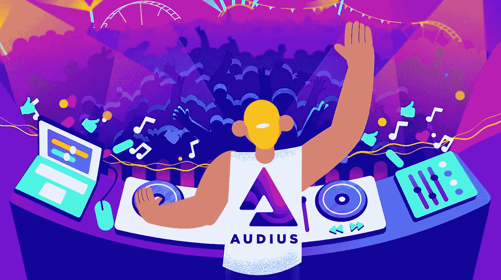
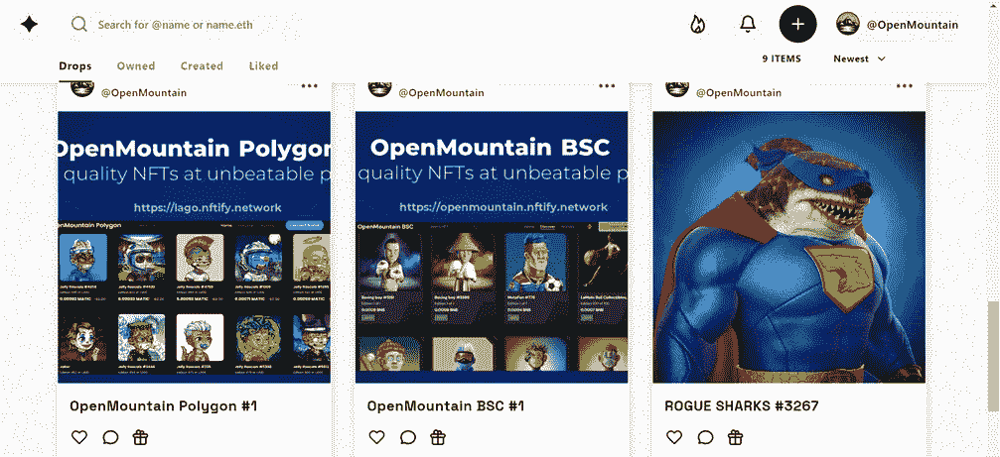

# Web3 中的下一个 Google、YouTube、Spotify 和 Instagram 就在这里！

> 原文：<https://medium.com/coinmonks/the-next-google-youtube-spotify-instagram-in-web3-is-here-5dbfb2dd84f0?source=collection_archive---------22----------------------->

在 Web3 中，一切都在快速构建。在这里，我将与你分享 Web3 中的下一件大事，它将彻底改变我们的生活！

在 Web3 中，一切都在快速构建。在这里，我将与你分享 Web3 中的下一件大事，它将彻底改变我们的生活！

随着去中心化的到来，许多 dApps(去中心化的应用)寻求取代中心化的应用。这下一代 dApps 包括所有当前应用程序的功能，以及一些令人兴奋的新功能！

随着区块链技术在现实世界中的多种实际应用，特别是以太坊，很明显 Web3 时代不是理论上的。以下是一些常用应用的 web3 替代方案。

(他们是下一个谷歌、YouTube、Spotify 和 Instagram，但更好！)

# 下一个谷歌:

你是否还记得在智能手机上搜索某样东西，然后在笔记本电脑上浏览 YouTube 时看到了一个同样内容的广告？

您在集中式浏览器上做的任何事情，如访问网站、输入凭据或购买产品，都可以被记录下来，并与第三方公司共享，用于营销目的。

这是谷歌赚钱最多的地方！

显然，这种广告策略降低了整体用户体验。因此，有另一种浏览器可以解决所有这些问题！

Brave 是一款安全的互联网浏览器，允许用户在不留下数字足迹的情况下访问网站。它有几个显著的特点，包括:

1.  Brave 上没有广告。
2.  广告奖励([蝙蝠](https://basicattentiontoken.org/)):您可以选择在浏览器上显示广告，并获得 Brave 为观看广告而创建的加密蝙蝠(基本注意力令牌)奖励。
3.  没有数字足迹:与其他互联网浏览器不同，Brave 不会监控你的数据。
4.  节省时间和数据:在 brave 的主页上，你可以看到你节省了多少数据和时间，否则这是不可能的。

Brave 正在快速扩张，人们越来越接受该公司的承诺。

# 下一个 YouTube:

集中式 web2 视频流服务存在几个问题。以 YouTube 为例:

1.  版权问题
2.  骗局和机器人评论
3.  特定主题的审查
4.  创作者的不确定性和低收入

在 2020 年的印度，YouTube 只提供 100 美元——100 万次观看需要 400 美元。

为什么 YouTube 因为创作者创作的视频而占用了很大一部分收入，而整个公司却在运转？

但是如果有一些东西是以创造者为中心而不是以金钱为中心的呢？

答案是 [Odysee](https://odysee.com/) ！

与其他科技巨头不同，Odysee 是由构建区块链系统 LBRY 的同一团队开发的。Odysee 的运作方式与 YouTube 完全不同，后者将视频上传保存在中央服务器上。

它将资料上传到网络，网络中的设备分发数据并在线维护，LBRY 区块链只包含文件的位置。

因为材料共享是点对点(直接)的，而不是通过像 YouTube 这样的中介，创作者保留所有权并收取报酬，没有任何中介参与。

# 下一个 Spotify/Apple Music/ YouTube 音乐:

今年，音乐流媒体业务的总收入超过 80 亿美元！令人沮丧的是，这些收入中只有一小部分分配给了世界各地的艺术家。

通常情况下，艺人是由各大厂牌付费的，也就是说 Spotify 从收益中拿一部分给厂牌。唱片公司在付钱给艺人之前也会抽取一部分。

根据 iGroove Music 的数据，2020 年 100 万次收听的 Spotify 付费从阿根廷的 850 美元到挪威的 5479 美元不等。

一个艺术家需要 22 万到 140 万个流才能接近美国最低工资(1200 美元)。

但是我们都知道 Web3 不会满足于此！这就是为什么 [Audius](https://audius.co/) 是音乐流媒体行业的下一个大事件！

任何音乐艺术家都可以在 Audius 上上传素材并赚钱。

没有任何要求，如注册一个标签或有一个庞大的粉丝群。Audius 还为里程碑式的艺术家颁发音频代币，例如在每周五大流行歌曲和播放列表中。

包括超过 600 万的月用户，该网站增加了超过 10 万名艺术家。Audius 在整个免费音乐服务中提供最优质的声音，支持 320kbps 的流媒体和下载。

目前，音乐业务收入中只有 12%归创作者所有，但奥迪斯希望将这一数字提高到 90%。这是可行的，因为没有中间人，艺术家拥有自己的歌曲。

# 下一个 Instagram:

Instagram 每月约有 10 亿活跃用户，是世界上增长最快的社交网络平台之一。

但残酷的事实是，它收集了你的位置、兴趣和在不同应用程序部分花费的时间等信息。在提供定制广告之前，它会比较你在脸书、Messenger 和 WhatsApp 等 Meta 平台上的数据。

[Showtime](https://showtime.xyz/) 是 Web3 对所有这些的解决方案！

Showtime 是 NFT 的一个社交网络，可以让你找到并观看数字艺术。它就像是一个分散的 Instagram for NFTs。您可以创建个人资料并关注个人。您可以在任何平台上看到您的 NFTs，包括 SuperRare OpenSea、Foundation 和 Nifty Gateway。

这仅适用于 NFTs，尽管当前的社交媒体很有可能变得分散化。

有几个应用程序，如[乙醚](https://getaether.net/)、[乳齿象](https://getaether.net/)、[头脑](https://www.minds.com/newsfeed/subscriptions)、[散居者](https://diasporafoundation.org/)和 [MeWe](https://mewe.com/) ，为全球提供了一个更好的去中心化的社交媒体，我们可以在其中控制我们的数据，不受当前社交媒体所提供的操纵内容广告的影响。

这篇文章中提供的内容不是赞助的，据我所知是正确的。这篇文章不是金融建议，我们不对针对这篇文章采取的任何行动负责！

请随时查看我们的社交平台，了解每日加密更新，或通过以下渠道联系我们:

[YouTube](https://www.youtube.com/channel/UCjfinzatswbVaRd89zn5kJQ/featured)

[推特](https://twitter.com/whitehatcrypto)

[Instagram](https://instagram.com/white.hatcrypto?igshid=YmMyMTA2M2Y=)

[Gmail](http://cryptowhitehat@gmail.com/)

信息来源:弗林特

> 交易新手？试试[加密交易机器人](/coinmonks/crypto-trading-bot-c2ffce8acb2a)或者[复制交易](/coinmonks/top-10-crypto-copy-trading-platforms-for-beginners-d0c37c7d698c)