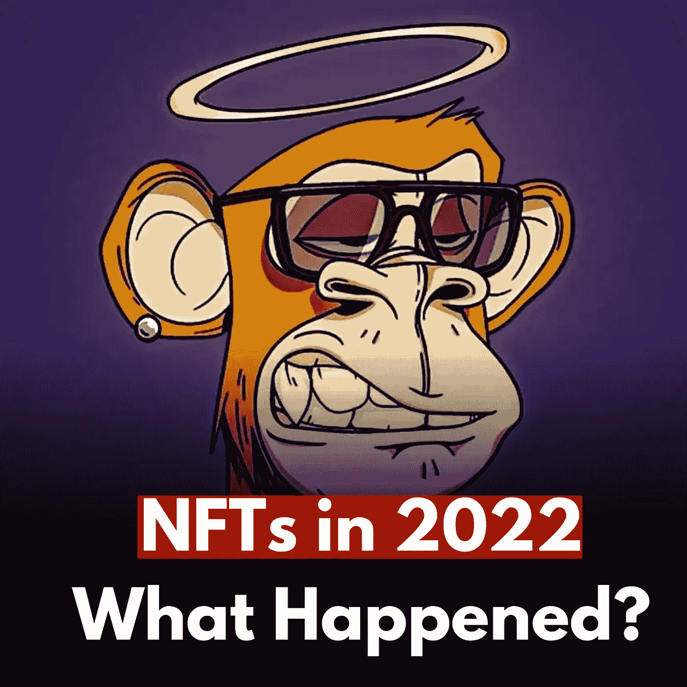
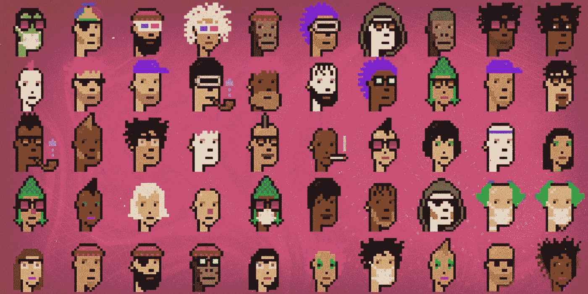
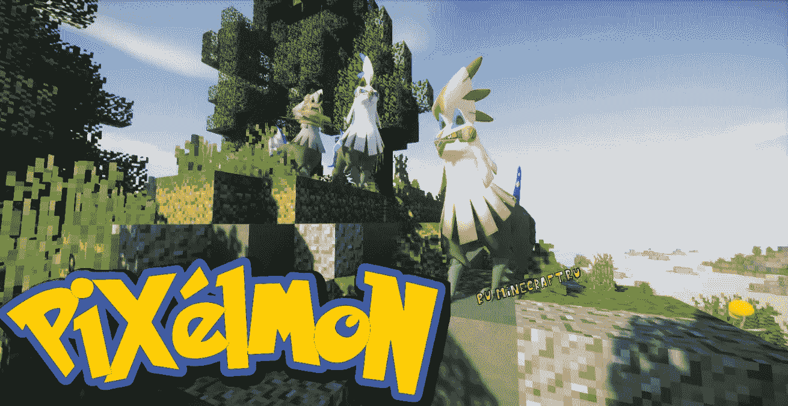
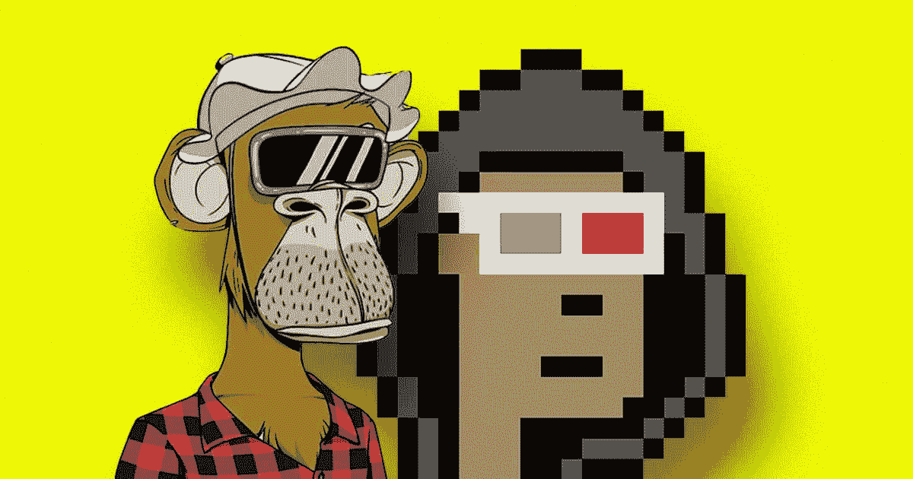
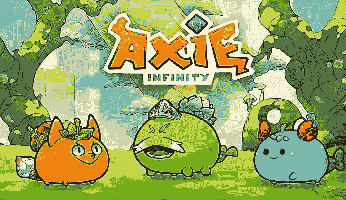
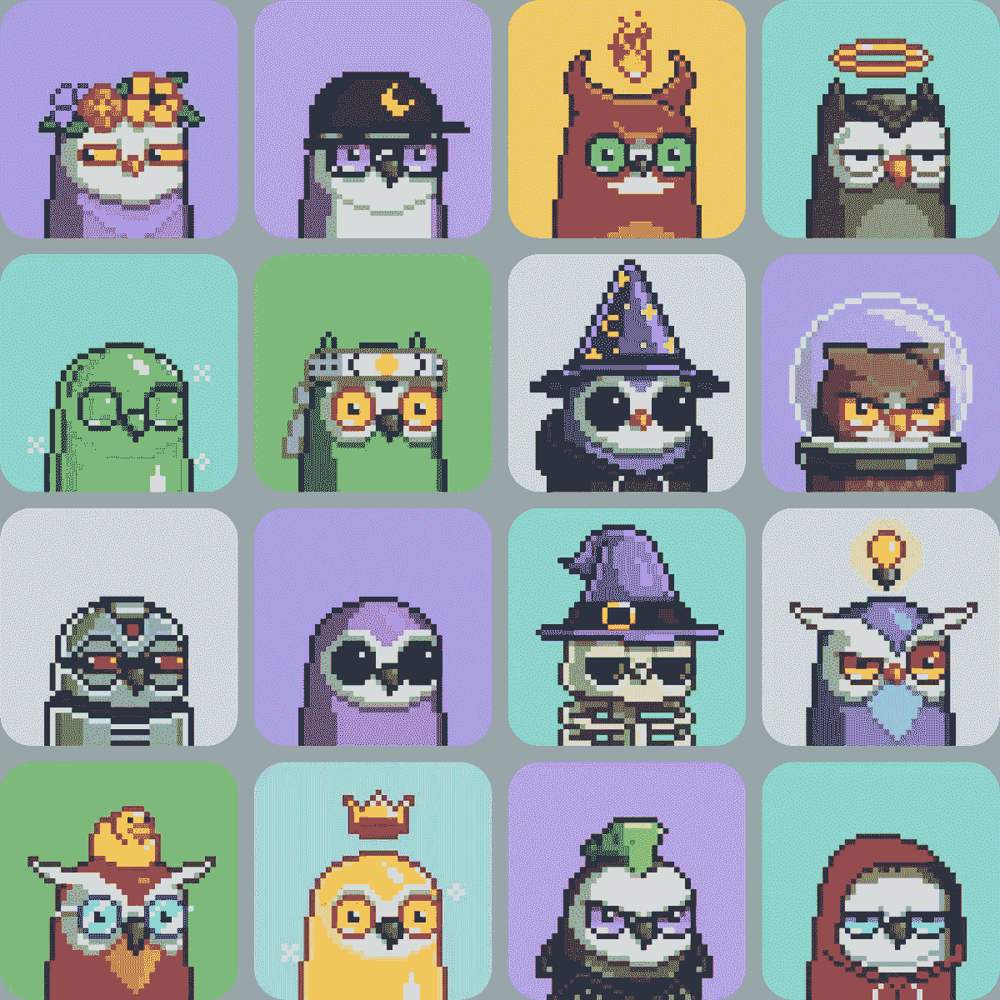
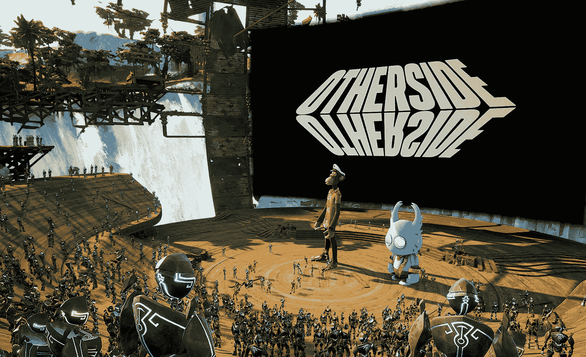
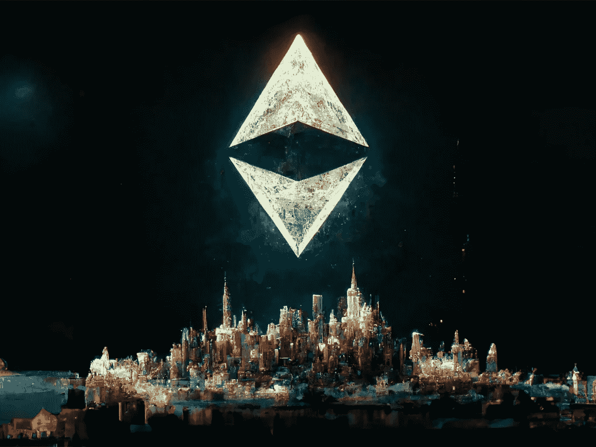
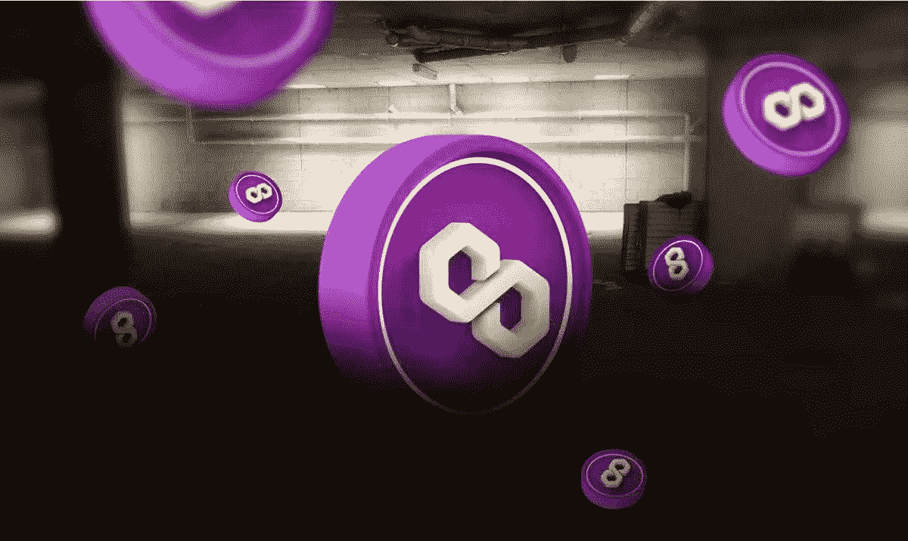

# 2022 年的 NFT 市场:哪些事件影响深远？

> 原文：<https://medium.com/coinmonks/the-nft-market-in-2022-which-events-leave-profound-impacts-a0062e3c85f6?source=collection_archive---------16----------------------->

NFT 市场经历了多事之秋，有积极的变化，也有消极的变化。让我们简单看一下能够塑造 2023 年 NFTs 未来[的显著事件。](/p/38fa1382a772)

 [## 2023 年的 NFT 市场会发生什么？

### 密码市场今年经历了一场真正的混乱。许多大公司灾难性的倒闭和破产…

medium.com](/coinmonks/what-will-happen-in-the-nft-market-in-2023-38fa1382a772) 

在今年早些时候，在加密崩溃及其传染性影响出现之前，不可替代令牌(NFT)曾备受瞩目。这可能标志着大部分投机狂热的结束。

> 不知道什么时候买卖，试试[复制交易](http://coincodecap.com/go/bityard)。

然而，情况可能更乐观。同意有一些道路颠簸，但我们应该提到一些亮点，活跃的空间。例如，使用 NFT 艺术品开发品牌和项目的激增！

NFT 经历了动荡的一年。这篇文章分享了 2022 年 T4 主导 NFT 的时刻，这样你就可以洞察过去、现在和未来的潜在趋势。

 [## NFTs 2023 预测:展望未来的回顾

### 支持 NFTs 的著名企业家 Gary Vaynerchuck 提到了一些严重影响 NFT 市场的因素…

medium.com](/coinmonks/the-forecasts-of-nfts-2023-a-look-back-for-a-look-forward-9399e36fafed) 

# 百威淡啤有了一种使用名词的新方法

*Bud Light and Nouns for Super Bowl — Source: Decrypt*

名词是一个由[名词道](https://nouns.wtf/)(去中心化的自治组织)组成的 NFT 集合。也是以太坊上的一个实验，目的是提高链上社区的互动。对于不知道的人来说，名词是以太坊授予流行的美式淡啤啤酒公司百威淡啤(Bud Light)的道高价值 NFT 之一。

百威啤酒没有遵循传统的方法，而是与众不同。它在超级碗上把名词眼镜放在易拉罐上，让持有者代表它给名词 DAO 投票。在加里·维纳查克 Web3 咨询公司 Veyner3 的帮助下，该项目取得了成功。它显示了主要品牌以有意义的方式拥抱 Web3 协作的潜力。

# CryptoPunks 创下了销售记录

*CryptoPunks — Source: NFT Now*

尽管今年早些时候有上升的趋势，但创纪录的销售额仍然属于二月份以近 2400 万英镑的价格售出的一首单曲[crypto 朋克 NFT](https://www.larvalabs.com/cryptopunks) 。Deepak Thapliyal 是 Web3 创业链背后的人。他以 8000 以太坊(ETH)的价格购买了这个朋克，这是之前标志性的以太坊个人资料图片(PEP)项目纪录的两倍。在 [FTX 崩溃](/coinmonks/the-ftx-disaster-why-does-it-profoundly-impact-the-crypto-market-f738a1cc7735)的边缘，Deepak Thapliyal 打算卖掉 NFT，但他决定保留这个加密身份符号。

 [## FTX 灾难:为什么它会深刻影响加密市场？

### FTX 的惨败严重影响了许多公司，甚至整个加密行业。因此，许多人把……

medium.com](/coinmonks/the-ftx-disaster-why-does-it-profoundly-impact-the-crypto-market-f738a1cc7735) 

# Pixelmon 灾难

*Pixelmon — TLauncher*

Pixelmon，一款令牌化的怪物游戏，听起来像是口袋妖怪的模仿版。感觉糟透了。人们形容它与其说是一个看起来笨重、四四方方的怪物，不如说是一个概念艺术。甚至它的创始人也说 Pixelmon 的展示是一个“可怕的错误”。一个新的团队加入进来，以获得适当的配置文件和操作。

# 加密朋克现在属于 BAYC 团队

*CryptoPunks and Bored Ape are now in the same house — Source: Futurism*

BAYC，[无聊猿游艇俱乐部](https://boredapeyachtclub.com/)，是一个位于以太坊的 NFT。其创始人宇迦实验室发布了一项重大声明，称 BAYC 从幼虫实验室购买了领先的 CryptoPunks IP 和以元宇宙为中心的 Meebits Avatar IPs。这是一个权力翻倍的举动，因为 NFT 最大的两个项目现在在一个房子下面。

CryptoPunks 和 Meebits 的持有者现在像无聊的猿类一样拥有知识产权商业化权利。此外，宇迦实验室一直致力于建立朋克在艺术界的遗产。

# 免费的钱对猿来说是真实的

无聊猿游艇俱乐部继续推出 ApeCoin，这是总部位于以太坊的区块链上的一种用于元宇宙应用程序的令牌。无聊的猿猴持有者可以在第一天获得价值近 8 万美元的代币。尽管 ApeCoin 的价格已经从最高点下跌了 85%,但 NFT 的持有者还是兑现了现金，并在这个隐秘的冬天很快在发行上赚了大钱。

# Axie Infinity 被黑了

*Axie Infinity — Source: CryptoStars*

Axie Infinity ，一个怪物战斗游戏的免费生态系统，是 NFT 最大的项目，然而它在 2022 年开始时就陷入了困境。它见证了 NFT 和代币价格的急剧下降。3 月下旬的一次黑客攻击让事情变得更糟，价值约 6.22 亿美元的加密资金从游戏的以太坊侧链中被盗。

Robin Network 黑客被认为是由于分散化不足，这为攻击者通过其网桥向以太坊发送欺诈性交易留下了空间。与此同时，美国政府将矛头指向了朝鲜臭名昭著的拉扎勒斯集团。Axie Infinity 开发商 Sky Mavis 筹集了 1.5 亿美元的新资本，以支持受影响用户的退款。黑客通过交易所追回了大约 10%的被盗资金。

# 月鸟开始比赛

*Moonbirds — Source: NFT Now*

在上市后的两天内，Moonbirds 获得了价值约 2.8 亿美元的一级和二级交易量。随后，Reddit 的联合创始人亚历克西斯·奥哈尼安(Alexis Ohanian)筹集了这笔资金。Web3 初创公司 Proof 在 8 月向所有人开放了 Moonbirds 的知识产权商业化权利。尽管引发了争议，Proof 仍然是 Web3 最热门的创业公司之一。

# 另一边有一次爆炸发射

*Otherside and BAYC — Source: TechCrush*

BAYC 的创始人宇迦实验室推出了《彼岸元宇宙》游戏的虚拟地契。无聊猿人的主人获得了免费的有价值的加密资产。它立即帮助猿 NFTs 飙升的价值。

在最初的几天里，Otherside 的推出累积了超过 9 亿美元的一级和二级销售。在此过程中，它帮助顶级市场 OpenSea 创下了单日交易记录。然而，它在设计和以太坊燃气费方面受到了批评，宇迦实验室最终退还了部分费用，但他在投诉面前保持沉默。

# NFT 投机泡沫显示下沉信号

“彼岸”的推出是最新的大幅下跌，但在更广泛的加密崩溃和宏观经济动荡的影响下，NFT 市场也不例外。交易量急剧下降，与 1 月份相比，11 月份的数据每月下降 88%，NFT 数据大幅下降。

Bored Ape 从 4 月下旬的 429，000 美元跌至整个 11 月的 60，000 美元以下。该市场每月的交易量仍超过 5 亿美元。领先的 NFT 项目偶尔会卖出高价，但这种热潮已经消退。

# 《我的世界》将禁止非功能性食物

虽然 NFT 是一种趋势，但一些传统的游戏玩家表示反对 NFT。《我的世界》和它的母公司——微软，宣布他们打算禁止粉丝运营的《我的世界》服务器上的 NFTs。

此外，它禁止衍生项目从《我的世界》目前的游戏资产。此外，主要游戏工作室 Rockstar Games 宣布将禁止《侠盗猎车手 V》服务器上的 NFT。此举导致 NFT 世界决定重新开始，开发自己的同款游戏。

 [## 如何评价一个 NFT 的价值？

### NFT 是一个新的领域，最近引起了公众的极大关注。因此，测量 NFTs 的价值是…

medium.com](/coinmonks/how-to-evaluate-the-value-of-an-nft-d4078f1a98ba) 

# 推特诈骗的黄金时间

社交媒体骗局显示了通过 FOMO 文化操纵人们的真正力量。突出的例子可以在 Discord 和 Instagram 上找到，其中帐户被劫持来传播诈骗链接，以窃取用户的 NFT 来连接他们的钱包。然而，在 Twitter 上却没有那么明显。

现在的趋势是像记者一样窃取并更名已验证的用户，以共享诈骗链接。你可以在“彼岸”和“志那都红豆”这样的项目中找到它。甚至像首席执行官 Gabriel Leydon，Beeple，名词和极限突破背后的人，都是窃取社交账户的受害者。一些公司进行了反击，如 MetaMask 和 OpenSea，但攻击仍然充斥着空间。

 [## NFTs 的未来:幻想还是乐观？

### 非专利技术已经上升到投资者和投资者最值得考虑的投资项目

medium.com](/coinmonks/the-future-of-nfts-illusions-or-optimism-a95f7520786e) 

# 索拉纳的主要球员的开始

索拉纳·NFT 的空间在 2022 年继续固化为一个强大的以太坊竞争对手，这要归功于一些突出的项目，如魔法伊甸园和 DeGods。具体来说，Magic Eden 接管了 Solana space，并在 6 月份带来了 16 亿美元的估值，与 OpenSea 进行了有力的竞争，同时也向以太坊进行了扩张。

与此同时，NFT 个人资料图片项目 DeGods 从 2021 年底的 rocky launch 发展成为今年所有 NFT 平台的真正巨头。它立即成为索拉纳上最有价值的项目。

# 无聊猿扩大 IP 使用

去中心化 IP 的想法在去年见证了一些早期的牵引力，但在 2022 年借助 Snoop Dogg 和 Eminem 的 MV 和 MTV VMAs 表演等高调项目的帮助下，人气激增。此外，引人注目的项目包括推出无聊猿主题餐厅和饮料品牌。

 [## 无聊的猿 NFT:为什么它很贵？

### 无聊猿 NFT 是最著名的 NFT 符号之一，吸引了许多有影响力的艺术家交易或显示所有权…

medium.com](/coinmonks/bored-ape-nft-why-is-it-expensive-61598dc65185) 

# 以太坊合并是一个转盘

*Ethereum Merge — CoinDesk*

合并后的向更加环保的共识模式的转变为 NFT 空间的感知带来了巨大的好处。由于消除了资源密集型采矿，它有助于最大的 NFT 区块链的消耗下降到 99%以上。

 [## 2022 年的密码英雄:那些给密码行业带来清晰的人

### 看起来今年的加密市场不景气。在余波中有许多戏剧…

medium.com](/coinmonks/the-crypto-heros-in-2022-those-who-bring-clarity-to-the-crypto-industry-de76c5b54277) 

以太坊 NFT 的环境影响可能是 NFT 批评家们抱怨最多的，直到合并开始。创造者现在不必担心巨大的能源冲击或碳足迹。

# Polygon 是大品牌对 NFTs 最喜欢的选择

*Polygon — Source: Zipmex*

10 月，Reddit 的一名高管表示，超过 300 万 Reddit 用户创建了 Polygon 钱包，用于铸造其可收藏的头像 NFT。虽然这些免费赠品没有巨大的价值，但它仍然是向大众迈出的一大步。星巴克的 NFT 奖励和 Meta 的 Instagram [NFT 造币](/@libraryoftrader/what-does-minting-nft-mean-everything-you-need-to-know-c14e94e707dd)的平台可以接触到更多的人。

 [## 铸造 NFT 意味着什么？你需要知道的一切

### 介绍

medium.com](/@libraryoftrader/what-does-minting-nft-mean-everything-you-need-to-know-c14e94e707dd) 

# 创作者版税之争

二次销售通常会收取 5%到 10%的版税，返还给原创艺术家或创作者。Web3 将这一特征作为一个关键方面来构建，以确保创作者和建设者分享他们工作的现有成功。

然而，一些市场开始忽视它们，以吸引交易者和投资者远离主要平台。OpenSea 表示，它也采取了同样的举措，但很快就遭遇了创作者的强烈反对。

最终，OpenSea 表示，它将继续执行版税，竞争对手平台 X2Y2 使用了 OpenSea 的新以太坊执行工具。然而，随着创作者试图挽救 Web3 的一个关键收入来源，故事继续发展，新的版税强制执行 NFT 基准和工具。

**你也能找到我们👇**

*   [库的交易员](http://bit.ly/3GQsIiY)
*   [脸书](http://bit.ly/3XyoeTY)
*   [推特](http://bit.ly/3XHQRhK)
*   [领英](http://bit.ly/3ihv3cu)
*   [Reddit](http://bit.ly/3imq76f)
*   [Quora](http://bit.ly/3VcaEUK)
*   [Tiktok](http://bit.ly/3VibUpx)

> 加入 Coinmonks [电报频道](https://t.me/coincodecap)和 [Youtube 频道](https://www.youtube.com/c/coinmonks/videos)了解加密交易和投资

# 另外，阅读

*   最佳加密[硬件钱包](/coinmonks/hardware-wallets-dfa1211730c6) | [Bitbns 评论](/coinmonks/bitbns-review-38256a07e161)
*   [新加坡十大最佳加密交易所](https://coincodecap.com/crypto-exchange-in-singapore) | [购买 AXS](https://coincodecap.com/buy-axs-token)
*   [红狗赌场评论](https://coincodecap.com/red-dog-casino-review) | [Swyftx 评论](https://coincodecap.com/swyftx-review)
*   [投资印度的最佳密码](https://coincodecap.com/best-crypto-to-invest-in-india-in-2021)|[WazirX P2P](https://coincodecap.com/wazirx-p2p)|[Hi Dollar Review](https://coincodecap.com/hi-dollar-review)
*   [加拿大最佳加密交易机器人](https://coincodecap.com/5-best-crypto-trading-bots-in-canada) | [库币评论](https://coincodecap.com/kucoin-review)