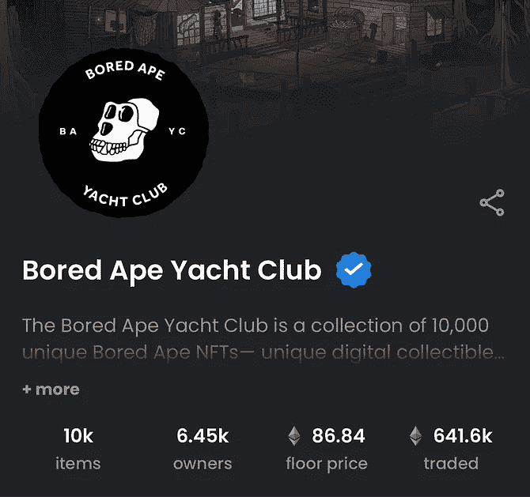
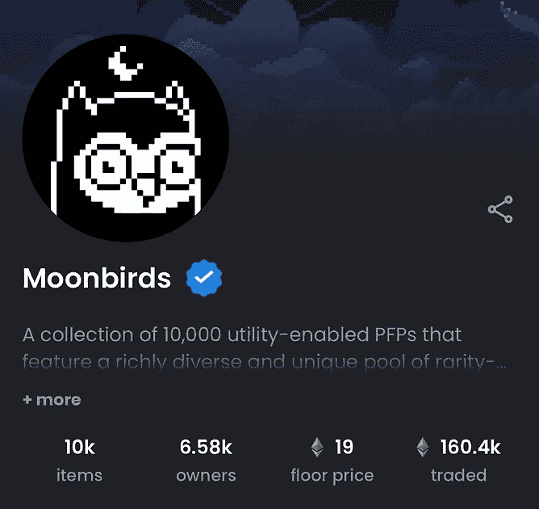
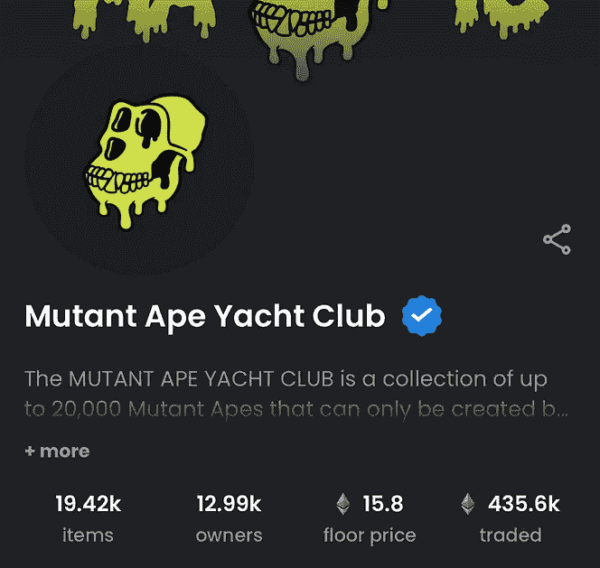
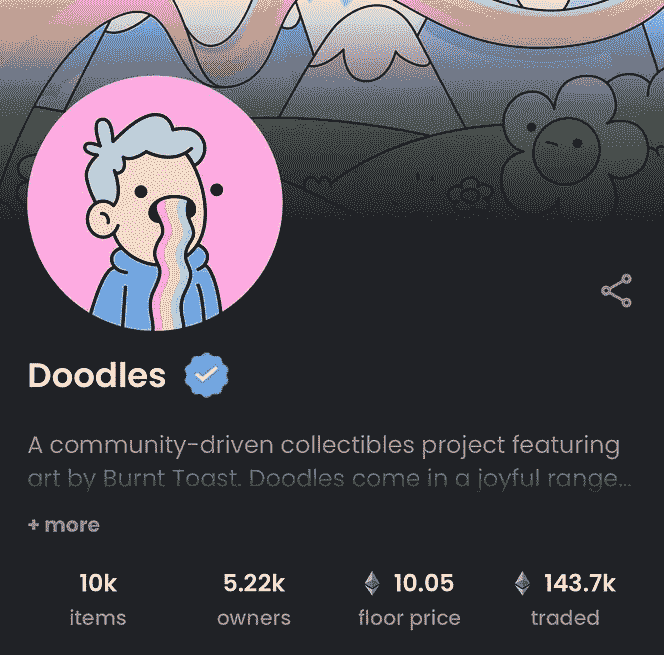
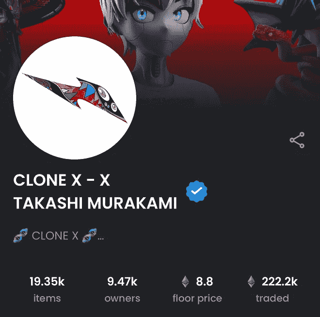
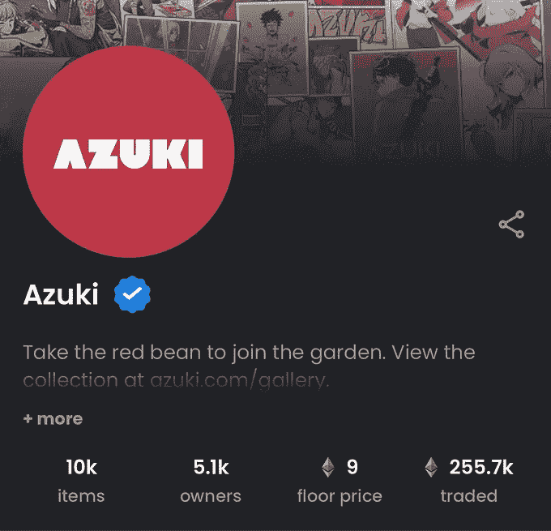

# NFT 市场的回调——为什么你所有的 JPEGs 图片都下跌了

> 原文：<https://medium.com/coinmonks/the-nft-market-pullback-why-all-your-jpegs-are-down-b42f21088117?source=collection_archive---------15----------------------->

整个 NFT 市场目前正经历大规模回调。根据 OpenSea 的数据，蓝筹以太坊 NFT 处于一年多以来的最低水平。

一段时间以来，NFT 股市一直不景气，但过去几个月，蓝筹股项目大多保持了不错的水平。然而，随着经济环境的恶化，曾经看起来有趣、有利可图的投机 JPEGs 文件突然看起来不那么好了。

以下是以太坊顶级项目的当前楼层:

**百无聊赖的猿:87 ETH**

**月鸟:19 ETH**

**变异猿类:16 ETH**

**涂鸦:10 ETH**

**CloneX: 9 ETH**

**志那都红豆:第九届**

随着 NFTs 的缩水，ETH 的价值是今年早些时候的一半，任何在过去几个月投资于投机性 JPEGs 的人都将面临相当大的损失。

"当经济的其他部分不景气时，人们不需要 JPEG 可收藏的图像."—皮奥，漂亮的阿尔法

尽管过去两周的反弹给市场带来了一些希望，但现在似乎很清楚，这是一个牛市陷阱，上钩的摇摆交易者下跌了不少。

尚不清楚 NFT 股市何时会反弹，也不清楚它是否会反弹。当我们看到交易者亏损 10000-40000 美元时,“只涨不跌”季节的快乐时光现在感觉像是遥远的记忆。

如果你能负担得起，就暂时保留你的 jpegs 图片。据推测，我们可能会在中期选举前看到一些量化宽松政策，这可能会提供一些暂时的缓解。

在那之前，将会是一个漫长、寒冷、隐秘的冬天。

一如既往地感谢您的阅读。

看看我在推特上未经过滤的想法:

[https://twitter.com/wasifmrahman](https://twitter.com/wasifmrahman)

在 LinkedIn 上关注我的职业生涯:

[https://www.linkedin.com/in/wasifmrahman/](https://www.linkedin.com/in/wasifmrahman/)

我对媒体的另一个想法是:

 [## 瓦西夫·拉赫曼-中号

### 阅读瓦西夫·拉赫曼在媒介上的作品。Web 3 德根 Ex Populus 营销伙伴关系总监。每天…

medium.com](/@wasifmrahman) 

> 交易新手？尝试[加密交易机器人](/coinmonks/crypto-trading-bot-c2ffce8acb2a)或[复制交易](/coinmonks/top-10-crypto-copy-trading-platforms-for-beginners-d0c37c7d698c)