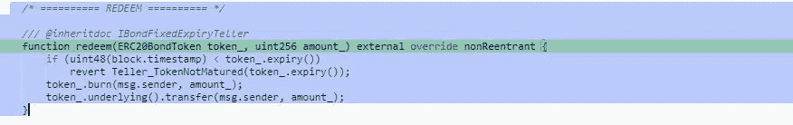

# 奥林巴斯道黑客事件详情(2022 年 10 月)

> 原文：<https://medium.com/coinmonks/the-olympusdao-hack-is-detailed-october-2022-57dbfc4e9207?source=collection_archive---------22----------------------->

## OlympusDAO 事件说明了在 DeFi 时代优先考虑安全是多么重要。通过使用安全审计、漏洞奖金和类似的最佳实践，区块链项目可以免受昂贵的黑客攻击。

2022 年 10 月 21 日星期五，一个恶意演员利用智能合同漏洞，从奥林巴斯道拿走了 30，437 欧姆代币。事后发现，价值约 30 万美元的欧姆代币被黑客窃取。

OlympusDAO 的 BondFixedExpiryTeller 合约的 rename()函数中的一个错误导致了价值约 292，000 美元的损失。不久之后，黑客将被盗资产恢复到协议中，奥林巴斯 DAO 在随后的更新中通知了用户。

债券契约中的 OHM 令牌可能会被攻击者兑换，因为 rename()函数无需任何输入验证即可接受令牌，并使攻击者能够使用他们自己的恶意契约。由于恶意契约将在攻击者手中，他们将完全控制他们为“amount_”参数提供的值。作为结果，由 msg.sender 代表的攻击者将接收相同数量的欧姆令牌。然后，攻击者可能会赎回并转移所有代币！

## 最后的话

总是仔细检查和清理用户输入。确保每一段代码都是公众可以访问的，并且经过彻底的审计。如果你想防止黑客在获得用户控制权的情况下偷走所有的钱，那么合同必须包含访问控制程序。如果一个项目团队低估了流动性池中代币的价值，不道德的行为者可能会利用聪明的合同漏洞来攻击用户的快速贷款。

> 交易新手？试试[加密交易机器人](/coinmonks/crypto-trading-bot-c2ffce8acb2a)或者[复制交易](/coinmonks/top-10-crypto-copy-trading-platforms-for-beginners-d0c37c7d698c)