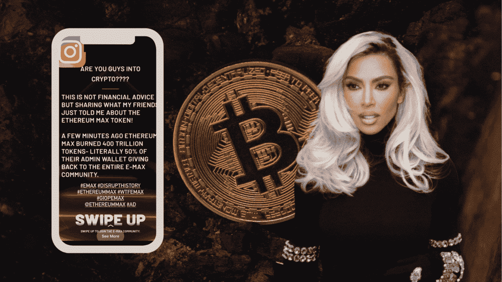
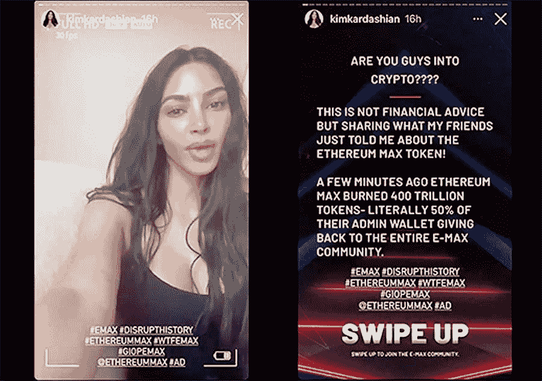

# 花费金·卡戴珊 126 万美元的 Instagram 帖子

> 原文：<https://medium.com/coinmonks/the-one-instagram-post-that-cost-kim-kardashian-1-26m-f15789bf9cb5?source=collection_archive---------19----------------------->

Kim Kardashian got fined $1.26M by the SEC, but she isn’t the only celebrity shilling shady crypto projects.

金·卡戴珊对加密货币了解多少？

似乎不多。

但她身价 18 亿美元，Instagram 粉丝超过 3.31 亿。

不管我们同意与否，当她发布一张照片或说些什么时，人们都会听。

当她向她的追随者推销自己的服装系列或化妆品时，这很好。

但当她开始兜售和兜售以太坊 Max 等加密货币，鼓励人们购买和炒作时，这就开始越界了。

“美国证券交易委员会周一宣布对金·卡戴珊的指控，罪名是[推广一种加密货币](https://www.axios.com/2022/01/13/kim-kardashian-crypto)，但没有透露她为此获得了报酬。卡戴珊已经同意支付 126 万美元作为和解的一部分。

当然，这是一笔巨额罚款，但这可能是金在喝完一杯镶金边的拿铁咖啡后会忘记的一笔钱。

The 1 IG post that cost her $1.26M. It doesn’t even sound sincere!

那则广告让她赚了大约 25 万美元，所以总的来说，她还是少了 100 万美元。

当然以太坊 Max，和真正的以太坊毫无关系，不久后就崩溃了，烧成了虚无。

这都是一个骗局，炒作硬币价格，并利用那些不知不觉中模仿的傻瓜来赚钱。

不知道有多少人的投资组合在这个过程中被毁掉了。

最精彩的部分是她对标题的措辞，好像这只是她偶然发现的东西，从来没有表明这是一个付费广告。

狡猾。

这表明我们真的不能相信名人和我们在社交媒体上看到的任何东西。

拜托，伙计们，任何时候你看到某个名人兜售与他们擅长或习惯的东西如此不同的东西，这都是一个危险信号。

名人时尚达人称赞一种加密货币？

嘣，红旗！

退休拳击手吹捧一个未知硬币的优点？

嘣，更红的旗！

但是当然，我们都知道那些相信这些计划的人并不像你我一样受过良好教育和精明。

这是普通人，辛勤工作的人，忠实的球迷谁不习惯或不熟悉密码摆在首位。

那些人相信像金这样的名人，当地毯被拉到他们下面时，他们最终会被狠狠揍一顿。

Kim’s a billionaire, along with her highly successful and wealthy family.

那么这是否意味着…她错了？

或许，但更重要的是，这是美国证券交易委员会希望向所有其他名人传递的信息。

他们在看。

他们警告:你不能在不向公众披露的情况下兜售加密或任何其他形式的投资。

对于我们这些没有金正日的长相、财富或欺骗他人嗜好的普通人来说，在 web3 世界里，只要格外小心你点击和同意的内容就行了。

更严重的是，25 万美元一个帖子的目标是近 3 亿人，即时+即时名人支持。

做一些餐巾数学，每 1 美元，广告到达 1200 人。

嗯，毫无疑问，这可能是有史以来最便宜的付费广告了！

我打赌她也有很多以太坊 Max 代币。

我仍然打赌一个金高银很快就会出现。

-

名人吹捧加密货币是对的吗？

-

#初创公司#商业# startupx #成长#成功#社交媒体#文化#企业家精神#战略# eth # btc #加密#金卡戴珊#金#先令# NFT # sec fine #加里根斯勒

> 交易新手？试试[加密交易机器人](/coinmonks/crypto-trading-bot-c2ffce8acb2a)或者[复制交易](/coinmonks/top-10-crypto-copy-trading-platforms-for-beginners-d0c37c7d698c)