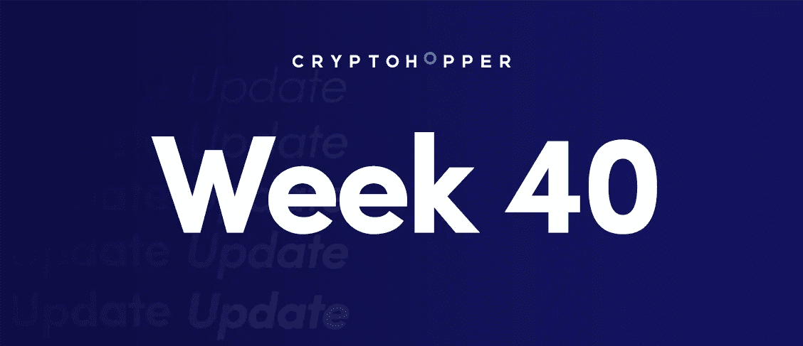
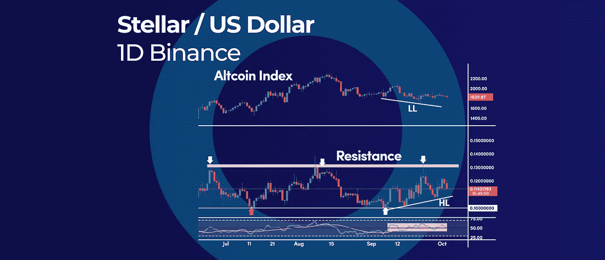
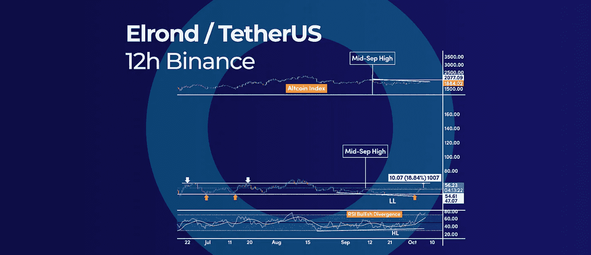

# 你唯一需要知道的以太坊合并后的更新|以及本周更多的加密更新。

> 原文：<https://medium.com/coinmonks/the-only-ethereum-post-merge-update-you-need-to-know-and-more-in-this-weeks-crypto-update-b0744ecc0953?source=collection_archive---------18----------------------->

The Only Ethereum Post-Merge Update You Need to Know | And More in This Weeks Crypto Update.

*   加密货币恒星的相对强度警报
*   埃尔隆德多头 RSI 背离呼吁至少 10 美元的反弹
*   您需要知道的唯一以太坊合并后更新

# 加密货币恒星的相对强度警报

Stellar (XLM)是少数几个在整体市场疲软的情况下保持克制的加密货币之一。与基准的 Altcoin 指数相比，加密货币 XLM 表现出相对强势。XLM 价格和比特币指数之间的背离无疑是一个看涨信号。

## XLM 相对实力

相对强势警报正在显现，因为 XLM 的价格出现了更高的低点，而与此同时，跟踪整体市场表现的 Altcoin 指数出现了更低的低点。这表明 XLM 比整个加密市场更强大。

相对强弱信号通常是趋势反转前的先行指标。

我们在这里写了一篇关于相对强弱指数 RSI [的博客。](https://www.cryptohopper.com/blog/7544-crypto-trading-101-what-is-the-relative-strength-index-rsi-and-how-to-use-it)

## XLM 支持级别

自 5 月中旬以来，0.10 美元的大心理水平一直作为强支撑位支撑下行。这个支撑位有 4 次测试，但每次都是多头来救市。

短期来看，如果看涨势头持续，我们可能会重新测试 0.130 美元和 0.138 美元之间的阻力区域。如果日线突破并收盘于该阻力区上方，将为再次测试 6 月高点 0.158 美元左右打开大门。

## RSI 指标

相对强度指数(RSI)在 50 的中间水平附近徘徊，发出了复杂的信号。这种行为表明我们仍处于整合期。在这方面，我们只能期待测试盘整的顶部，位于 0.15 美元左右的水平。

## 什么是恒星 XLM？

Stellar 是一种加密货币，创建于 2014 年。由 XLM 符号表示的货币是基于 Ripple 协议的。它旨在为跨境支付提供一个分散的平台，并有一个内置的交易所。Stellar network 还提供分布式分类账，用于记录金融交易。

# 埃尔隆德多头 RSI 背离呼吁至少 10 美元的反弹

埃尔隆德(EGLD)已经打印了一个看涨的 RSI 背离，支持更多的上行空间，至少在下一个 63 美元附近的阻力再次被测试之前。此外，与整体加密货币市场相比，埃尔隆德表现出了相对优势。这两个技术因素共同为埃尔隆德价格提供了一个短期看涨的前景。

## 什么是埃尔隆德？

埃尔隆德是一个区块链平台，支持高吞吐量和低延迟交易。它使用一种新颖的分片方法来实现可伸缩性。埃尔隆德有一个本地令牌 ESD，用于支付交易费用。埃尔隆德网络由由赌注者运行的节点提供动力。利益相关者因其参与而获得 ESD 奖励。

## 多头 RSI 背离

EGLD 和相对强弱指数(RSI)振荡指标之间的强烈看涨背离出现在当前范围的底部，靠近 47 美元支撑位。随后出现的反弹似乎并没有失去动力。

此外，价格已经在多个时间框架内形成多头 RSI 背离，表明可能出现更大反弹。

阻力最小的路径是上行，因为在 63 美元和 65 美元之间没有明显的阻力水平。

# 您需要知道的唯一以太坊合并后更新

以太坊从[工作证明(POW)](https://www.investopedia.com/terms/p/proof-work.asp) 模式过渡到[利益证明(POS)](https://www.investopedia.com/terms/p/proof-stake-pos.asp) 模式——更广为人知的是“合并”自 9 月 15 日以来，ETH 的价格下跌了 25%以上，但从长期来看，更重要的是，随着 POS 切换，网络发行利率也出现了暴跌。

## 以太坊合并更新

从 POW 到 POS 的转换意味着矿工已经被押了 ETH 的验证者所取代。ETH 令牌组学的这一重大变化引发了 ETH 发行率近 95%的下降。本质上，以太供应的减少使得以太坊更加通货紧缩。

根据 ultrasound.modey 的实时统计数据，自合并以来(截至 2022 年 10 月 3 日)，已发放了 10，894 个 ETH。

相比之下，如果工作证明(POW)模型仍在运行，自 9 月 15 日以来，矿工将生产 223，738 ETH。

这表明乙醚的供应量明显减少，证明了合并具有很大的通货紧缩效应的理论。

合并后的统计数据还显示，考虑到 EIP-1559 的升级和合并，每年将生产 603，000 个新的乙醚，相比之下，旧的 POW 型号将生产 4，931，000 个新的乙醚。

截至今天，以太坊的供应量目前为 122，629，383 以太，总交易价值为 1580 亿美元。

随着时间的推移，ETH 变得越来越稀缺，这种供应冲击加上未来对加密货币的需求增加，将在长期内支持 ETH 价格的上涨。

订阅我们的媒体每周博客和更新。
在[推特上关注我们](https://twitter.com/cryptohopper) | [脸书](https://www.facebook.com/cryptohopper)|[Reddit](https://www.reddit.com/r/CryptoHopper/)|[insta gram](https://www.instagram.com/cryptohopper/?hl=nl)

在 [Cryptohopper](https://www.cryptohopper.com/) 开始交易！

> 交易新手？尝试[加密交易机器人](/coinmonks/crypto-trading-bot-c2ffce8acb2a)或[复制交易](/coinmonks/top-10-crypto-copy-trading-platforms-for-beginners-d0c37c7d698c)