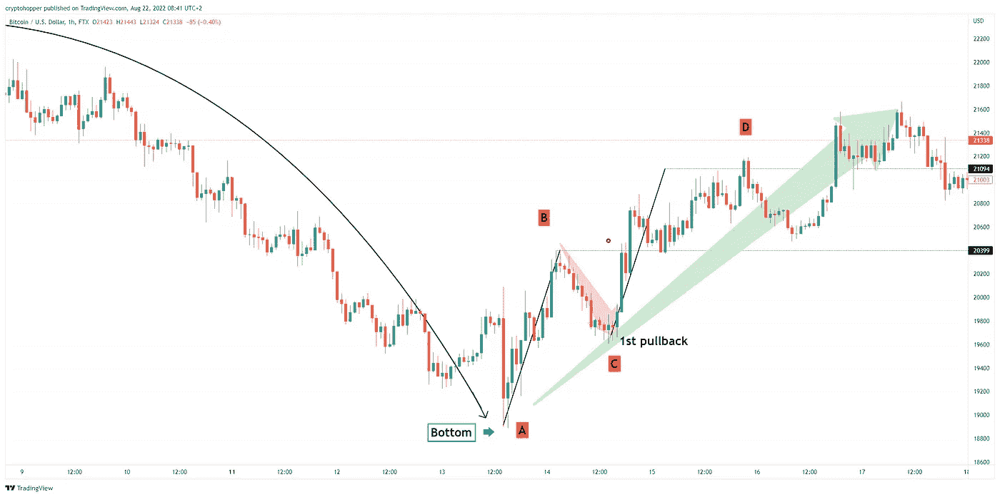
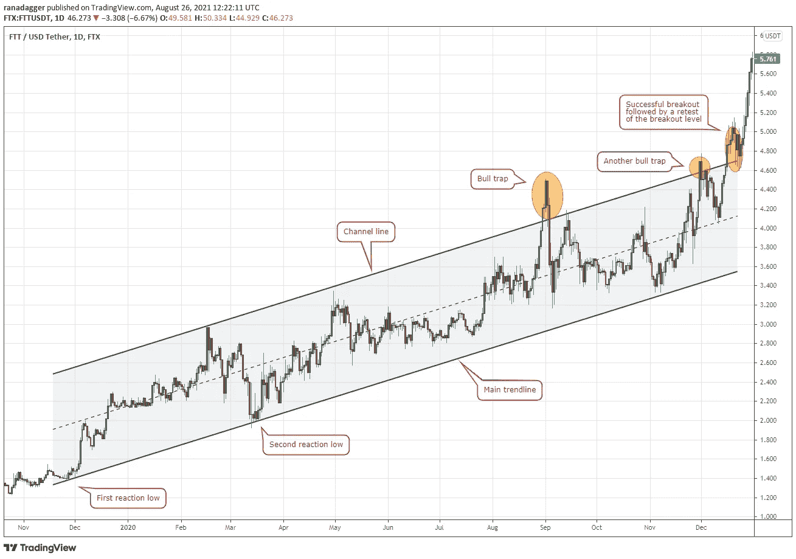

# 你需要知道的唯一提示是尽早购买蘸酱

> 原文：<https://medium.com/coinmonks/the-only-tip-you-need-to-know-to-buy-the-dip-early-979dda6be9b4?source=collection_archive---------16----------------------->

控制买入 dip 的原则在任何市场都是一样的，包括加密货币市场。通俗地说，买入 dip 是一种策略，包括在价格下跌后购买加密资产。

# 如何早点买到蘸料

如果你不想在“下跌的刀”前跳跃，并且想要一个更安全和更保守的方法以折扣价购买 crypto，最好的方法是在第一次回调时购买。这意味着我们给市场时间建立底部，并在第一次回调时进入。

用这种方法进入市场可以让你在新趋势开始时就行动起来。

让我们来探讨一下这个交易技巧，以及在扣动扳机之前你需要寻找什么信号。

# 信号#1 市场结构的打破

你需要掌握的第一个概念是，价格结构突破或市场动能变化的第一个迹象是价格创出更高的低点。这是一个潜在的底部形态正在形成的信号。

更高的低点是力量的标志，表明看跌的势头正在消退。

# 信号#2 AB=CD 模式

需要知道的最重要的一点是，趋势经常被 3 波逆势价格运动所逆转。所以，在每个新趋势的开始，你会看到这个价格结构。这种 3 波模式也与 AB=CD 模式相关联。

在这方面，交易第一次回撤最简单的方法是发现或更好地预测 AB=CD 模式，其中 BC 段是实际的回调。

一旦价格突破了 B 浪的高点，这个形态就被确认了，这也是买入低点的进场点。

# 购买蘸酱的另一种选择

## 利用上升通道买入下跌

上升通道背后的想法是，当加密市场上涨时，你应该在上升通道中间购买加密。这一战略在过去非常有效，今后也将继续有效。因此，如果你有兴趣购买加密，请务必遵循这些提示。

1.  跟随趋势——如果你看到一个资产在上涨，跟随趋势是很重要的。这意味着在资产交易价格达到最高点时买入，在交易价格降到最低点时卖出。
2.  识别关键支撑位和阻力位——上升通道通常在关键支撑位或阻力位附近形成。这意味着密切监控这些水平以决定何时买入或卖出是很重要的。
3.  保持纪律性——重要的是不要被你的投资决定冲昏头脑。记住，上升通道是一个长期策略，所以你需要长期投资才能赚钱。

*最初发表于*[*【https://www.cryptohopper.com】*](https://www.cryptohopper.com/blog/7565-the-only-tip-you-need-to-know-to-buy-the-dip-early)*。*

> 交易新手？尝试[加密交易机器人](/coinmonks/crypto-trading-bot-c2ffce8acb2a)或[复制交易](/coinmonks/top-10-crypto-copy-trading-platforms-for-beginners-d0c37c7d698c)