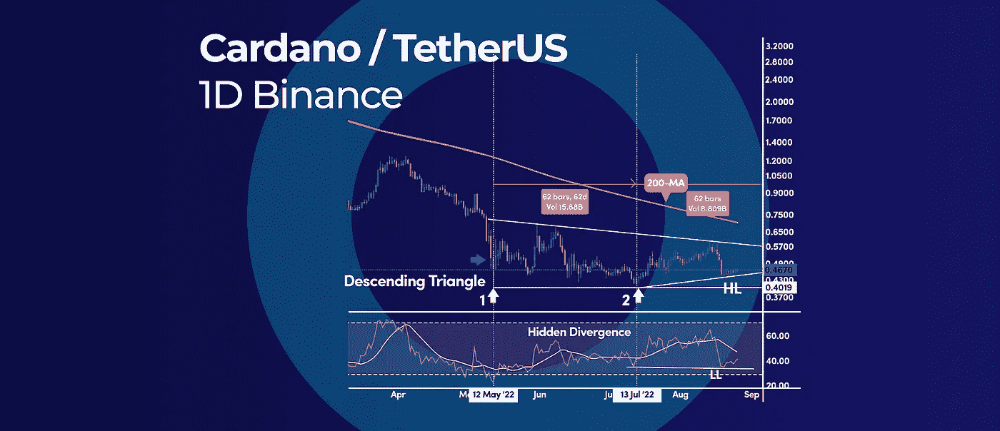

# 你需要知道的唯一提示是尽早购买 Dip 以及本周的加密更新。

> 原文：<https://medium.com/coinmonks/the-only-tip-you-need-to-know-to-buy-the-dip-early-and-more-in-this-weeks-crypto-update-3168b5910200?source=collection_archive---------32----------------------->

The Only Tip You Need to Know to Buy the Dip Early | And More in This Weeks Crypto Update.

*   索拉纳 21 周周期呼吁 9 月见底
*   卡尔达诺潜在的三重底部形态在 0.40 美元
*   你需要知道的唯一提示是尽早购买蘸酱

# 索拉纳 21 周周期呼吁 9 月见底

Solana 21-Week Cycle Calls for a September Bottom

市场周期似乎指出，索拉纳(SOL)将在 9 月初建立一个周期性低点。SOL 的价格以 21 周为周期运行，这表明我们大约每 21 周就会达到一个高点或低点。

## 索拉纳 21 周周期

周期不能孤立地运行，因为我们不能期望每 21 周有一个精确的周期性低点或高点。然而，自成立以来，SOL 的价格每 21 周经历一次重大价格事件，如下所示:

*   2020 年 8 月 31 日高
*   2021 年 1 月 25 日，我们打破了历史新高。实际低点发生在 2020 年 12 月 21 日
*   2021 年 6 月 21 日低
*   2021 年 11 月 15 日的高点是接下来 21 周的事件，但实际的历史高点是在两周前打印的
*   2022 年 4 月 11 日高
*   21 周周期预测下一个重大事件发生在 9 月 5 日，由于主要趋势是熊市，我们可以预计在这个日期左右会出现一个低点。

我们也可以区分在这个结构中起作用的其他更高的周期，例如 37 周的周期，这是非常相关的。

这些周期间隔可以被平均以形成市场模型，该模型可以预测 SOL 价格的可能转折点。为此，我们使用 21 周期简单移动平均线来查看实际价格与这些周期之间的关系。

简单来说，如果我们在 21 日均线上方交易，我们处于牛市周期，反之亦然。如果我们低于 21-SMA，我们就处于熊市周期。

# 卡尔达诺潜在的三重底部形态在 0.40 美元

Cardano Potential Triple Bottom Pattern at $0.40

日线图强调了在 0.40 美元的心理价位可能出现三重底形态。此外，技术因素的综合支持看涨的情况，如 RSI 隐藏背离和 3 个月下降三角形。

## ADA 三重底

每日技术图显示，ADA 已经在 0.40 美元处形成了一个双底，现在正在关注第三个支撑位，以完成一个三重底看涨反转模式。通常，3 个连续的谷底之间是对称的，这意味着我们可以预期下一个谷底会在第二个谷底 62 天后出现。

这意味着最终的底部可能会在 9 月 13 日出现。虽然我们不能指望在确切的日期形成底部，但这只是一个粗略的估计。

## 下降三角形

同时，ADA 在下降三角形内交易，从 0.40 美元的连续反弹越来越小。随着价格在下降通道内压缩，我们可以预期价格区间会越来越小。

随着价格从小价格区间向大价格区间移动，这最终将导致突破。

## RSI 隐藏背离

当价格创出更高的低点，同时 RSI 振荡指标创出更低的低点时，隐藏的看涨背离出现。这通常被视为看涨信号。

当我们有多种技术因素汇集在一起时，看涨的情况变得更加相关，价格更有可能有利于这些信号。

# 你需要知道的唯一提示是尽早购买蘸酱

控制买入 dip 的原则在任何市场都是一样的，包括加密货币市场。通俗地说，买入 dip 是一种策略，包括在价格下跌后购买加密资产。

## 如何早点买到蘸料

如果你不想在“下跌的刀”前跳跃，并且想要一个更安全和更保守的方法以折扣价购买 crypto，最好的方法是在第一次回调时购买。这意味着我们给市场时间建立底部，并在第一次回调时进入。

用这种方法进入市场可以让你在新趋势开始时就行动起来。

让我们来探讨一下这个交易技巧，以及在扣动扳机之前你需要寻找什么信号。

## 信号#1 市场结构的打破

你需要掌握的第一个概念是，价格结构突破或市场动能变化的第一个迹象是价格创出更高的低点。这是一个潜在的底部形态正在形成的信号。

更高的低点是力量的标志，表明看跌的势头正在消退。

## 信号#2 AB=CD 模式

需要知道的最重要的一点是，趋势经常被 3 波逆势价格运动所逆转。所以，在每个新趋势的开始，你会看到这个价格结构。这种 3 波模式也与 AB=CD 模式相关联。

在这方面，交易第一次回撤最简单的方法是发现或更好地预测 AB=CD 模式，其中 BC 段是实际的回调。

一旦价格突破了 B 浪的高点，这个形态就被确认了，这也是买入低点的进场点。

## 购买蘸酱的另一种选择

## 利用上升通道买入下跌

上升通道背后的想法是，当加密市场上涨时，你应该在上升通道中间购买加密。这一战略在过去非常有效，今后也将继续有效。因此，如果你有兴趣购买加密，请务必遵循这些提示。

1.  跟随趋势——如果你看到一个资产在上涨，跟随趋势是很重要的。这意味着在资产交易价格达到最高点时买入，在交易价格降到最低点时卖出。
2.  确定关键支撑和阻力水平——上升通道通常形成在关键支撑或阻力水平附近。这意味着密切监控这些水平以决定何时买入或卖出非常重要。
3.  保持纪律——重要的是不要对您的投资决定过于自信。请记住，上行渠道是一个长期战略，所以您需要长期投资才能赚钱。

订阅我们的媒体每周博客和更新。
在[推特上关注我们](https://twitter.com/cryptohopper) | [脸书](https://www.facebook.com/cryptohopper) | [红迪](https://www.reddit.com/r/CryptoHopper/) | [Instagram](https://www.instagram.com/cryptohopper/?hl=nl)

在[cryptopper](https://www.cryptohopper.com/)开始交易！

> 交易新手？试试[密码交易机器人](/coinmonks/crypto-trading-bot-c2ffce8acb2a)或者[拷贝交易](/coinmonks/top-10-crypto-copy-trading-platforms-for-beginners-d0c37c7d698c)