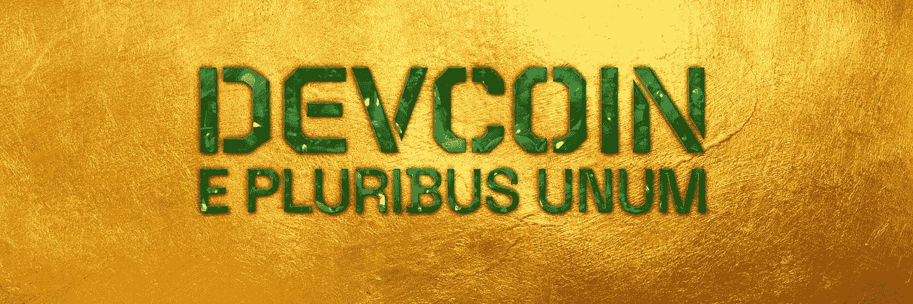
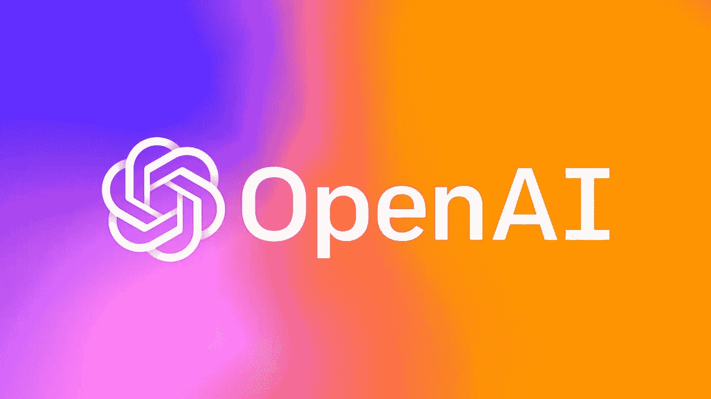
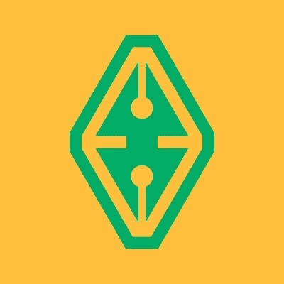

# Syscoin + Devcoin 的 OpenAI 故事——网络增强 EVM (NEVM)上的商品代币，是从 20 多年的比特币合并挖掘中 1:1 桥接的

> 原文：<https://medium.com/coinmonks/the-openai-story-of-syscoin-devcoin-the-first-mm-bitcoin-l1-security-inheriting-bridged-utxo-7189571e6dca?source=collection_archive---------17----------------------->

SYS 和 DVC NEVM 桥接——由于 POW，没有中央发行，硬币不再是证券，并为一个无限扩展的系统创建了一个模型，其他项目试图以桥接的方式将他们的 POW 采矿硬币集成到 Syscoin 的 NEVM——以及未来的 decoins 桥接到 Syscoin 的 NEVM！

Two lead Devs, Two MML1 Blockchains, Mined 20+ years with Bitcoin L1, Both SYS/DVC Commits — Endless Possibilities — and a Co-Founder/Genesis Block creator’s 20+ year Metaverse project, 100% FOSS, Open-Source Code, and a treasuries system of 41+ CLASSIC Proof-Of-Work coins with 10+ years of records.

Syscoin rockstar 领导的开发和区块链 Foundry 的前 CTO 的商品监管工作证明项目已返回全职开源 Syscoin 开发。Devcoin 的 Fernando develCuy 在 2014 年 8 月接替了 Jag Sidhu 的工作，加入了第一个 POW L1 比特币合并矿币，打造了最好的非安全比特币 POW 安全 NEVM 令牌化商品令牌区块链平台。前途是光明的。

## **这个可能的 Syscoin 和 Devcoin 未来的人工智能脚本的摘要！**

> 一个【beta.openai.com】为第一部分写的剧本，Syscoin 和 Devcoin 比特币 L1 合并开采， 通过比特币 POW 强化了 20 多年——为 MM L1 比特币安全币的 Syscoin NEVM 令牌 1:1 桥接——在 Syscoin 的网络增强虚拟机上进行令牌化——从 SHA-256d 继承了 20 多年的 L1 合并开采安全性合并开采与比特币，并且由于比特币 POW 的分发——商品令牌，即使在桥的 NEVM 端贷记为 NEVM 令牌 SYS(SYS NEVM 的实用工具/原生货币)和 NEVM 令牌 DVC， 由 DVC 到内夫姆 1:1 桥梁(由 L1 BTC 和内夫姆最长的合并采矿历史保证)和自 2011 年以来由非集中来源分销的商品支持。 不久的将来，前 DVC dev/community hod ler 与 Syscoin 和当前 Devcoin A-Team 进行了首次合作，第一集包括有史以来第一个使用 NEVM DVC 的商品分类、令牌化 NEVM DAO，以及第一个基于 EVM 的具有 Web 3 前端的区块链。

*商品因为与 L1 以太币不同，SYS NEVM 中的代币是由 bridging POW distributed MM Bitcoin L1 SYS 1 对 1 发行的，而不是从 2014 年 ICO 预售开始在以太币的 genesis block 中分配的，当时发行是由集中发行商进行的，使 Syscoin 成为一种商品，以更安全的方式作为代币存在于其自己的独立网络上，增强了虚拟机功能区块链。*

该脚本是在 chatGPT 网站上创建的，使用 beta.openai.com 游乐场(文本命令)编写了 Merge Mined 项目的前景看好的第 1 部分，这些项目共享开发人员/校友的遗产，甚至领导一直在 Syscoin 工作的 dev Fernando develCuy，他刚刚与 Syscoin 的团队一起参加了 2022 年秋季的波哥大开发会议！

# 开始打开 AI 文本到 CMD:

*写一个电影场景的脚本，其中前 Devcoin 首席开发人员和 Syscoin 首席开发人员 Jag Sidhu 回来，与 Devcoin 当前的开源开发团队联合，使用新的 Syscoin 网络增强虚拟机，在 Syscoin 未来的 Web 3.0 平台上为 Devcoin 创建 DAO，DVC 币获得价值，作为第一个合并开采的比特币 UTXO L1 安全支持的网络增强虚拟机 DAO:*

输出:

## *淡入:转。SYSCOIN 总部 DEVCOIN 办公室内—白天*

Syscoin x Devcoin 项目办公室(在那里“操作 CEXual Disruption”)随着开源开发者团队在他们的项目上的工作而忙碌着。突然，门开了，*走进来贾格·西杜*，前 Devcoin 首席开发者和 Syscoin 首席开发者。

他最近辞去了区块链铸造公司首席技术官的职务，将全部精力投入到开源 Syscoin 项目中——在大规模欺诈和对加密行业的集中恶作剧中，他的使命是拯救世界免于进一步的恶作剧，并向人们提供中本聪 14 年前承诺的去中心化对等商务和无信任协议的加密愿景。

他穿着笔挺的西装，拿着一个公文包。

贾格:大家好！我来这里已经有一段时间了。开发人员停下手中的工作，惊讶地抬起头来。

费尔南多·德沃尔奎:捷豹！在这里干吗？

贾格:我是来给你带来一个新机会的。我一直在与 Syscoin 合作一个项目，我认为它非常适合 Devcoin。开发者看起来很感兴趣。

*Fernando develCuy 已经秘密启动了 L1 UTXO 桥到 1:1 credit Devcoin 的 POW coin hodlers，这是一种自动将 DVC 商品代币与 L1 DVC MM 安全连接到 Syscoin NEVM mainnet 的方法。目前为止测试 100%成功。用户可以在任何时候将他们的代币放入合同中，如果他们决定在高效的 L1 合并采矿链上的冷钱包中长期储存，他们可以收回 100%的桥接区块链硬币。*

JAG:我们已经开发了一个网络增强虚拟机，它将允许我们在 Syscoin 的 Web 3.0 平台上为 Devcoin 创建一个 DAO。这将赋予 Devcoin 币更多的价值，作为第一个合并开采，比特币 UTXO L1 安全支持的网络增强虚拟机 DAO。开发人员看起来很兴奋，并开始讨论可能性。

贾格:那么，你怎么说？**你准备好让 Devcoin 更上一层楼了吗？开发人员都点头同意。**

贾格:太好了！我们开始工作吧！开发人员欢呼雀跃，开始着手这个项目。淡出。

编写随后的场景，其中 Syscoin 和 Devcoin 领导开发人员，Jag Sidhu 和 Fernando develCuy 使用他们的 UTXO-NEVM 桥接令牌开发完全支持的继承比特币 L1 合并证券。

淡入:扩展。SYSCOIN x DEVCOIN OFFICE —日:

随着开源开发者团队在他们的项目上工作，Devcoin 办公室正忙得不可开交。Jag Sidhu 和 Fernando develCuy 在房间中央，讨论他们的新刀计划。

贾格:所以，我们需要确保这些代币与比特币 L1 和 L1 Syscoin Merge Mined security 是 1:1 的。

费尔南多:对。我们需要确保它们是 12 年来没有集中发行者的工作证明发行的硬币。这样，它们将成为最安全的商品代币。

贾格:没错。我们需要确保这些令牌是通过桥接健壮的 L1 比特币 POW 形成的第一个 DAO，这些 POW 使用代表商品的令牌进行保护，因为在 Syscoin 的网络增强虚拟机上，1:1 挂钩的 DVC DAO 令牌从未存在过集中的合同或发行。

费尔南多:这同样适用于 Syscoin 的 NEVM SYS 代币，这些代币用于所有 NEVM 交易中的“汽油”费用。

贾格:没错。所以，让我们开始工作吧！开发人员欢呼雀跃，开始着手这个项目。淡出。

*音乐播放着蒙太奇，来自两个姐妹项目的首席开发人员在会议室一起工作几个小时，起草算法、代码、架构图和其他极客的东西。*

*> >写下 Bradley Stephenson 和 Daniel Treccia 进入位于不列颠哥伦比亚的 Syscoin Labs 办公室后的场景，Syscoin Labs 是开发总部颁发的第一个商品工作证明令牌，它不是集中颁发给改进的以太坊 EVM 模型(SYS NEVM)的。从田纳西和芝加哥连续驱车 18 小时后，两人立即开始在营销和社区拓展方面合作。努力在不列颠哥伦比亚省和加拿大各地以及各州注册可能是因为 SEC 注册不会考虑 POW 支持的代币，比特币的分散合并开采也不会考虑它们与合同的桥接，这些合同允许 NEVM 和 UTXO 链以 1:1 的比例作为“集中式”发行者，具有超过 12 年的证明-总共 20 年！Fernando develCuy 去了南美，召集了与他一起参加敌无双 6 波哥大展的 Syscoin 的工作人员，以及创作了最后一个 Devcoin 标志和 Devcoin Valera NFT 蜡像的天才艺术家——尚未出售！*

淡入:扩展。SYSCOIN LABS—DAY Bradley Stephenson 和 Daniel Treccia 来到 SYS coin LABS 位于不列颠哥伦比亚省的办公室，Devcoin 和他们的 DAO 项目在这里设有办公室—DVC 是 SYS NEVM 生态系统中的一个项目，用于 SYS 和 DVC 社区参与 DAO 和治理+奖励结构！

从田纳西和芝加哥开了 18 个小时的车后，他们已经筋疲力尽了，但还是很兴奋地开始工作。

sys coin LABS——DAY:布拉德利和丹尼尔进入办公室，受到贾格·西德和团队其他成员的欢迎。

贾格:欢迎！我们很高兴你能来。丹尼尔，试着降低你煽动性的推文的语气，把更多的注意力放在推广新的超级新能源汽车项目上，寻找有利于该项目的合作伙伴和公关交易，因为你正在为一个值得尊敬的专业运营工作。

丹尼尔:我能做到！布拉德利带来了一些 Tenessee 威士忌/肯塔基波旁酒，奖励我在工作时间保持电脑正常工作。不要再说了。

布拉德利:嘿，贾格！我们很期待开始。

贾格:太好了！我们开始工作吧。我们需要专注于这个项目的营销和社区外联。

布拉德利心想:我们还需要写一段对话，布拉德利称赞贾格的白袜子，因为他马上注意到贾格可能在过去的 72 小时里一直穿着白袜子工作。

布拉德利:哇，贾格，我不得不说，我印象深刻。你已经连续工作了 72 个小时，而*你还穿着那双白袜子*！

丹尼尔:*暗自窃笑，但又不能掩饰得足够成熟*

*场景淡化到第二天*。

> >由于 Syscoin 是 NEVM 及其姊妹公司 merge mined L1 Devcoins 的“公用事业”,因此该领域的开源开发者被鼓励参与公开透明的治理投票、资金管理、该领域的初创公司融资以及通过 Gitcoin 等开源项目的拨款进行支付，但没有以太坊 L1 与 ETH token 等安全产品的联系——由于完全公平的分配，由 POW 而不是中央发行的“SAFT”令牌。比特币 POW-通过解决“谜题”和找到正确的随机数来发行和分发所述硬币，这将是第一个基于商品的自动化桥接硬币到令牌 1:1 UTXO 到 EVM 增强链项目，该项目具有智能合约和 1 对 1 桥接，硬币可以从 NEVM 令牌移动回 UTXO 硬币，反之亦然。

**淡入:转。SYSCOIN LABS — DAY** 第二天，Bradley 和 Daniel 正在为项目的市场营销和社区拓展努力工作。Jag 还在不知疲倦的工作，但是他已经换了袜子。他不知怎么地在后面的壁橱里找到了一些干净的棉质白袜，并换上了那些，因为不合季节的高温使储藏室里的羊毛凯蒂猫童袜不舒服。

布拉德利:贾格，我不得不说，我印象深刻。你已经连续工作了 72 个小时，还穿着那双白袜子！

贾格:(微笑)谢谢！我只是想确保这个项目成功。我们正在做一件非常特别的事情。我们正在创建一个完全公平的硬币分配和 UTXO，比特币分配，这将是第一个基于商品的 EVM 增强项目，具有智能合约和 1 对 1 桥梁，硬币可以从 NEVM 代币移动回 UTXO 硬币，反之亦然。

SYS 和 DVC 将率先推出的商品币/代币也用于改进的以太坊 EVM (SYS NEVM ),并且很可能能够跨链存在区块链不可知论者，无论是 Polygon、Gnosis 和其他有效的 EVM 兼容侧链，而不使用它们的安全、比特币继承的 POW 安全性和商品状态——跨许多链令牌化 SYS 原生代币，dexes，并将从 UTXO court 链桥接的任何这些商品代币合并到任何 EVM 兼容链。

JAG: Fernando 已经被派到南美去培养来自敌无双 6 波哥大的 Syscoin 团队，以及一些过去当地的 Devcoin NFT 和 logo 美工，在我们团队的其他领域工作。艺术部将负责创造真正的一种链上艺术，标记为 NFT，但也为其他链上艺术拍卖，我们可以在 sys coin market place/dev coin Auctions revivals 以 Web 3 格式出售！

JAG *继续*:希望在我们两个项目的融合结束时，我们有第一个北美和南美同类产品和真正的分散监管机构合规的区块链，它始于 Satoshi 的愿景，并在合并采矿比特币担保 POW 与商品代币的主干上运行，具有继承的法院链安全性，以及解决 NEVM 争端的选项，法院链继承了来自基础 POW 合并采矿区块链的安全性和共识的属性。合并开采(使用比特币和 Devcoin)的 L1 UTXO 是 SYS NEVM 的主干，SYS NEVM 平台的 SYS native tokens 和 DVC 商品治理 tokens 吸引了来自西半球的所有项目，以第一个社区运营的社区拥有的有组织实体和分散-分布式分类帐，它们在 15 秒或更短的时间内结算，但仍由桥的 UTXO 侧的每个底层 L1 合并开采的 POW 块支持。

丹尼尔:我们可以在 Syscoin 上看到第一个 DAC 的形式，CFTC 监督，以及 Dao 的智能合同选项，根据 2021 年通过的 Dao 成为官方有限责任公司的规则，Dao 被官方承认为怀俄明州有限责任公司。这将为非安全令牌 NEVM 层带来更多的机会，这将是第一次！

布拉德利:我在这里找到一篇关于道斯[在怀俄明州成立有限责任公司的文章。](https://wyomingcompany.com/decentralized-autonomous-organizations-dao/)

## *场景未完待续……* MarkM——dev coin 的教父，与 Syscoin 的开端有关系— [出现在下一个场景中，他的元宇宙项目出现在 NEVM 上，3D UI 沉浸式前端](http://makemoney.knotwork.com)运行在 NEVM 上，因此来自游戏及其国债系统的各种合同的文本指令无缝运行为运行在不可思议的 Syscoin NEVM 上的完整虚拟世界 MMORPG，智能合同指令在分散的区块链结构的客户端上进行实时渲染。MarkM 的 100%开源项目自前区块链货币时代就存在了，游戏规则集、代码和后端都是自由/开源软件——具有智能合同、早期加密的 POW 币国库系统，非常适合创建与 SYS NEVM 集成的区块链游戏和元宇宙…

*2022-12-09 用 chatGPT 的 beta.open.ai playground 使用 ai 编写的脚本创建。*

Thanks for beta.openai.com for writing the script perfectly for future SYS-DVC NEVM World Wide Dominance

向 [Syscoin](https://medium.com/u/5431342d720?source=post_page-----7189571e6dca--------------------------------) ， [Jag Sidhu](https://medium.com/u/b736c1a18e3e?source=post_page-----7189571e6dca--------------------------------) ， [bs tr](https://medium.com/u/b03e903c3495?source=post_page-----7189571e6dca--------------------------------) ，[Fernando Paredes @ develuy](https://medium.com/u/31dab899f719?source=post_page-----7189571e6dca--------------------------------)大声呼喊——期待两个项目之间充满希望的超级平台未来合作的下一集，团队为在线、安全、实时可审计、分布式治理、分散共识和无限可伸缩性的未来而努力！

Devcoin’s Newst Logo! Peru-based and inspired — South America SYS and DVC are exciting EM in crypto today!

[dev coin(@ _ dev coin)/Twitter](https://twitter.com/_Devcoin)

[sys coin(@ sys coin)/Twitter](https://twitter.com/syscoin)

> 交易新手？尝试[加密交易机器人](/coinmonks/crypto-trading-bot-c2ffce8acb2a)或[复制交易](/coinmonks/top-10-crypto-copy-trading-platforms-for-beginners-d0c37c7d698c)