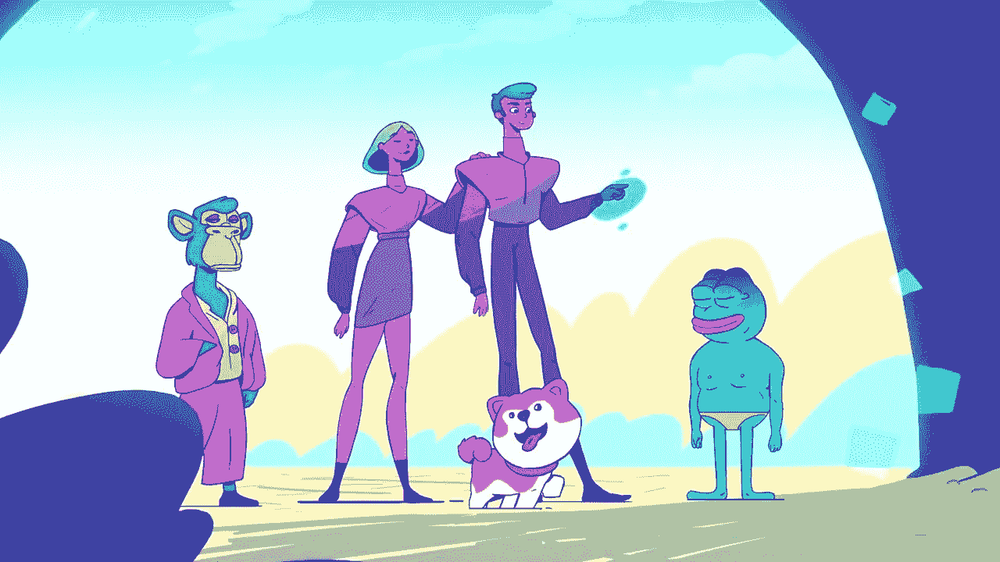
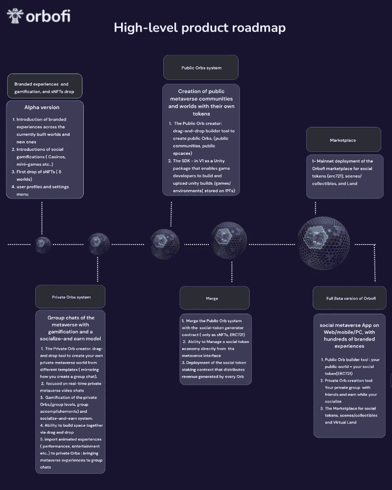
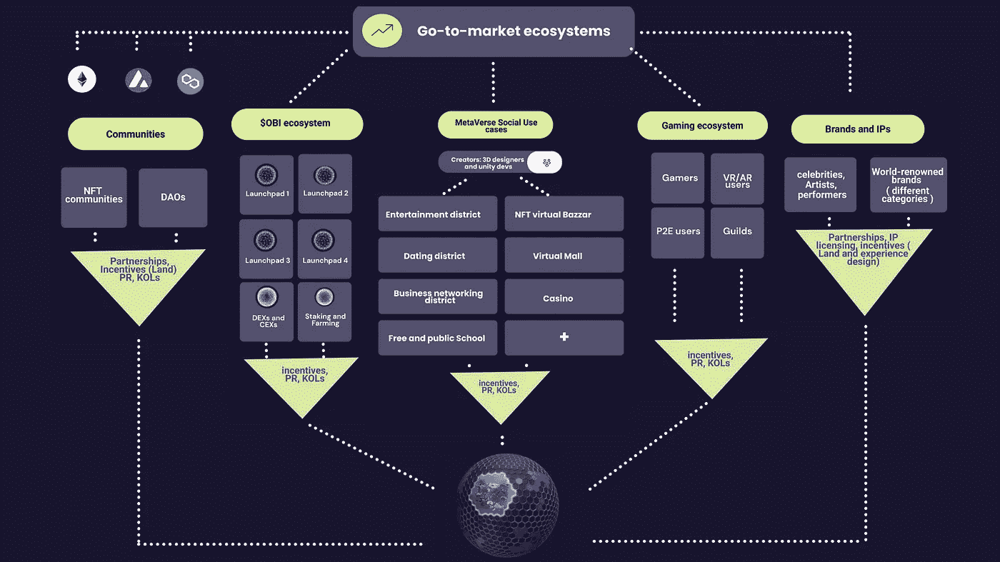

# 奥比菲元宇宙空投警报！

> 原文：<https://medium.com/coinmonks/the-orbofi-metaverse-airdrop-alert-ed5ae1e9142f?source=collection_archive---------6----------------------->

## 免费奥比代币、造田通行证和 NFT 阿尔法通行证

## 什么是欧博菲？

Orbofi 是一个通用的虚拟世界，也是世界上第一个多链社交元宇宙，让人们能够在他们共同拥有、构建、填充虚拟体验并从中受益的虚拟土地上建立和发展自己的令牌化社区。

# 奥比菲空投

执行简单任务的用户将获得免费的奥比令牌、一张采矿通行证、一张 NFT 阿尔法通行证和来自奥博菲的贵重物品。注册 airdrop 以接收条目，然后完成基本的杂务。获得额外的条目。前 100 名参赛者将获得免费的奥比代币。前 1，000 名参与者将获得免费的造田通行证，前 10，000 名将获得 NFT 阿尔法通行证和无价之宝。

# 如何认领奥博菲空投？

1.  [访问](https://www.getwaitlist.com/waitlist/4082?ref_id=FU3M13L5F) [Orbofi](https://www.getwaitlist.com/waitlist/4082?ref_id=FU3M13L5F) 空投的页面。
2.  输入您的信息进行注册。
3.  获得额外的条目。

# 什么是$OBI Orbofi Token？

Orbofi 令牌(OBI)是一种公用事业令牌，用于管理元宇宙社会的经济和激励层。

$OBI 用于创建、加入和建立社区，以及交换社交令牌、虚拟土地和收藏品。OBI 是通过建造和拥有土地/经验以及赌注获得的。

# 路线图:

产品路线图，2022 年第三季度至 2023 年 Q1

PRODUCT ROADMAP

ECOSYSTEM EXPLAINED

## 社交，同时从多个来源赚钱。

通过在元宇宙社交赚钱-创建或加入社区 Orb，构建您的虚拟世界，并从社交代币销售、土地销售、收藏品(NFT)销售以及未来的社区内广告中赚钱。

在 Orbofi 上创建一个元宇宙社区需要创建一个集体货币化和所有权的沉浸式空间，无论是作为一个创造者还是作为一个社区伙伴和世界成员。

> 交易新手？尝试[加密交易机器人](/coinmonks/crypto-trading-bot-c2ffce8acb2a)或[复制交易](/coinmonks/top-10-crypto-copy-trading-platforms-for-beginners-d0c37c7d698c)