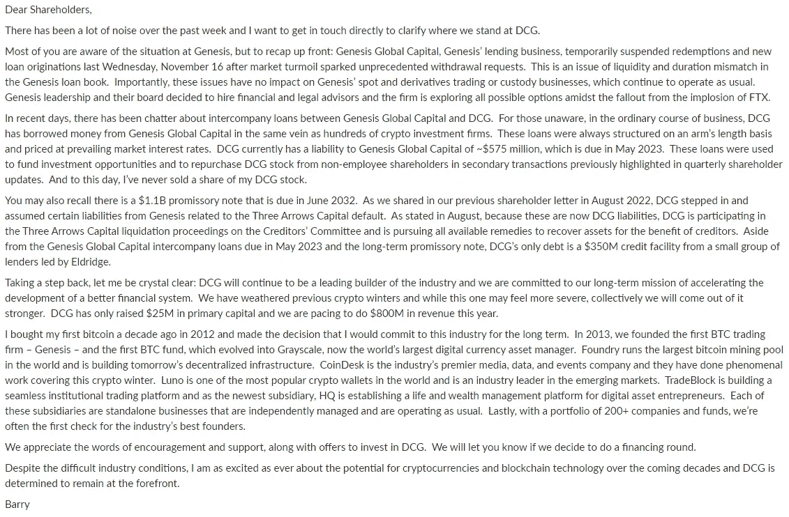

# 加密的原罪

> 原文：<https://medium.com/coinmonks/the-original-sin-of-crypto-2359c21b3f95?source=collection_archive---------16----------------------->

一个关于混合自营交易、第三方经纪和托管职责的故事

Photo by [Nick](https://unsplash.com/@byshark?utm_source=unsplash&utm_medium=referral&utm_content=creditCopyText) on [Unsplash](https://unsplash.com/s/photos/sin?utm_source=unsplash&utm_medium=referral&utm_content=creditCopyText)

加密的原罪来自于这样一个事实，即新生的中央交易所也经营它们的自营大宗经纪或交易业务。尽管这几乎是激活市场流动性的必要手段，但这是以巨大的利益冲突和循环风险为代价的，并最终损害了客户的利益。

我们来看看倒下的多米诺骨牌和它们之间的相互关系。

第一张多米诺骨牌，DeFi summer 2021。第一层加密是由 Uniswap、Compound、MakerDAO 和 Aave 构建的，它们都依赖于相当自动化且风险相对较低的融资机制。DeFi summer 在此基础上构建并带来了“德根交易”，即大规模建立加密赌场，新协议据此在自己的本地令牌上建立杠杆策略。简而言之，只要本地生态系统增长，购买兴趣扩大，这种方法就会奏效。一旦赎回量超过需求，它就崩溃了。

这正是它所做的，慢慢地，然后大规模地。“德根交易”的庞氏性质随着 Anchor Protocol 80 亿美元的失败而达到高潮。这是第一个病人，这是传染病开始的地方。简而言之，Anchor Protocol 正在用他们自己的 LUNA 硬币来养殖 UST，并且人为地设定了一个很高的、有补贴的、大约 20%的赌注率来强制保留。从 11 月 21 日到 22 年初，加密令牌市场下跌了 40%，削弱了对冲基金的只做多策略，此后他们的计划受到了考验。

👉更多关于主播 Terra [这里](https://open.substack.com/pub/fullcrypto/p/understanding-anchor-protocol-b89232425e6f?r=2e6fd&utm_campaign=post&utm_medium=web)

Anchor 的崩溃让一些对冲基金蒙受了损失，比如三箭资本(Three Arrows Capital，简称“3AC”)在 Genesis 留下了 11 亿美元的亏空，在 Blockfi 留下了 8000 万美元的亏空，总共损失了 80 亿美元。这些裂痕至今仍在回荡，因为 Genesis 现在处于破产边缘，BlockFi 于 28Nov22 申请了第 11 章，而 Celsius，Voyager 正在清算中。

另一个巨大的多米诺骨牌，FTX。这件事之所以引人注目，不仅在于 100 亿美元资产损失的庞大规模，还在于 SBF 在据称最老练的投资者中制造了巨大的骗局。在 1 月 22 日以 320 亿美元的估值融资 4 亿美元后，该公司在 11 月 22 日轰然倒下，此前有消息称，该公司的资产负债表依赖于基于非流动性和巨额 FTT 头寸的杠杆交易。安然前清算人进行的进一步调查揭示了挪用资金、缺乏风险管理和控制以及完全无视客户资产安全的情况。相同-相同但不同，因为债权人总共被欠另外 100 亿美元。在这里，阿拉米达研究(交易部门)和 FTX(交易所)之间的乱伦关系是罪魁祸首。这两个实体在没有监管、没有风险管理、甚至没有一点合规意识的情况下进行利益冲突交易。

👉更多关于 FTX 的灭亡[这里](https://open.substack.com/pub/fullcrypto/p/the-ftx-balance-sheet?r=2e6fd&utm_campaign=post&utm_medium=web)

数字货币集团(“DGC”)似乎是下一个。碰巧的是，DGC 是 Genesis Trading 的母公司，已经发行了 11 亿美元的票据来弥补 3AC 的影响。现在，Genesis 的债权人可能会要求 DCG 兑现他们的借据，迫使该集团寻找即时流动性。

Barry’s message to shareholders via [Frank Chaparro](https://medium.com/u/eb279b7ab15?source=post_page-----2359c21b3f95--------------------------------)

从创世纪公司借了 5 亿美元用于股票回购的 DCG，似乎也没有那么大的流动性。他们唯一的皇冠上的宝石是灰度，第一个推出 BTC 信托并从中获利数亿美元。现在，看起来灰度也有自己的问题。

创世纪贸易是 GBTC 的流动性提供者。这个独一无二的位置让创世纪公司铸造了 GBTC。这种能力得到了很好的利用，因为 Genesis 将 BTC 借给了对冲基金，特别是 3AC，然后 3AC 将 BTC 带回 Genesis，铸造 g BTC。从 2019 年到 3 月 21 日，3AC 当时在市场上以约 15%的溢价出售 GBTC。这一战略在 2011 财年宣告失败，因为 BTC 直销变得更加容易。这可能给 Genesis 带来了一些损失，并对其交易业务的重叠及其作为流动性提供者的角色提出了一些问题。

Genesis 作为一家流动性供应商，还被授权代表 GBTC 拥有 BTC 地址。虽然整个 BTC 似乎都在托管人比特币基地的管辖范围内，但创世的债权人可能会要求创世名下拥有的 BTC。现在只是推测，更多的将会跟随。唯一的区别是创世纪和 DGC 似乎拥有更广泛的生态系统的信任，这使得典型的银行挤兑不太可能发生。这是“流动性危机”和“资不抵债”的根本区别。

在所有情况下，很明显，将托管、第三方经纪和自营交易结合在一起是不合适的。这是 TradFi 在 90 年前付出代价得到的教训，这导致了 1933 年证券法的制定，并由 1940 年的投资顾问法补充。这些东西实际上对加密投资也很重要。

**关于—**

*360 咨询有限责任公司是一家总部位于波士顿的 RIA 公司，管理投资，包括加密*

👉[上午 9 点至 30 点](https://twitter.com/930AM2)🐰🕳

**来源—**

👉[https://www.capitalfundlaw.com/blog/crypto-funds-strategy](https://www.capitalfundlaw.com/blog/crypto-funds-strategy)

👉[https://www . Bloomberg . com/news/articles/2022-11-22/genesis-balance-sheet-reveals-web-of-loans-cross-silbert-empire-DCG](https://www.bloomberg.com/news/articles/2022-11-22/genesis-balance-sheet-reveals-web-of-loans-across-silbert-empire-dcg)

👉[https://Twitter . com/hodlKRYPTONITE/status/1595324566783819776？s = 20&t = umb 545 xmi 5 NWS MX 2um 0 tgw](https://twitter.com/hodlKRYPTONITE/status/1595324566783819776?s=20&t=UmB545XmI5NwsMX2Um0tgw)

> 交易新手？尝试[加密交易机器人](/coinmonks/crypto-trading-bot-c2ffce8acb2a)或[复制交易](/coinmonks/top-10-crypto-copy-trading-platforms-for-beginners-d0c37c7d698c)