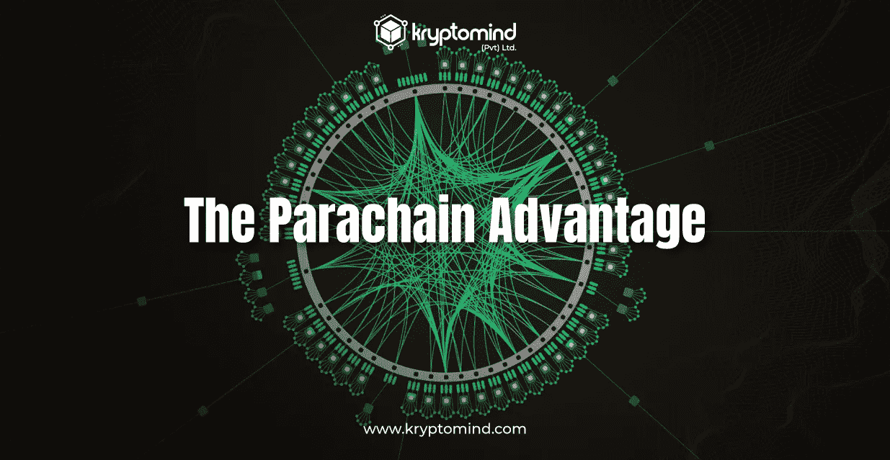

# 副链优势——氪星思维

> 原文：<https://medium.com/coinmonks/the-parachain-advantage-kryptomind-d97d8e479446?source=collection_archive---------49----------------------->

Polkadot 在 2016 年开发的异构多链方法使众多独立的具有专业功能的区块链能够在单一安全层下合作。

Polkadot 网络的主干包括被称为 parachains 的第 1 层下一代区块链，它将“多”放在多链中，并建立独立链的自由联盟。在这个第 1 层副链网络中，Polkadot 充当基础和支持的第 0 层协议。得益于 Polkadot 的跨链互操作性，任何类型的数据或资产都可以在链间传输，从而开创了链间服务、组织和经济的新范式。Polkadot 的多链设计使它能够成为一个新的分散式互联网的基础，其创造者 Gavin Wood 博士称之为“Web3”

与仅仅依赖第二层扩展解决方案相反，parachain 方法以更加分散和不可信的方式扩展区块链技术。一组分散的验证器保护了许多区块链，其中事务可以“并行”或并发地发生。

在 Polkadot 不断扩大的生态系统中，超过 130 个区块链开发团队正在全球范围内创建和推出他们的 parachain，这主要是因为 para chain 架构为他们提供了明显的优势。Polkadot 的“金丝雀网络”Kusama 已经有几个 parachains 在运行，自 2021 年夏天以来，它们已经处理了几千笔交易。

Polkadot 开发的 parachain 架构为区块链系统和 Web3 的未来展现了新的前景。部分是因为副链模型提供了如此多的优势，总结它的真正价值可能很有挑战性。

仅举几个例子如下:

# 专门化

parachain 的概念是基于许多不同种类的区块链将在未来的 Web3 中协作的想法而开发的。这是因为没有哪种特定的区块链设计适合所有用例。每个链都有一些权衡，使其更适合某些应用。

区块链必须提供一系列的服务，就像现有的互联网适应不同的需求:一个链可能是为游戏创建的，另一个是为身份和访问管理创建的，另一个是为金融创建的，等等。波尔卡多特通过连接这几个链建立了区块链互联网的框架。

实际上，对于任何区块链用例，副链都可以定制，它们可以作为测试新用例的工具，特别是在草间弥生上。由于它们的专业化，副链作为一个群体可以比任何一个链单独完成更多的事情，为分散的企业促进充满活力的生态系统的发展。

# 灵活性

由于 Polkadot，在构建链时，parachain 开发人员拥有最大的灵活性。parachain 的唯一技术先决条件是能够向 Polkadot 验证人员证明其每个模块都符合既定协议。除此之外，为某个用例或使用集合创建理想链的可能性是无限的。

与那些基于智能合约平台的开发者相比，区块链开发者在创建副链时拥有更大的灵活性。在智能合约层进行构造的开发人员受到区块链底层架构选择的约束，这对于他们的用例来说可能并不理想。有了 Polkadot，开发人员可以深入到第 1 层 parachain 的内部推理，为他们打开无数额外的优化机会。

parachain 模型的适应性允许最广泛的区块链技术变化，促进了 Web3 的创新，避免了早期区块链网络的缺点和错误。

> 交易新手？试试[加密交易机器人](/coinmonks/crypto-trading-bot-c2ffce8acb2a)或者[复制交易](/coinmonks/top-10-crypto-copy-trading-platforms-for-beginners-d0c37c7d698c)

# 互用性

不同设计的区块链相互交流的能力是链状建筑的重要组成部分。由于 Polkadot 的互操作性，也是基于交叉组合性，区块链不再是彼此隔绝的孤岛。通过建立一个分散的，互联的区块链互联网，以前只有孤立的网络到他们的部落社区，parachains 结束了区块链的时代。

重要的是，Polkadot 使 parachains 能够在彼此之间传递任何类型的数据，而不仅仅是令牌，从而创建了一系列新的区块链用例。Polkadot 开发人员可以开发利用多个链的优势的服务，而不是局限于一个区块链的功能。

当你比较自由贸易和孤立主义对经济的影响时，你可以看到互操作性的实际价值。每个区块链就其内部社会和经济而言，相当于一个独立的主权国家。因此，副链模式为国际自由贸易提供了一个强大的框架，废除了阻碍经济增长和限制每个链单独作用的孤立主义和巴尔干化。

# 可量测性

与仅仅依赖于第 2 层相比，parachain 范式允许 Polkadot 在第 1 层扩展，这更加分散和有效。但是，第 2 层解决方案也可以包含在 parachains 中，从而显著增强可伸缩性。有了 Polkadot，事务可以分散在专用的第 1 层区块链网络中并发处理，与非分片网络相比，极大地提高了吞吐量和可伸缩性。

随着 Polkadot 在未来提高可伸缩性和事务吞吐量，分散性、数据可用性和安全性都将得到保持，这要归功于已经提出的几项改进。最后一项是至关重要的，因为其他网络可能会以这些关键要素为代价来支持 TPS，但为了吞吐量而放弃去中心化违背了 Web3 的根本目标。

# 没有平台成本

波尔卡多连接的副链拥有无限的计算能力，无需支付额外的费用或“汽油”价格。由于 Polkadot 的多功能性，parachain 开发者和 dapp 开发者可以为他们的客户设计任何他们认为合适的价格系统。

最好的部分是，副链的用户甚至不需要意识到他们正在处理一个区块链，或者他们需要拥有点令牌来访问应用程序和服务。通过这种方式，由于副链范式，区块链技术可以消除传统网络中出现的可用性和可接受性的实质性障碍。想象一下，如果你每次想使用手机上的应用程序时，都必须携带一个特定的令牌并支付费用。消除消费者的平台成本将是广泛采用 Web3 的一个关键因素。

# 安全性

新区块链经常需要建立一个验证者网络来引导他们的安全。由于这一程序的难度和时间，许多区块链有一定程度的安全，使他们容易受到攻击。

当链接到 Polkadot 时，副链立即获得强大的安全性。新的区块链团队可能会很快获得类似于银行的安全性，因为这种内置的安全机制，也称为共享安全性。此外，它降低了他们的准入门槛，并大大缩短了创建新网络所需的时间。

# 可升级性

技术在我们的环境中不断发展；今天，它可能是尖端的，明天，它可能就过时了。像任何软件一样，区块链需要定期升级，以便在新功能可用时集成它们，解决问题，并集成更复杂的技术。然而，传统区块链的现代化是一个耗时的过程，有时涉及“分叉”或打破链条，这阻碍了创新，有时会分裂社区。

更简单的“无叉”升级适用于波尔卡多和它的副链。因此，副链可以根据他们社区的愿望快速更新，使他们能够为未来可能带来的事情做好准备。有了副链概念，区块链可以更容易地改变和适应新的情况，确保它们随着新技术的发展而持续相关。

# 独立且适应性强的治理

在 Polkadot 上，parachains 可以自由地使用他们认为合适的任何治理模型，并且可以访问各种预构建的模块来设置不同的链上治理系统。由于先进的链上治理系统的可用性，团队可以大大减少链上硬分叉的可能性，这种分叉有将他们的社区一分为二的危险。

此外，链上治理为链下社区提供了一种透明和负责任的方式，这对于许多组织和受托人来说是必要的，他们经常需要在使用区块链技术之前见证透明的决策过程。强大的管理系统与 Polkadot 的无叉升级功能相结合，使 parachains 能够保持其竞争优势，同时促进社区凝聚力，并确保所有利益相关方对网络的命运拥有投票权。

# 金融服务

为了获得财务自主权和独立运作，以支持符合其社区意愿的活动，副链可能会利用链上金库。当与链上治理(分散的自治组织)相结合时，支持国库的副链社区可以很容易地呈现 DAO 的形状。

这为新的分散融资模式创造了条件，包括跨链并购、分散慈善、分散主权财富基金，以及为有利于网络的计划提供资金。由于 parachain 范式，区块链现在可以在金融上“在世界上行动”,这在以前只适用于中央集权的组织和企业。

# 轻松发展

最后，如果创建一个副链是一项不可能的任务，那么上面列出的优势就没有意义了。然而，parachain 开发团队可以使用各种开发工具，这使得创建区块链变得前所未有的简单。

主要的 Polkadot parachain SDK Substrate 是由 Parity Technologies 创建的区块链开发平台，可以帮助团队极大地减少创建 para chain 的工作量和复杂性。有了 Substrate，开发人员可以利用预构建的典型区块链特征模块进行组合和重新配置，就像区块链积木一样，以构建最适合其使用案例的独特副链。

有了 parachains，曾经需要由经验丰富的工程师组成的庞大团队花费数年时间才能完成的工作，现在只需一家年轻公司的资源就可以在几周内完成。

*原载于 2022 年 7 月 19 日*[*【https://kryptomind.com】*](https://kryptomind.com/the-parachain-advantage/)*。*