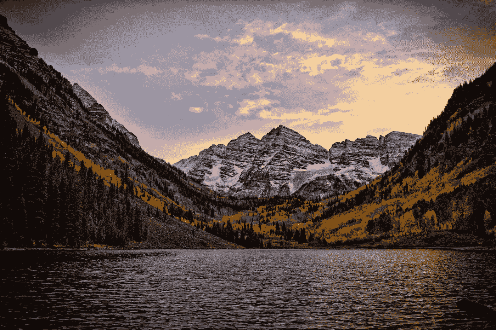
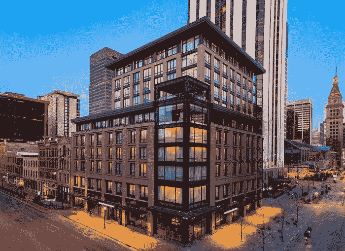
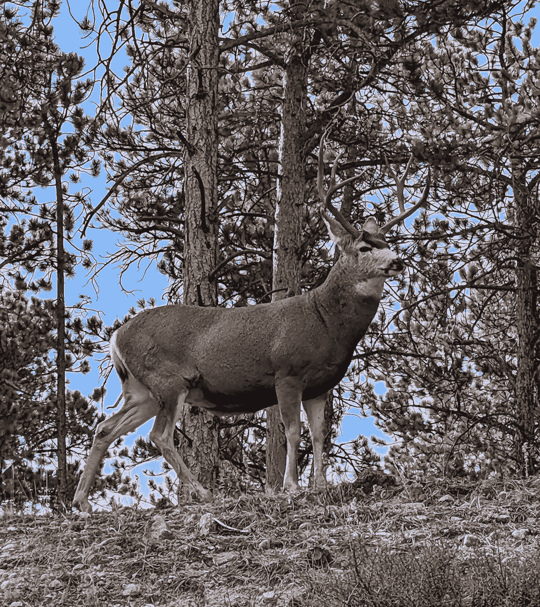
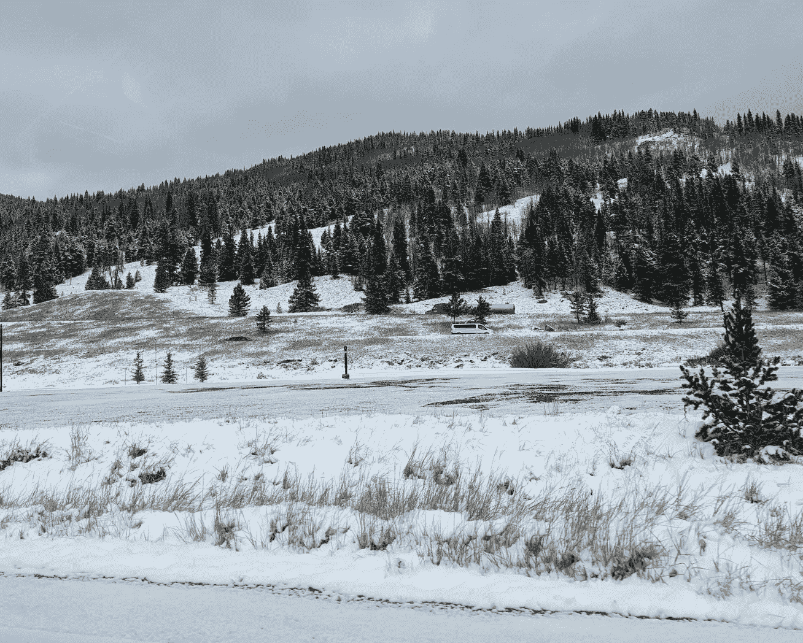

# 完美的丹佛静修[4D3N]

> 原文：<https://medium.com/coinmonks/the-perfect-denver-retreat-4d3n-aad5fdff1cd8?source=collection_archive---------14----------------------->

Photo by [Mike Scheid](https://unsplash.com/@mscheid?utm_source=medium&utm_medium=referral) on [Unsplash](https://unsplash.com?utm_source=medium&utm_medium=referral)

最近，我在科罗拉多州的丹佛参加了一个公司的务虚会，我利用这个机会延长了我在那里的逗留时间，让它成为我自己的一个完整的假期。

毕竟，生活从来都不只是工作。或者产品管理。

在那里是一次令人大开眼界的经历，如果有人想去旅行，我想和你们分享我在那里的经历。

> 所有的推荐根本不是赞助。(即使我会感谢任何赞助哈哈哈)

# 寄宿

在丹佛的 4D3N 中，我在多个城镇中穿梭，住过许多不同的 bnb。这是我个人住过的几家酒店，我强烈推荐:

1.  汤普森丹佛——我在公司静修时住在这里。我住过的最好的酒店之一。2022 年 1-2 月左右才刚刚开业！

Image from [TripAdvisor](https://www.tripadvisor.com/Hotel_Review-g33388-d23527617-Reviews-Thompson_Denver-Denver_Colorado.html)

**2。airbnbs**——这是我住过的少数几家，我会推荐它们。

*   [哈利的 Airbnb](https://www.airbnb.com/rooms/53824472?source_impression_id=p3_1666803247_VQMM4B3wTZrHYGDQ)——虽然它在郊区稍微远一点，但这是一个漂亮的家，有一张豪华的床，价格适中(大约 60 美元/晚)。他们的 furkid，本特利，也是一个绝对的万人迷！
*   乔纳森的 Airbnb——每晚 40 美元，绝对物有所值。虽然没有那么豪华，但它干净安静，能满足您的基本需求。他们有很多宠物(8 只猫，1 只狗)，所以如果你不是一个爱猫的人，它可能不适合你。

# 活动

以下是我建议大家在科罗拉多的 5 天里要做的几件事。你在这里的时候也应该租辆车，因为这些地方很多都很远！

*注意:他们主要关注自然，因此可能不是所有人！*

## 落基山国家公园(1 天)

当你在科罗拉多的时候，这是一个必看的景点。这里的景色令人叹为观止！从丹佛开车要花很长时间(大约两个小时？)但是完全值得。如果你和我一样是个动物爱好者，你一定要去公园里的这几个地方看看:

*   斯普拉格湖
*   绵羊湖
*   百合湖
*   熊湖
*   冰川峡谷

这是少数几个能看到野生动物的地方，如大角羊、麋鹿、麋鹿等。

Here is a deer that I saw

## 格伦伍德温泉(1 天)

这也是另一个必去的目的地。虽然从丹佛开车要花很长时间(大约 3 个小时)，但开车去那里是完全值得的，尤其是在十月份冬天开始悄悄来临的时候。你将会驶过一些令人惊叹的小溪、科罗拉多河、维尔的雪山——这一切让整个旅程变得非常神奇，像纳尼亚一样。

在这个小镇本身，也有很多事情要做，例如:

*   Yumpah Spa &沙龙——一个全天然的蒸汽洞穴(类似于蒸汽房)，你可以坐在里面放松两个小时！
*   **铁山温泉**——我会推荐这里，因为它提供了更独特的体验。但是如果你预算有限，可以去常规的格伦伍德温泉享受类似的体验。
*   **洞穴探险公园**——跳过这个，因为天气太冷，不适合坐过山车。但是我听说了一些很棒的事情，如果可以的话，你一定要去看看！
*   落基山披萨——我吃过的最好吃的披萨之一！这个比萨饼的面团/外壳非常完美，一大块只花了大约 5 美元。总的来说，这顿饭相当不错

## 丹佛市中心(1 天)

尽管丹佛市中心与其他州的任何其他市中心几乎没有什么不同，但我还是在这里做了一些事情。

*   穿梭于酒吧/餐馆之间——丹佛市中心有一点很棒，那就是它的食物。供应美食的好酒吧/餐馆/运动酒吧并不缺乏。我特别喜欢联合车站附近的这个地方(Hwaro Sushi ),因为他们有一个促销活动，整个菜单打五折！！
*   **看一场 NBA/冰球比赛**——丹佛掘金队的主场。我看了本赛季丹佛对俄克拉荷马的第一场主场比赛，太棒了。气氛非常有趣！
*   **参加当地旅游** —我参加了一个 3 小时的小型酿酒厂之旅，在那里我被带到了不同的当地酒吧，尝试当地的精酿啤酒。这些啤酒真的很独特和美味！(我尝试了胡萝卜啤酒和酸橙派啤酒)

# 一些荣誉提名

这些是我做过的一些小活动。我按照自己的时间表把它们放了进去。但是尽管如此，这些都是你不应该错过的经历！

1.  红岩圆形剧场/恐龙山脊——非常酷的地方，上面有巨大的岩石和恐龙脚印！
2.  科罗拉多斯普林斯——一个风景如画的小镇。我设法乘坐吉普车游览了众神花园、派克峰和马尼图温泉。我真的推荐去这里旅游，因为导游可以带你去很多不同的地方，还有它背后的历史。

在我一直从事的所有工作中，这次科罗拉多州丹佛市之行就像是呼吸了一口新鲜空气。我真的推荐任何想短途旅行的人去参观这个地方！

如果你喜欢我的内容，请给我一个关注和订阅。如果你能通过我的推荐申请会员资格，我将不胜感激。或者甚至给我小费哈哈哈但是没有压力:)

谢谢大家的支持！

> 交易新手？试试[密码交易机器人](/coinmonks/crypto-trading-bot-c2ffce8acb2a)或者[复制交易](/coinmonks/top-10-crypto-copy-trading-platforms-for-beginners-d0c37c7d698c)