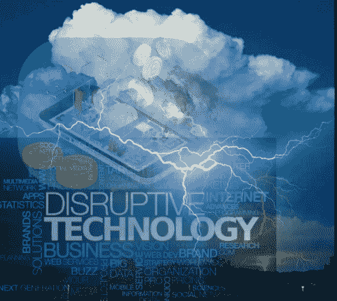
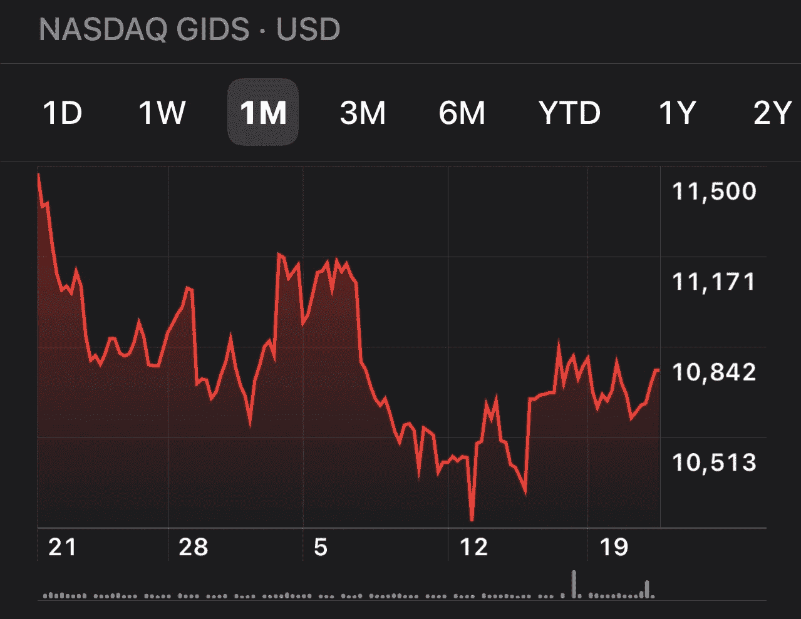
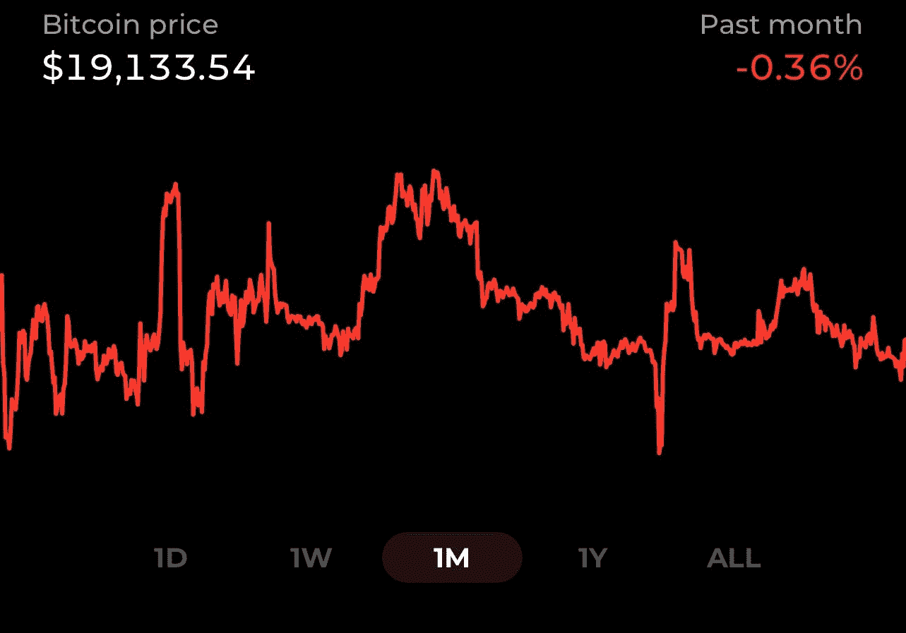
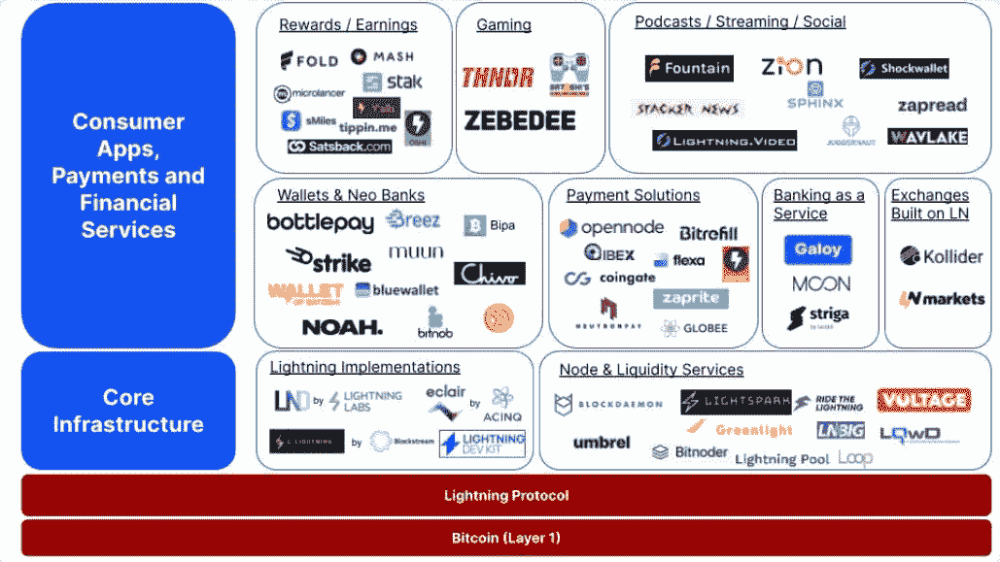

# 比特币/闪电颠覆的完美风暴

> 原文：<https://medium.com/coinmonks/the-perfect-storm-for-bitcoin-lightning-disruption-2f3738330a6e?source=collection_archive---------8----------------------->

这些天我注意到一件有趣的事情，就是房间里的白头发。我接触过的许多人从未经历过经济衰退或重大技术破坏。我不是经济学家，所以我将把对经济衰退的预测留给那些更有资格的人。然而，我建议深入债券和外汇市场，并做好相应的计划。我认为一场完美的风暴正在酝酿中…

让我们先来回顾一下最具颠覆性的技术浪潮的简史。1985 年，微软发布了 Windows，以回应苹果 1984 年发布的 Macintosh GUI。我还在上大学。然而，到我毕业的时候，我的每一份工作都大量使用个人电脑。结果，我们大多数人都成了“知识和信息工作者”。

九年后，网景公司的 Navigator 引入了万维网，粉碎了光盘市场，创造了前所未有的电子商务淘金热(如亚马逊)，最终导致了 2000 年著名的网络泡沫破裂。然而，短短四年后，我们有了 Web2.0，从 2004 年到 2005 年，互动和文件下载对更高宽带速度的需求急剧增加了 35%到 50%以上。

2007 年，第一部 iPhone 发布，开启了应用经济。到 2012 年，全球超过 10 亿人使用智能手机。应用程序激增，如优步颠覆了送货和打车行业，AirBnB 颠覆了酒店业，当然，社交媒体起飞了，创造了一个新的数字公共广场，每个人的声音都可以听到并放大许多倍，以及一个新的广告和商业平台。

然后在第一代 iPhone 和 10 亿智能手机用户之间发生了一件小事:2008 年金融危机。这导致了第一个比特币区块 Genesis 的诞生，该区块于 2009 年 1 月开采，以应对全球金融救助。来源:*《泰晤士报》2009 年 1 月 3 日“财政大臣濒临第二轮银行救助”*

从那时起，我们看到 BTC 产生了 146，618%的向上回报，这甚至比去年减少了 68%。有趣的是，尽管如此，在过去的几个月里，比特币比纳斯达克更稳定。

我认为，将在全球范围内推动金融科技、传统货币系统和传统点对点计算的下一次大规模颠覆的创新将是比特币闪电网络。

让我们来看看下面图表中的一个巨大的细分市场:电子游戏。

[*Source: Is the Bitcoin Lightning Network for real?*](https://www.coinbase.com/blog/is-the-bitcoin-lightning-network-for-real)

2017 年，Blockstream 的克里斯蒂安·德克尔(Christian Decker)进行了第一次全额、安全的闪电支付。五年后，只有两家公司在游戏中使用 Lightning。然而，目前的游戏市场高达 1960 亿美元，但年增长率仅为 5%。未来的指数级增长将归功于 Lightning 上的新创新(其中一些在我的上一篇博文中有所提及 [NFT 的很棒，但比特币 NFT 是游戏规则的改变者](/coinmonks/nfts-are-nifty-but-a-bitcoin-nft-is-a-game-changer-8dd62eb1b4d))。我认为，到 2028 年，多达 50%的游戏市场将被打乱，并转移到比特币和闪电。

总而言之，这是一场完美的风暴。当你考虑到在全球市场面临严重金融压力的时候，公司和行业必须创新，重塑他们做生意的方式，否则就会失败。我们早就应该迎接下一次重大破坏了。我预测，在未来五年内，超过 10 亿人将每天在闪电网络上使用比特币，用于我们做梦都没有想到的应用。好吧，也许有些人有，就像你一样。-).

祝一切顺利，

吉姆(人名)

> 交易新手？试试[密码交易机器人](/coinmonks/crypto-trading-bot-c2ffce8acb2a)或者[复制交易](/coinmonks/top-10-crypto-copy-trading-platforms-for-beginners-d0c37c7d698c)