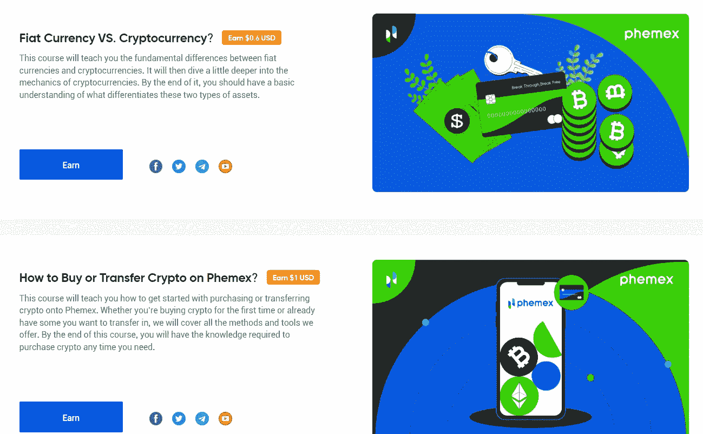

# Phemex 的故事:一个不可忽视的加密交易所

> 原文：<https://medium.com/coinmonks/the-phemex-story-an-underrated-crypto-exchange-that-you-should-not-ignore-4a1d84727876?source=collection_archive---------45----------------------->

# 什么是 Phemex？

除了传统的加密交易之外，任何使用更复杂的交易技术的人都肯定对永久合约感到困惑。这种衍生品与期货类似，允许使用高达 100 倍的资金，并承诺高额利润，但也存在高风险头寸。与传统期货不同，如果投资者可以存入足够的保证金，永久合约理论上可以无限期运行。 [Phemex](https://phemex.com/register-vt1?referralCode=G5FA63) 到底有什么了不起的，比特币衍生品到底适合哪些人？

# 奖金

[Phemex](https://phemex.com/register-vt1?referralCode=G5FA63) 提供了许多项目和奖励，以获得传统投资机会之外的 cryptos。

*   高达 180 美元的欢迎红利
*   高达 2500 美元的存款红利
*   学习和获得

## 高达 180 美元的欢迎红利

[Phemex](https://phemex.com/register-vt1?referralCode=G5FA63) 提供几种受欢迎的奖励，总价值可达 100 美元。举例来说，如果您至少存款 0.0003 BTC 并完成身份验证，您将获得额外的 10 美元。

关注和转发 Phemex 的 Twitter 账户，你还能得到 10 美元。轻松点。

## 学习和获得

没有任何存款或任何义务的最简单的赚钱方法。

## 高达 2500 美元的存款红利

如果你想使用这个平台，为什么不存一些 BTC，赚点存款红利呢？

如果你欣赏我的工作，并想在 [Phemex](http://I'm trading crypto on Phemex. Join me and grab an exclusive BTC bonus. https://phemex.com/register-vt1?referralCode=G5FA63) 上注册，请用我的推荐链接这样做，这样会激励我写这样一篇文章。对你来说，它不会花费你任何东西，但会帮助你在交易费用上获得额外的 20%的折扣。

 [## Phemex:买卖加密|交易 BTC 和加密衍生品

### Phemex 是最快的加密交换和加密衍生品平台。购买、出售和赚取比特币、以太币和替代币…

phemex.com](https://phemex.com/register-vt1?referralCode=G5FA63) 

> 交易新手？尝试[加密交易机器人](/coinmonks/crypto-trading-bot-c2ffce8acb2a)或[复制交易](/coinmonks/top-10-crypto-copy-trading-platforms-for-beginners-d0c37c7d698c)