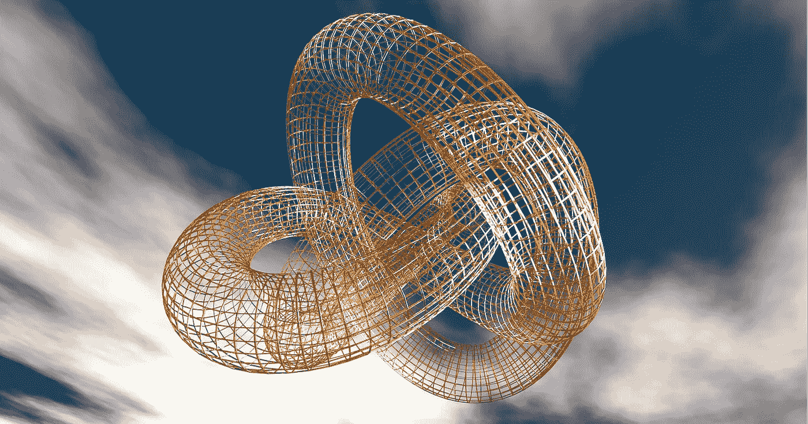

# 2022 年诺贝尔物理学奖

> 原文：<https://medium.com/coinmonks/the-physics-nobel-prize-2022-a4e28bed3eae?source=collection_archive---------2----------------------->

## 对其背后的物理学及其对量子计算机的重要性的洞察。

今天——2022 年 10 月 4 日——诺贝尔奖再一次颁给了物理学领域的伟大成就。今年，这一奖项被授予了三位科学家阿兰 Aspect，约翰·克劳瑟和安东·泽林格，以表彰他们的实验

> “[……]纠缠光子，确立了贝尔不等式的违反，开创了量子信息科学”。

这句话中有几件事乍一看可能会让人困惑。什么是纠缠光子？什么是贝尔不等式？所有这些和量子信息科学有什么关系？当我们谈论量子信息科学时，我们谈论的是量子计算的基础。显然，这三位科学家展示的东西在未来的计算中扮演着至关重要的角色。我认为我们应该看看所有这些背后的物理学原理。

# 纠缠

这一切都始于纠缠，量子粒子可能处于一种非常奇怪的状态。当我们谈论量子粒子时，我们指的是微观粒子，如分子、原子或电子。这些粒子不再遵循经典物理定律。这是一种不好的说法，因为经典物理定律不足以描述微观世界中粒子的行为。经典物理学可能在宏观世界中出色地描述了汽车、火箭或行星的运动，但是人们不能用同样的定律来描述电子的运动。

我们需要量子物理学来做到这一点。量子物理学有很多奇怪的特性。奇怪，因为它们完全违背了我们对经典物理学的期望。量子粒子突然可以同时出现在空间的两个地方。或者他们可以纠缠在一起。
但是这种纠缠到底是什么？

让我们取 2 个粒子 A 和 B，将它们“纠缠”在一起。既然他们纠缠在一起，他们之间就有某种联系。更准确地说:一个粒子的变化会直接影响另一个粒子的变化。

好吧，一开始听起来不太疯狂。但是现在我们把这些粒子放在远离彼此的地方。彼此相距甚远。
我们将它们放置在可观测宇宙的相对位置。然后，我们对粒子 A 做一些事情，在完全相同的时刻——瞬间——这触发了粒子 b 的一个动作。这意味着正在发生的事情的信息在这些粒子之间的传输速度超过了光速。
因为两种粒子都在可观测宇宙的两端。这意味着即使是光——宇宙中最快的东西——也不可能从一个粒子传播到另一个粒子。因为它需要的时间会比宇宙的年龄还要长。

但是量子物理学准确地预测到了这一点。另一边的即时反应，无论距离远近。
1935 年的 3 位物理学家阿尔伯特·爱因斯坦、鲍里斯·波多尔斯基和纳森·罗森并不喜欢那种“幽灵般的超距作用”。尤其是爱因斯坦对此有异议，因为这与他自己的狭义相对论相矛盾。在一份科学出版物中，他们声明量子物理学一定是一个“不完整”的理论。尤其是因为局部性原则没有得到满足。让我们看看这意味着什么。

## 位置

我们又遇到了另一个复杂的词。但是让我让你冷静一下，局域性原理其实很简单。它简单地陈述了一个粒子只能被它的直接环境所影响。为了更清楚地说明这一点:对于一个点 X 上的一个动作对另一个点 Y 的影响，在这些点之间的空间中的某些东西必须调节那个动作。例如，实际上人们可以看到电场或磁场的这种中介作用。电子和质子之间的磁引力由磁场传递。爱因斯坦用他的狭义相对论表明，这种行为不能超过光速。

符合这一原则的物理理论被称为“局域理论”。很明显，物理学家想让他们所有的理论都局限在本地，因为否则人们会认为事情可能在不知道为什么会发生的情况下发生。因为在没有任何信息传输的情况下，来自极远地方的某些东西影响了它——这使得测量几乎不可能。

# 量子物理学的怪异现实

这就是为什么爱因斯坦、波多尔斯基和罗森认为量子物理学一定是不完整的。他们认为，量子物理学不能很好地理解这个世界。他们只是不能接受非局域理论可以描述我们生活的真实世界。所以他们认为纠缠只有两种可能:

*   要么两个粒子之间的信息以超过光速的速度交换，要么
*   纠缠粒子有一些不可测量的性质，这些性质在它们被分离之前就决定了它们的最终量子态

由于第一个概率与爱因斯坦的狭义相对论相矛盾，三位科学家认为，这其中一定有隐藏的变量。
量子物理学家尚未发现的隐藏变量。
因此，在他们看来，量子物理学是**而不是**观察世界如何运作的正确方式。

# 贝尔不等式

几十年后，约翰·斯图尔特·贝尔在他自己的研究中拾起了纠缠的话题，并致力于所谓的 EPR 问题。他特别关注隐藏变量的情况。如何研究纠缠粒子是否包含隐藏变量？

这是约翰·贝尔试图回答的问题。他的回答方式是所谓的贝尔不等式。他声称，为了让一个量子粒子包含隐藏变量，它必须满足贝尔不等式。但他也发现，量子物理学预测的过程违反了这个不等式。违反这种不平等意味着，我们确实生活在一个非本地的现实中。

从那时起，一场持续至今的物理学和哲学的大讨论开始了。但是现在这三位诺贝尔奖获得者已经通过实验证实了贝尔不等式的违反，我们已经进入了一个理解我们的世界如何工作的新时代。但是这和量子计算有什么关系呢？

# 量子计算呢？

众所周知，量子计算机在未来执行许多任务的速度要比经典计算机快得多。但是为了让量子计算机正常工作，我们需要量子算法。这些算法是专门为量子计算机设计的，而且只适用于量子计算机。量子算法的一个例子是著名的 Shor 算法，由 Peter Shore 在 20 世纪 90 年代提出。使用这种算法，可以比经典计算机更快地分解大数。这可以用来破解地球上的任何安全系统，因为几乎所有的系统都是基于大数分解的数学问题。

大多数量子算法仍然是理论上的，还没有在量子计算机上进行适当的测试。但更重要的是:大部分都是基于粒子之间的纠缠。因此，通过证明贝尔不等式的违反，人们也就证明了通过量子物理预测的纠缠机制确实有效，并且在计算中没有忽略任何隐藏的属性。这是一个很好的保证，量子算法将在不久的将来发挥作用。

量子物理学是物理学的一个奇怪的部分，当被问及量子世界的过程时，几乎每个物理学家都会回答“我不知道发生了什么”。我们物理学家想出数学模型来解释我们的观察，但特别是在量子物理学中，很难理解为什么那些计算实际上有效。他们就是这样做的，尽管他们完全违背了我们从日常生活中所习惯的东西，但我们作为物理学家接受了他们。只是因为它们有用。

> 交易新手？试试[加密交易机器人](/coinmonks/crypto-trading-bot-c2ffce8acb2a)或者[复制交易](/coinmonks/top-10-crypto-copy-trading-platforms-for-beginners-d0c37c7d698c)