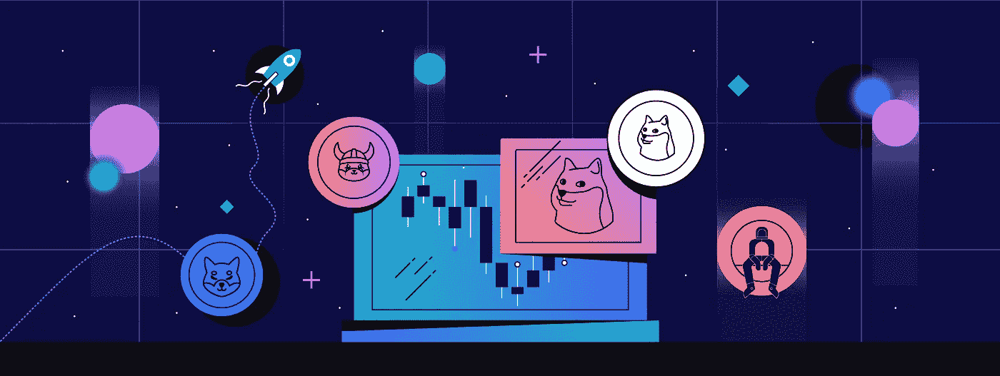
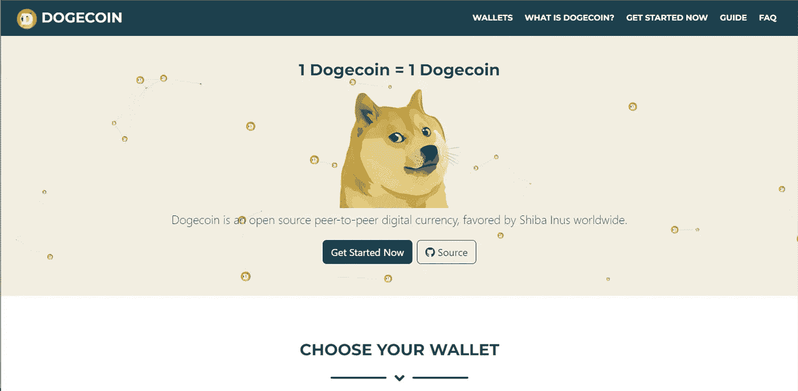

# 2022 年迷因币的潜在未来

> 原文：<https://medium.com/coinmonks/the-potential-future-of-meme-coins-in-2022-5ae873997a17?source=collection_archive---------27----------------------->

The Potential Future of Meme Coins in 2022

迷因币[继续](https://www.cryptohopper.com/blog/5451-a-quarter-by-quarter-analysis-of-cryptocurrency-markets-in-2021)在 2022 年获得牵引力。如今，流行的迷因币不仅被用作现实世界购物的支付方式，还在一定程度上被主流接受。然而，人们不能忽视这样一个事实，即迷因币的价格受社区情绪和社交媒体的影响很大。

这里有硬币的两面可以探索:有人认为迷因币注定要失败，而另一些人认为迷因币可以传播对数字资产的认识。

因此，让我们深入了解 2022 年最受欢迎的迷因币，以及它们将何去何从。

# 什么是迷因币？

迷因币是基于互联网迷因的加密货币。最知名的迷因币是 2013 年创造的 [Dogecoin](https://coinmarketcap.com/currencies/dogecoin/) 。截至 2022 年 6 月，Dogecoin 在所有加密货币中的市值排名第十。从那以后，其他的迷因币也出现了，比如柴犬和 Dogelon Mars。

迷因币受欢迎的原因之一是它们过去提供的回报。2021 年，Dogecoin [上涨](https://coinmarketcap.com/currencies/dogecoin/)约 8000%，成为市值最高的硬币之一。另一个以狗为主题的数字资产柴犬在 2021 年的收益超过了 60，000，000%。

尽管 memecoins 因其轻松的特性而广受欢迎，但一些投资者认为，meme coins 注定会失败，因为它们的价格在本质上是波动的，受投机和社区情绪的驱动。

# 为什么有人认为 meme 币注定要失败？

以下是一些可能阻止迷因币成为更主流的加密货币形式的风险。

## 1.泵送和倾倒方案

迷因币面临的最大危险之一是抽水和倾倒计划。这些骗局包括一群人通过大量购买来人为抬高硬币的价格。当价格达到一定水平时，他们会卖掉所有资产，导致硬币价值大幅贬值。这让投资者背黑锅，并可能对一枚硬币的声誉造成广泛损害。

## 2.名声

由于迷因币与抽水和倾倒计划有关联，它们通常被视为一种高风险投资。此外，人们认为迷因币是一个笑话，而不是一种严肃的数字资产形式。这可能会阻止潜在投资者认真对待它们。

## 3.波动性

Altcoins，包括 meme coins，本质上都是不稳定的。它们的价格波动很大，因为它们没有任何有形的东西作为支撑。这使得它们成为一种高风险的投资，可能会吓跑潜在的投资者。

## 4.没有明确的目标

迷因币面临的最大挑战是，大多数投资者不知道他们实际上能做什么。例如，像柴犬和 Dogecoin 这样表现最好的迷因币是作为网络笑话创造出来的。

> 交易新手？试试[加密交易机器人](/coinmonks/crypto-trading-bot-c2ffce8acb2a)或者[复制交易](/coinmonks/top-10-crypto-copy-trading-platforms-for-beginners-d0c37c7d698c)

# 2022 年流行的迷因币

尽管具有投机性质，但人们不能忽视的是，这些硬币继续以较大的市场资本化维持其地位。以下是 2022 年流行的迷因币。

# Dogecoin (DOGE)

Dogecoin 是最知名的迷因币，背后有一个强大的社区。这是引发 2013 年迷因硬币革命的首批硬币之一。

虽然有些人担心迷因硬币从长远来看可能是短命的，但一些投资者声称 Dogecoin 可以经受住时间的考验。在马克·库班和埃隆·马斯克等热门人物的支持下，Dogecoin 在过去几年里取得了长足的发展。作为 Twitter 的大股东，马斯克提议接受 DOGE 作为 Twitter Blue 的付款，以及最近为 [SpaceX](https://decrypt.co/101521/elon-musk-spacex-dogecoin-doge-pumps) 的付款。此外，强大的全球社区加上低成本的转让也有助于它的成功。

# 柴犬(SHIB)

柴犬是建立在以太坊基础上的去中心化、社区驱动的迷因币。自 2020 年硬币问世以来，柴犬已经成为加密领域的顶级表演者。截至 2022 年 6 月，它[在 crypto 排行榜上排名第 16，市值 60 亿美元。](https://coinmarketcap.com/currencies/shiba-inu/)

和其他硬币一样，它最大的挑战是缺乏实用性。然而，它一直在努力超越它的迷因硬币标签，并在元宇宙、stablecoin (SHIB)和 Shibarium 区块链找到真实世界的用例。随着这些项目的推出，燃烧机制和较低的汽油费推测，柴犬在 2022 年继续在加密社区中获得牵引力。

# 多吉龙火星(埃隆)

Dogelon Mars 是 Dogecoin 的衍生产品，包含了 Elon Musk 和 Dogecoin。投资者将其作为他们最喜欢的星际旅行迷因币。这个项目的主要焦点是火星，并展示了游戏中以狗为主题的迷因如何在宇宙中旅行并结交新朋友。像大多数迷因币一样，Dogelon Mars 是由一个匿名人物创造的。

# 弗洛基伊努(弗洛基)

根据 meme 硬币爱好者的说法，FLOKI 不仅仅是另一个以狗为主题的硬币。它的创造者将其视为一场运动。更重要的是，迷因币因其核心项目而广受欢迎:瓦尔哈拉(NFT 游戏)、区块链教育平台和 NFT 市场。

它最近的成功也可以归功于它的名字来源于善变的技术官僚的狗。Floki Inu 从这种联系中受益匪浅，作为回报，它发展了一个充满活力的社区。

# 安全月犬

Safemoon Inu 证明，并非所有的 meme 硬币都依赖于埃隆马斯克或 Discord 和 Reddit banters 的奇思妙想。与大多数迷因币不同，Safemoon Inu 致力于培育迷因和游戏社区。它的增长是基于区块链和游戏之间越来越多的联系。

此外，其协议正在开发一个名为 SMI Play 的全新游戏平台，并向 SMI 令牌持有者奖励 NFTs。它深受像 SafeMoon 这样的 DeFis 的奖惩结构的影响。Safemoon Inu 协议向长期持有人奖励每笔交易的一部分。

# 结束语

尽管迷因币越来越受欢迎，但投资者不应忽视这样一个事实，即迷因币在本质上是相当投机的。由于缺乏明确的用途，与其他数字资产相比，这些硬币非常不稳定。所以投资者在投资前进行尽职调查是很有必要的。

*最初发表于*[*【https://www.cryptohopper.com】*](https://www.cryptohopper.com/blog/6876-the-potential-future-of-meme-coins-in-2022?utm_source=medium&utm_medium=blog&utm_campaign=the-potential-future-of-meme-coins-in-2022)*。*