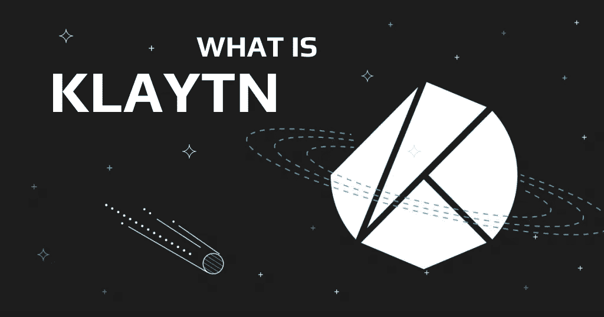
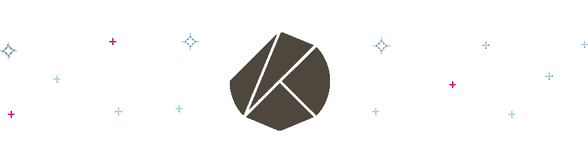
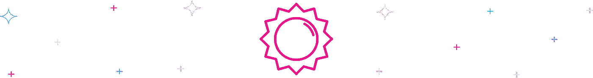

# 区块链驱动行业的力量:什么是 Klaytn 和$KLAY

> 原文：<https://medium.com/coinmonks/the-power-of-blockchain-driving-industries-what-is-klaytn-and-klay-d972064299f?source=collection_archive---------25----------------------->

相对而言，加密货币和元宇宙行业仍处于早期阶段，有时很难选择正确的工具来构建一个利用这两者的特定系统。考虑到所涉及技术的复杂性， [Klaytn](https://swapzone.io/currencies/klaytn) 是一个处理这些问题的简单解决方案。

Klaytn 是一个开源的区块链项目，它利用领先的区块链技术为不同行业的业务框架提供动力，从创意产业到元宇宙。Klaytn 专注于集成尽可能多的面向业务的区块链解决方案，而不考虑这些解决方案运行的底层技术。因此，它有助于促进区块链企业之间的互操作性。

# 克莱顿是怎么工作的？

[克莱令牌](https://swapzone.io/currencies/klaytn)为整个克莱滕生态系统供电。事实上，克莱滕将公共区块链的去中心化特性与私人区块链的高可伸缩性相结合。正是因为这个原因，Klaytn 项目被誉为混合生态系统。它通过几个独特的定制功能和框架的组合来实现这一点，例如伊斯坦布尔拜占庭容错(IBFT)框架。IBFT 是一种共识算法，允许在一秒钟内完成网络上发起的任何事务。

此外，Klaytn 项目声称与基于以太坊的软件完全兼容，这是一套完整的工具，开发者可以很容易地用来构建元宇宙基础设施。它使用先进的区块链技术来实现这些目标，其中包括复杂的定制第 2 层解决方案、SDK 和智能合约、钱包、链浏览器、桥和 oracle 支持。

由于其简单的灵活性和互操作性，Klaytn 还允许在区块链网络之间交换加密资产。

> 交易新手？试试[密码交易机器人](/coinmonks/crypto-trading-bot-c2ffce8acb2a)或[复制交易](/coinmonks/top-10-crypto-copy-trading-platforms-for-beginners-d0c37c7d698c)

此外，该议定书拥有独特的治理制度。该网络不向持有其本地 KLAY 加密货币令牌的用户分配投票特权。相反，该网络由治理委员会运行，该委员会由分散的自治组织(Dao)、构建者和企业组成。该网络确实计划在未来实现更多的 Dao。

# 克莱顿的优点和缺点

对于元宇宙基础设施的创建和无缝运营来说，Klaytn 是一个有用的工具，然而，该项目并非没有缺点。

# 赞成的意见

Klaytn 项目使得使用区块链技术创建和构建复杂的软件变得非常容易。玩赚游戏、加密货币钱包和加密货币交易所是区块链平台中可以受益于 Klaytn 广泛工具包的部分。目前与 Klaytn 相关的项目包括 MiR4、Metamask、币安和 Opensea。

Klaytn 还帮助培养创新的想法，因为它的综合工具包使软件的创建更加容易。

# 骗局

克莱滕面临的主要劣势是激烈的竞争。Klaytn 网络仍然是一个相对较新的项目，开发者可能会选择更熟悉的名称，如分散的土地。

# 谁创造了克莱恩？

Klaytn 由韩国 Kakao 集团的子公司 Ground X 于 2019 年创立。Kakao 主要是一家移动平台公司，然而，他们在 2017 年开始涉足 Web3 领域，并最终在 2019 年 7 月推出了 Klaytn。

# 为什么克莱滕($KLAY)有价值？

Klaytn 网络及其本地令牌 KLAY crypto 可以为正在出现的与区块链相关的挑战提供有用的解决方案。首先，Klaytn 模型相当于以太坊的 EVM 第一层协议，这使得基于以太坊的网络无需任何修改就可以与区块链集成。该协议也是高度可定制的，可以调整以适应用户的需求，无论他们可能是什么。

# 克莱顿的价格

根据来自 Coin Market Cap 的[数据](https://coinmarketcap.com/currencies/klaytn/)，在撰写本文时，Klaytn (KLAY)正在以大约 0.2 美元的价格易手。按市值计算，该代币是第 47 大加密货币，流通供应量为 26.4 亿代币。加密资产在 2021 年 3 月达到了 4.24 美元的历史最高价格。

# 为什么要用克莱顿？

克莱令牌是克莱滕区块链本地的加密资产。这种代币确实有价值，因为它在克莱恩区块链内外的各种交易中都有使用。就像任何其他加密资产一样，它可以被购买、出售、交易或下注，并用于促进在元宇宙中进行的交易。这些交易可能包括出售或购买 NFT 和虚拟资产。用户甚至可以获得 KLAY 代币形式的奖励。

# 克莱顿 dApp 生态系统

不像大多数区块链协议将他们的托管网络称为分散式应用(dapp ), klay TN 将其托管网络称为区块链应用(bApps)。这是因为这些网络不一定必须在其服务链上运行分散的 web 服务。

bApps 是与 Klaytn 网络合作提供顶级区块链服务的网络。截至 2019 年，Klaytn [拥有](/klaytn/51-bapps-on-klaytn-9c9f3549b336) 51 个与其 mainnet 关联的 bApps，其中包括 Rayon、Blockpet、Pibble 等。

# 克莱顿有赌注吗？

克雷顿允许标记克雷令牌。代币可以被押在加密货币交易所，如币安，或 Klaytn 的官方赌注工具，称为 Klaystation。

克莱的赌注奖励也因交易所而异。例如，在 Gate.io 上押注 KLAY 可以让你获得高达 10%的代币回报，而币安提供的回报略低。

或者，您也可以在 Klaytn 平台上下注 KLAY，以换取 DeFi 赌注奖励。尽管你需要一个兼容克莱汀区块链的 web 3.0 钱包。

# 如何交换克莱顿

1.  **前往**[**swap zone . io**](https://swapzone.io/)
2.  **访问 Swapzone 的 Klaytn 交换页面:**前往交换页面，用一枚硬币兑换 KLAY 代币。你的选择包括以太坊(ETH)、比特币(BTC)和系绳(USDT)等。在本指南中，我们将以 USDT 为例。
3.  你想要多少克莱？选择一对互换货币后，你可以决定你想要的 KLAY 的数量。Swapzone 在交换页面上有两个位置，发送框和获取框，在发送框中，您可以输入您愿意发送的 USDT，在获取框中，显示了您预计将获得的回报。
4.  **选择一个加密交易所:** Swapzone 将为您汇总一个合适平台的列表，并根据速度、费率和评级对它们进行排名。选择最适合您需求的服务。
5.  **输入您的钱包详细信息:**您需要输入您的 Klaytn 钱包地址、USDT 退款地址，还可以选择输入您的电子邮件。确认详细信息后，点击蓝色的继续交易按钮。
6.  **转移 USDT:** 将您在步骤 3 中同意的 USDT 转移到您屏幕上的钱包地址。确认所有的数字都是正确的，这样你就不会损失你的资金。
7.  **交换完成**

搞定了。你现在需要做的就是等待你的克莱代币到来。一旦它出现在你的钱包上，恭喜你，你已经交换了克莱顿！