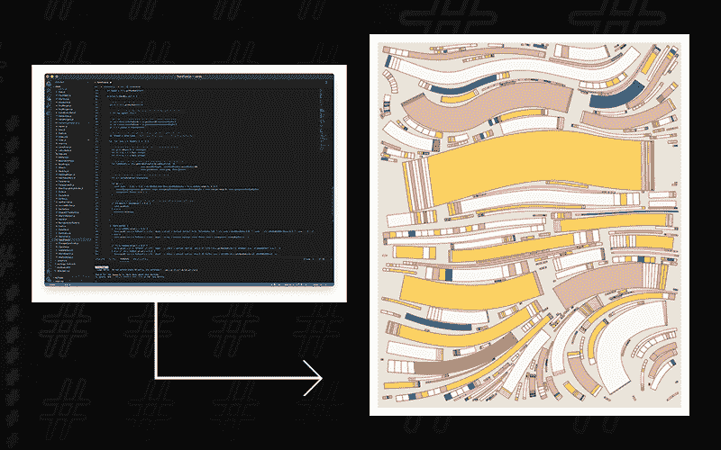
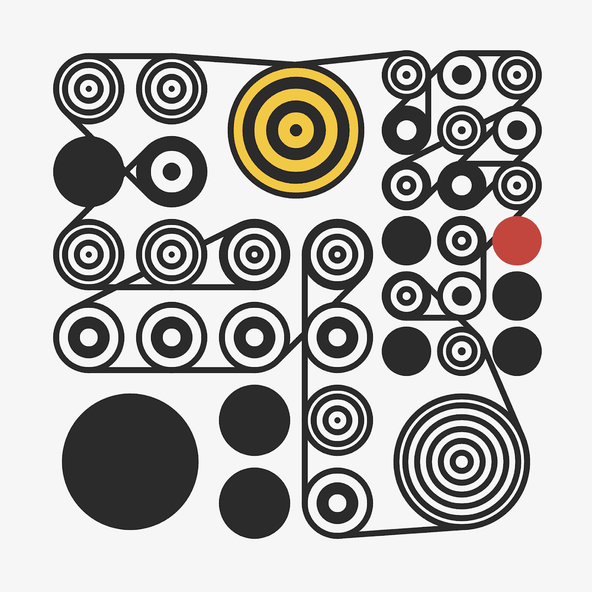
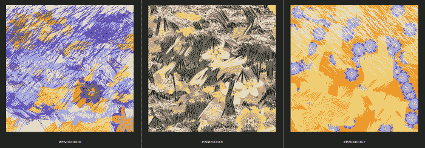
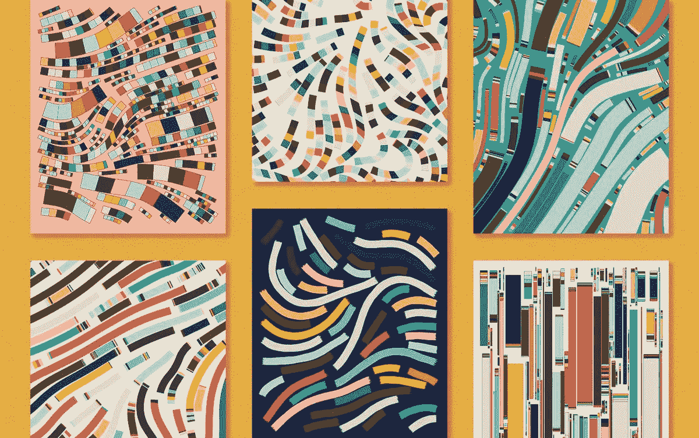

# NFT 空间中生成艺术的力量

> 原文：<https://medium.com/coinmonks/the-power-of-generative-art-in-the-nft-space-2423d382b484?source=collection_archive---------27----------------------->

生成艺术是一段代码，用来创建随机生成的艺术作品。

NFTs 的受欢迎程度已经爆炸了。尽管有些作品比其他作品更有价值，但这些数字艺术品对艺术家和开发者来说价值数百万美元。但是你听说过用算法创造一个吗？其中一个 NFT 类型是生成艺术，艺术板块以创造它为荣。

生成艺术是一种挑战我们的艺术创作和价值观念的基本媒介，它通过程序的每一次运行提供了自动化艺术作品的无限可能性。

在过去，生成艺术并没有被广泛接受。它很少被称为“真正的艺术”,经常被描述为无趣。然而，NFT 空间改变了我们对数字艺术的认知和评价

一些著名的 NFT 生成艺术作品有 Ringers、Scrappy 松鼠、Fidenza 等。

虽然生成艺术可能是一个令人生畏的学科，因为它似乎包含了大量的数学，但实际上，它完全不是那样的。任何人都可以创造这些奇妙的作品。那么，什么是生成艺术呢？

[**The Ringers #109**](https://opensea.io/assets/0xa7d8d9ef8d8ce8992df33d8b8cf4aebabd5bd270/13000109) **is one of the most expensive NFTs, sold for $7.1 million.**

# 到底什么是生成艺术？

生成艺术是一种协同努力，通过不断调整变量，将生命注入抽象概念，从而驾驭非人类系统。

完全或部分由自主系统创作的艺术被称为“生成艺术”，自主系统可以独立决定艺术作品的特征，否则需要艺术家直接做出决定

自治系统可以由用于创建艺术作品的编程语言、机器、计算机程序和程序发明组成。数字表示、3D、2D、虚拟现实或这些的组合可以虚拟地呈现或在物理环境中实现，作为创造性艺术的例子

因为这个系统在生成艺术中被赋予了一些自由，艺术家有时并不直接控制结果。因此，艺术作品的华丽有时会受到称赞，而没有考虑代码复杂的基础。通常，生成性铸造过程需要一种方式，艺术家结合特定的代码并监控最终的输出，以选择所有视觉上有趣和有前途的结果。

当一个特定的结论看起来有希望时，艺术家识别算法并编码它。一个不愉快的模式也可以被写成不存在。

生成艺术是一种基础媒体，通过为每个程序运行提供无限数量的自动化艺术作品，挑战我们对艺术创作和价值的理解。

# 生成艺术是如何进入现实的？

这些艺术自 20 世纪 60 年代初就已经存在，包括几何抽象艺术、机器人绘画、计算机图形、自动绘制的照片、音乐和随机诗歌等。

工程师兼艺术家 Aaron Penne 自 2018 年以来一直致力于生成艺术，目前正在以 NFT 的形式销售算法。苏富比和佳士得都展示过他的作品。

他创作了一系列名为“幻影”的画作，利用计算机算法创造出彩色的重复线条层，从而产生动态运动。

利瓦伊·沃尔特·雅吉 1893 年的一幅画对此产生了影响。他使用生成艺术 NFT 平台艺术块，通过引入 20 种颜色的手工挑选组合，制作了 1500 幅画。

现在，该系列的每一次二级市场销售都要向艺术家支付 5%的版税。基于 2.8K 以太交易量，该项目支付给艺术家大约 60 万美元。

# NFT 影响了生成艺术的发展

跨维度数字艺术家的快速增长的生态系统已经成为传统艺术的一个可行的替代方案，通过扩大意识。许多数字艺术家正在利用新技术重新赋予艺术价值，在许多方面推动创造力的界限。

通过生成性艺术作品，NFT 不仅保证了独特艺术的有效性；艺术是嵌入在令牌本身，给它额外的创意，从而增加其价值。例如，在 2021 年 8 月的 Art Blocks 上，名为 Vincent Van Dough 的用户以 600，000 美元购买了三件艺术作品。

> 交易新手？试试[加密交易机器人](/coinmonks/crypto-trading-bot-c2ffce8acb2a)或者[复制交易](/coinmonks/top-10-crypto-copy-trading-platforms-for-beginners-d0c37c7d698c)

[**Fragments of an Infinite Field**](https://opensea.io/assets/0xa7d8d9ef8d8ce8992df33d8b8cf4aebabd5bd270/159000353) **by Monica Rizzolli has made 1,623 ether (around $5.38 million) through a sale on Art Blocks, the non-fungible token (NFT) platform.**

# 生成艺术中值得注意的概念

**艺术街区**是 NFT 领先的商业项目之一，影响着 NFT 空间中生成艺术的发展。Art Blocks 是以太坊上的一个 dApp，艺术家和艺术收藏家可以在这里创作、选择和购买艺术作品。8 月份，艺术品市场的年化交易量占全球艺术品市场的 20%。

另一个秘密艺术项目 **Avid Lines** 发明了一个混合数字艺术的系统，通过从自动摄影仪获取指令来创作作品。

**突变花园播种者**创造了基于时间的绘画，这些绘画在不同的时间频率上改变顺序。

**Autoglyphs:** 以太坊区块链上第一个 100%链上生成艺术。它们是由幼虫实验室(CryptoPunks 背后的同一家公司)创建的。一个完全独立的机制从 ERC-721 智能合约中生成艺术。大多数 NFT 使用 ERC-721 契约来注册 NFT，但是字形是从智能契约本身生成的。

**Fidenza by Tyler Hobbs** ，Fidenza 算法创作的艺术品被认为是市场上旗舰级的生成艺术 NFT 之一。目前最便宜的 Fidenzas 大约是 50 万美元。菲登扎#30 被变异猫道购买。

[**Fidenza by Tyler Hobbs**](https://tylerxhobbs.com/fidenza)

# 生成艺术的 5 个最佳特征

# 不可预测的结果

艺术品属性是在铸造过程中随机生成的。因此，在艺术品落入钱包之前，编码艺术家和目前的买家都不知道艺术品将如何出现。这使得它成为艺术收藏家和艺术家激动人心的经历。

# 流动性

用于生成艺术品的算法可以调整和改进。嵌入或删除一点代码会产生一个完全不同的作品。

# 缓解

尽管大多数生成性艺术需要复杂的代码和脚本，但已经为初学者开发了易于使用的应用程序来探索创意设计。比如处理类 app。此外，实时脚本可以在浏览器中运行，并实时生成内容。例如，一些算法允许用户在 Art Blocks 平台上以一定的成本实时铸造他们的艺术品。每次点击按钮都会产生新的艺术作品。

# 速度

计算机化工具的使用在短时间内提供了更高的准确性和更重要的结果。因此，生产变得很快，取得了令人惊叹的成果。

# 准备好的市场

在全球艺术爱好者社区准备通过 NFT 市场购买的地方，生成性艺术可以立即被创造出来。

# NFT 和元宇宙未来的生成艺术

类似于 NFTs 可以有多种艺术形式，生成性艺术可以有多种表现方式，加密的生成性艺术可以“玩”。

考虑艺术块的情况。不同于头像 NFT 的标准数量通常固定在一万，艺术块上一系列作品最显著的限制是一千到几百。

不仅如此，此外，人们可以根据自己的喜好，花尽可能多的时间探索特定领域。例如，艺术家不仅对视觉图片进行实验，也对视频和音频进行实验。

换句话说，生成艺术是有趣的，为探索提供了无限的空间，并有助于赋予元宇宙的概念。此外，脸书的名字刚刚被改为元。

元宇宙新贵公司的首席执行官马克·扎克伯格写了一封“创始人信”,详细说明了公司为元宇宙创作的新目标。“我们的使命没有改变，仍然是把人们团结在一起，”他同时表示。

这可能会激发全球投资者对元宇宙概念的兴趣，而生成艺术的加入可能会提高工作效率，并使元宇宙环境更加充满活力。

> 加入 Coinmonks [电报频道](https://t.me/coincodecap)和 [Youtube 频道](https://www.youtube.com/c/coinmonks/videos)了解加密交易和投资

# 另外，阅读

*   如何在 Uniswap 上交换加密？ | [A-Ads 审查](https://coincodecap.com/a-ads-review)
*   [加密货币储蓄账户](/coinmonks/cryptocurrency-savings-accounts-be3bc0feffbf) | [YoBit 审核](/coinmonks/yobit-review-175464162c62)
*   [Botsfolio vs nap bots vs Mudrex](/coinmonks/botsfolio-vs-napbots-vs-mudrex-c81344970c02)|[gate . io 交流回顾](/coinmonks/gate-io-exchange-review-61bf87b7078f)
*   [CoinFLEX 评论](https://coincodecap.com/coinflex-review) | [AEX 交易所评论](https://coincodecap.com/aex-exchange-review) | [UPbit 评论](https://coincodecap.com/upbit-review)
*   [AscendEx 保证金交易](https://coincodecap.com/ascendex-margin-trading) | [Bitfinex 赌注](https://coincodecap.com/bitfinex-staking) | [bitFlyer 点评](https://coincodecap.com/bitflyer-review)