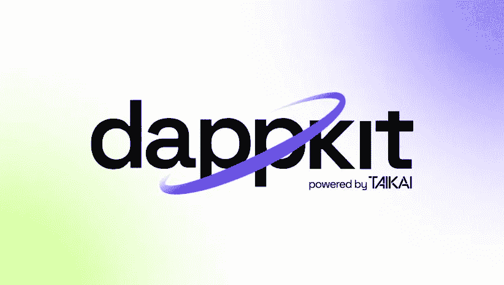

# 强大的 WEB3 工具— dappKit

> 原文：<https://medium.com/coinmonks/the-powerful-web3-tool-dappkit-2fb37a229d4b?source=collection_archive---------17----------------------->

区块链和 web3 技术已经存在了一段时间，并已经显示出它们对任何商业模式的影响。越来越多的人加入现有的 web3 项目或开始新的项目。

## WEB3 的革命

Web3 技术显然还处于早期阶段，到目前为止，人们仍在探索它所能提供的可能性，并取得了巨大的成功。随着这项技术的使用，公司、企业或任何商业模式如何运作的新时代正在发生巨大变化。权力回到人民身上，让任何产品或协议的用户更加清楚。

每出一个新的，总有一些问题重要不重要。至于 web3，一些人可能会发现很难理解这种新情况，所以这可能是他们中很大一部分人加入的障碍。为此，这一领域的专家必须提供课程或工具，帮助其他人理解这一新技术，从而实现全面的 web3 过渡和全面采用。

目前已经有许多来自现有 web3 项目的团队试图教育他们的社区，资助新的想法，并在这个领域为创业团队提供建议，并取得了很好的效果。有成千上万的项目具有真正创新的想法，可以对这个世界产生巨大的积极影响，但问题是如何整合更多不具备必要编程知识的 web3 开发人员，以及如何让任何人都可以轻松地从 web2 过渡到 web3。这只能通过一种工具来实现，这种工具可以使整个过程完全自动化，或者用更少的努力或知识来开发 web3 项目，而 TAIKAI 团队拥有解决方案。

## 完整的 WEB3 开发生态系统

泰凯网络实验室的团队是一群 Web3 先驱，他们的愿景是通过他们的生态系统和独特的 Web3 产品为公司和创作者提供解决方案。值得一提的是，泰凯网络实验室已被公认为 2022 年葡萄牙发展最快的 50 家创业公司之一。

## **TAIKAI 团队是三个现有产品的幕后推手，这三个产品共同为开发者和 web3 开发提供了完美的平台:**

1.  第一个产品是 Bepro network，这是一个分散的市场和系统，连接开发者和运营商，为任何想要建立开源开发库的人提供一个地方。该协议是 web3 开发世界的一项创新，因为它可以降低任何使用它的人的成本，因为你不需要雇用整个开发团队，但你可以在 Bepro protocol bounty 平台上创建开发问题作为奖金，并向解决问题的人支付报酬。随着 [v2](https://taikai.notion.site/V2-Bepro-Protocol-Moonbeam-Deployment-232f10cb92cc49579469b0e5c42e2818) 在 Moonbeam 网络上的部署，该协议的更多功能将很快问世。
2.  第二个产品是[黑客马拉松平台](https://taikai.network/en/organizations)，该平台已经为微软、辉瑞、Tik Tok、Telos、Harmony 等 web2 和 web3 领域的知名企业举办了许多黑客马拉松。如今，黑客马拉松是向更广泛的受众展示您的发展动态、寻找新的人才和创意以应对招聘挑战或为您的员工举办内部黑客马拉松的最佳方式。
3.  一个完整的 web3 开发生态系统不能缺少一个工具来使从 web2 到 web3 的过渡变得非常容易。这个工具就是 [dappKit](https://dappkit.dev/) ，太凯团队的第三个产品。

## **终极 WEB3 工具— dappKit**

dappkit 是一个精心策划的框架，这样你就可以通过编写 solidity 来自动化创建和单元测试、javascript 包装和扩展集成——这是一个用 [Truffle](https://trufflesuite.com/docs/truffle/) (在你的智能合约中集成 solc 编译)& [Open Zeppelin](https://openzeppelin.com/) (提供可信任的、经审计的&测试的智能合约)构建的工具，已经集成，解决了一个非常简单的问题:solidity 开发的速度。



对于任何新项目来说，使用 dappKit 都是在几分钟内免费开发一些 web3 集成的好方法。现在，任何知道 **typescript** 或 **javascript** 的开发人员都可以创建第一个 web3 集成，打破关于智能合约的编程语言知识的障碍。此外，web2 公司可以通过一个简单的过程过渡到 web3，并探索超出他们目前所知的新的可能性。

## **使用 dappKit 的开发者在很多方面受益:**

1.**更好的升级:**您可以以更快的方式将区块链相关功能添加到您的软件中，并避免所有与智能合同开发相关的重复任务。

2.**更快的上市时间:**提高智能合同的开发、测试和部署速度；

3.**降低成本:**通过使用开源框架降低你的应用开发成本；

4.**成为强势品牌的一员&社区:** TAIKAI 有一个非常强大的社区，你也可以成为其中的一员。我们有一个受人喜爱的品牌，你可以用它来从事与你的兴趣和目标相一致的有趣和具有挑战性的项目。

5.**Javascript SDK:**Javascript 是世界上使用最多的编程语言之一，尤其是对于 web apps 和前端用途。你不需要添加额外的语言到你的栈中，来构建去中心化的 web3 应用。

## [**dapkit 使用指南**](https://docs.dappkit.dev/start-building/installation)

使用 dappKit，您可以极快地部署 DeFi 平台、加密令牌、NFT 或 Dao。你需要做的就是遵循以下步骤:

1.安装: **dappkit** 作为 [npm 包](https://www.npmjs.com/package/@taikai/dappkit)提供

2.创建一个 **web3 连接**(元掩码)

3.部署您想要的项目类型(DeFi 平台、NFTs 等)。)

值得一提的是，dappKit 可以**与任何 EVM 区块链**进行交互，从而在该领域提供多链解决方案。

## [**分分钟部署您的 web3 项目:**](https://docs.dappkit.dev/start-building/how-to-guides)

**ERC-721 NFT(不可替代令牌)**

```
*import { Erc721Standard } from "@taikai/dappkit";*

*const nftToken = new Erc721Standard(*
*{ web3Host: "http://localhost:1337", privateKey: "*" },*
*"0xContractAddress"*
*);*

*await nftToken.start();*
*await nftToken.mint("0xWalletAddress", "tokenId-1");*
```

**ERC-20 或 ERC1155 代币**

```
import { ERC20 } from "@taikai/dappkit";

const erc20 = new ERC20(
{ web3Host: "http://localhost:1337", privateKey: "*" },
"0xContractAddress"
);

await erc20.start();
await erc20.transferTokenAmount("0xWalletAddress", 100);
```

**DeFi 平台**

```
import { Sablier } from "@taikai/dappkit";

const sablier = new Sablier(
  { web3Host: "http://localhost:1337", privateKey: "*" },
  "0xContractAddress"
);

await sablier.start();
await sablier.withdrawFromStream(1, 500);
```

**DAOs(分权自治组织)**

```
import { Network_V2 } from "@taikai/dappkit";

const network = new Network_V2(
{ web3Host: "http://localhost:1337", privateKey: "*" },
"0xContractAddress"
);

await network.start();
await network.lock(205000);
```

**使用开源库开发您的项目:**

1.  [Node.js](https://stackblitz.com/edit/node-b3cgaa?file=index.mjs)
2.  [Next.js](https://stackblitz.com/edit/nextjs-nzulwe?file=pages%2Findex.js)
3.  [Github](https://github.com/taikai/dappkit-testflight)

**如果需要定制开发，可以使用 Bepro 网络** [**赏金平台**](https://development.bepro.network/) **并创建赏金来实现。**

dappKit 的选择不止于此，因为它是一个开源的 SDK，总是会随着更多的特性和功能而进一步改进。**通过 Bepro 网络赏金平台可以实现对 dappKit 的投稿。**任何解决 dapkit 相关开发问题的开发者都可以获得奖励，同时为 dapkit 的发展做出贡献。**随着 Bepro 协议** [**v2**](https://taikai.notion.site/V2-Bepro-Protocol-Moonbeam-Deployment-232f10cb92cc49579469b0e5c42e2818) **的发布，将会有更多的奖励选择。**

**通过 Bepro 网络** [**赏金平台**](https://development.bepro.network/create-bounty) **:** 为 dappKit 的进一步发展创造赏金

[*Bepro 网络(web app)*](https://development.bepro.network/) *>连接 metamask >连接你的 Github 账号>创建赏金>填写描述>为赏金设置$BEPRO 值>赏金就绪*

**总而言之，dappKit 是最强大的 SDK 之一，因为它允许开发人员非常快速地开发 web3 集成，无需任何成本，也不需要任何智能合约的特殊知识。可能性是无限的，因为它将继续发展，使其成为创业公司、web2 公司和所有开发者的一站式解决方案。TAIKAI/Bepro 网络是最完整的开发者生态系统，dappKit 在大规模采用中发挥着关键作用。**

*在第三季度(Q3)，Bepro 网络的* [*v2*](https://taikai.notion.site/V2-Bepro-Protocol-Moonbeam-Deployment-232f10cb92cc49579469b0e5c42e2818) *将部署在 Moonbeam 网络上，为公司、企业、初创公司和该协议的用户带来全新的可能性。*

[***dapkkit***](https://dappkit.dev/)

***泰开社交媒体平台:***

[***网站***](https://taikai.network/en)

[***Linkedin***](https://www.linkedin.com/company/taikainetwork/)

[***insta gram***](https://www.instagram.com/taikainetwork/)

[***推特***](https://twitter.com/taikainetwork)

***Bepro 网络社交媒体平台:***

[***网站***](https://bepro.network/)

[***不和***](https://discord.com/invite/bepronetwork)

[***推特***](https://twitter.com/bepronet)

[***领英***](https://www.linkedin.com/company/betprotocol/)

[***insta gram***](https://www.instagram.com/bepronetwork/)

[***电报***](https://t.me/betprotocol)

> 交易新手？尝试[加密交易机器人](/coinmonks/crypto-trading-bot-c2ffce8acb2a)或[复制交易](/coinmonks/top-10-crypto-copy-trading-platforms-for-beginners-d0c37c7d698c)