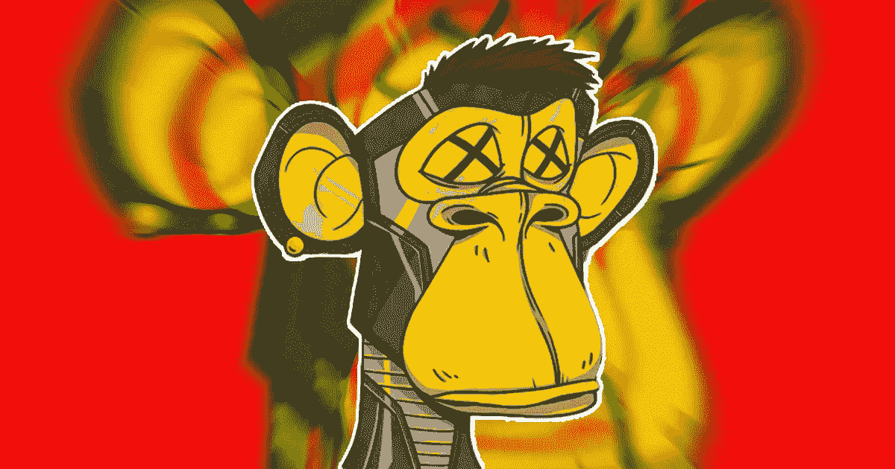

# NFTs 的问题是

> 原文：<https://medium.com/coinmonks/the-problem-with-nfts-adab50f058b2?source=collection_archive---------18----------------------->

我现在已经无法数清有多少次读到过不可替代的代币是稀有、独特和有价值的数字资产，其价值可以超越区块链生态系统。然而，我很难完全同意这种说法。

一方面，我知道这是真的，但另一方面，我发现很难理解这种独特性的范围。在这篇文章中，我讨论了 NFTs 的多方面问题；也许，我可能不是唯一一个有这种想法的人。

# NFT 是独一无二的

无数次地，NFT 是独一无二的和有价值的，它们的用例可以扩展到现实世界，甚至影响我们的日常生活。它们在艺术领域的应用非常迅速(毕竟它们还能在哪里找到应用),因为创作者将它们视为代表自己作品并永久保存记录的一种方式。

我们也看到了它们在房地产行业的应用，房地产经纪人使用 NFT 作为房地产的表现形式。因此，当个人购买房产时，他们也会收到其数字 NFT，作为永久资产转让和所有权的确认。

游戏、活动和票务以及行政管理是采用 NFTs 的其他领域。最近，我们甚至听说了它们在食品工业中的应用。

# NFTs 的问题

NFTs 的第一个主要问题是，在很大程度上，这个空间充满了只专注于数字艺术的创作者。尽管一对一艺术以其巨大的销售记录将非功能性艺术带到了舞台上，但现在这个空间被生成的非功能性艺术所主导，这些非功能性艺术由数以千计的人工智能生成的艺术组成，这些艺术只能通过特征和属性来区分。

问题不在于艺术本身，而是这种扩散将公众的注意力转移到了其他可以部署 NFTs 的基本的和转变的用例上。花点时间问问任何人他们对 NFT 的看法，你最有可能听到的是猴子和猿带着帽子，没有实际价值。只要看一看 [Opensea](https://opensea.io/rankings) 就可以自己看了。

尽管这种扩散，我也不得不提到，这些收藏中的一小部分实际上是在为他们的收藏者社区构建有形的用例。

NFT 的第二个问题与它们在其他行业的使用直接相关。最近在 [NFTgators](https://www.nftgators.com/nfts-turn-out-to-be-a-great-channel-of-revenue-for-businesses-ask-nike/) 上发布的消息称，NFT 排名前十的品牌自从进入这个领域以来，在不到一年的时间里已经赚了大约 2.8 亿美元。这表明，除了数字艺术，NFTs 在其他行业也有有价值的使用案例。问问耐克、蒂芙尼、百威啤酒和其他公司，他们是如何做到这一点的。

到目前为止，NFTs 在其他领域的应用进展缓慢。也许，许多人被 2021 年的 NFT 狂潮所吸引，现在持有价值暴跌的资产。这表明只有有形的用例才有能力创造对数字艺术的持续需求。

# 潜力

NFTs 有可能最终成为主流，并在几个行业中被采用。它能够在区块链上永久展示贵重物品，这意味着除了潜在的价值储存之外，它们还可以作为认证的证据。

因此，土地分配和管理、城市规划、食品、娱乐、票务、供应链、库存图像摄影和其他几个领域的用例可以极大地增加 NFTs 的价值和采用。

# 结论

NFT 的问题在于它们出现后的叙事。这种说法需要改变，这样每个人都可以开始看到它们的价值，而不仅仅是数字收藏品。在达到这一水平之前，到目前为止困扰非正规金融机构的问题肯定会继续存在。

> 交易新手？试试[加密交易机器人](/coinmonks/crypto-trading-bot-c2ffce8acb2a)或者[复制交易](/coinmonks/top-10-crypto-copy-trading-platforms-for-beginners-d0c37c7d698c)