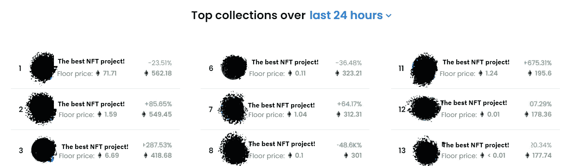

# 今天 NFTs 的问题是

> 原文：<https://medium.com/coinmonks/the-problem-with-nfts-today-fa2da514c216?source=collection_archive---------13----------------------->

大约在 2021 年和 2022 年(到目前为止), NFT 最大的项目开始时没有一个明确的战略，即他们将如何处理来自造币和版税的资金。他们首先专注于销售，然后计算出他们将为投资者和客户提供什么价值。我不认为我需要指出这不是一个可行的商业实践。想象一下，亚马逊向你收取 Prime 订阅费，却不告诉你能得到什么，而是说“订阅为社区带来了好处，可以访问未来的项目和白名单”。

引领(不好的)趋势

许多其他项目复制了(并且仍在复制)这种方法，希望从市场上的投资者那里得到一张空白支票。只要上 Opensea，随时查看任何趋势项目(大约在撰写本文时，2022 年夏天)，去他们的网站看看是否有任何有意义的东西。大多数时候，你可以阅读一些无意识的故事，通常专注于艺术本身，对 NFT 买家来说没有任何真正的内容或价值主张。一切都建立在期望、未来潜力和炒作之上。自然，这不会加强创始人和投资者之间的信任关系。更不用说，通过随机检查热门项目，你会发现他们中的大多数在他们的网站上没有任何隐私政策或条款和条件；这可能看起来微不足道，但事实上，它为责任敞开了一扇大门。

基本上，NFT 项目的商业努力和资源大部分被分配给影响者和阿尔法小组网络中的社区建设，希望人为的炒作将推动他们的 NFT 销售。这是一个空壳:背后没有商业理念，没有商业计划，没有经过评估的价值主张。与此同时，无论创始人承诺什么，都缺乏细节，实现承诺的计划缺失，团队能力不明确，人们只是希望相信这一点。

**那么，我们为什么会陷入这种困境呢？**

这些 NFT 项目的内部问题是项目成功的定义，或者换句话说，项目的使命和目标。

在一个正常的商业世界中，所有非功能性交易的销售将是一种业绩衡量(如果你愿意，可以称之为北极星)，而不是目标本身。但是，由于 NFT 所有权是由它们作为投资的价值驱动的，所有可用代币的(快速)销售通常意味着有利于其公允价值增加的需求/供给比率。

问题是，如果没有项目的实质，或者没有对潜在的真正商业的依赖，而这种商业基于在自由市场上向客户群提供的产品和服务来推动对 NFT 的需求，对非功能性技术的需求可能会像其生产一样迅速下降。同样，这种方法会导致创始人缺乏责任感，由于地毯拉扯或不成功销售的巨大风险，对项目的可信度产生实际影响，并对 NFT 市场的可信度以及最终对整个区块链的采用产生连锁影响。

**非功能性测试的思维模式必须发展**

在一个为无信任所有权、所有权转让和交易提供所有工具的行业，要建立、培养和保持投资者的信任，仍有许多工作要做，这在某种程度上很有趣。人们可能会认为技术的价值会影响用户的价值，但是我们并不是生活在一个理想的世界里。

最终，在早期采用阶段留下印记的仍然是人的缺陷，这就是我们需要努力制定结构化方法来克服过去每一项技术、经济和金融突破所面临的挑战的地方。只是这一次，它是在一个非常有希望的，也许是改变文明的 Web 3.0 范式转变的背景下。

如果你对我的文章有共鸣，请在 [twitter](https://twitter.com/bayar_ali) 和 [linkedin](https://www.linkedin.com/in/bayarali) 上关注我！

> 交易新手？尝试[加密交易机器人](/coinmonks/crypto-trading-bot-c2ffce8acb2a)或[复制交易](/coinmonks/top-10-crypto-copy-trading-platforms-for-beginners-d0c37c7d698c)