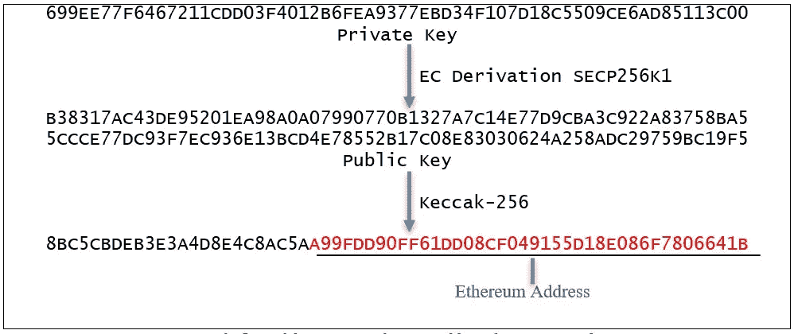

# 亵渎性地址黑客——虚假地址是如何产生的？

> 原文：<https://medium.com/coinmonks/the-profanity-address-hack-how-are-vanity-addresses-generated-cce40ba5ed39?source=collection_archive---------1----------------------->

digital picture of a figure of vanity standing in front of a mirror, Picasso, cyberpunk

嗨，朋友们，这周过得怎么样？太好了，我们继续走。

您可能已经注意到，加密货币钱包地址是一长串胡言乱语。这些疯狂的地址背后有一种方法。

尽管如此，一些个人和公司希望他们的钱包账户有令人难忘的品牌。当加密货币首次推出时，没有任何定制钱包地址的选项。

2011 年，接近比特币诞生之际，一款名为 [Vanitygen](https://en.bitcoin.it/wiki/Vanitygen) 的工具上市了。通过 Vanitygen，用户可以为自己的比特币钱包地址创建一个自定义前缀。

比特币地址通常是这样的:

1a 1 zp1 EP 5 qgefi 2 dmptftl 5 slmv 7 div FNA '

现在可能是这样的:

1 first EP 5 qgefi 2 dmptftl 5 slmv 7 div FNA '。

美好时光。

在本例中，首字母“1”后的前五个字符被改为单词“first”

快进到 2022 年，虚名地址在包括以太坊在内的网络中司空见惯。

# **简介**

_______________________________

Profanity 是一个为以太坊开发的开源虚空地址生成器。

上周，人们发现由亵渎产生的地址被黑客攻击。

我们将在本文中探索的是:

-为什么使用亵渎语言生成的地址易受攻击

-以太坊地址是如何生成的

-虚假地址是如何产生的

-比特币地址也有风险吗？

# 发生了什么事？

_______________________________

首先是最近发现的亵渎漏洞的概要。

今年早些时候，包括创始人之一在内的 1inch 的贡献者表达了他们的担忧[。](https://github.com/johguse/profanity/issues/61.)问题在于私钥的 32 位种子。

从几个月前到上周，很明显用户的地址被清空了。

为什么 32 位地址是一个问题？让我们先简单介绍一下地址。

# 以太坊地址是如何产生的？

_______________________________

你的以太坊地址就是你的账户或者钱包。

您有一个公钥(您复制并发送给其他人以向您发送令牌的那个公钥)。而且你有一个私钥(平时看不到，藏在你钱包软件的某个地方)。

当您首次创建新帐户时，会随机生成一个私钥。使用加密算法从该私钥生成公钥。然后，另一种算法获取该公钥，并将其散列。这个散列就是你的公钥。

这是它的样子:

Ethereum address generation

这通常很有效。

地址随机生成。随机化的范围很广。足够宽，不需要担心地址冲突。

当我们主动选择地址时，即使我们只选择了几个字符，冲突的几率也会有所变化。

# 虚荣的地址

_______________________________

回想一下上面的内容，虚拟地址选择加密货币钱包地址中的几个初始字符。

以下是以太坊地址示例:

' 0x71c 7656 EC 7 ab 88 b 098 defb 751 b 7401 b5 f6d 8976 f '。

虚名地址版本可能如下所示:

0x 1234566 EC 7 ab 88 b 098 defb 751 b 7401 b 5 f 6d 8976 f '。

此处“0x”后的前六个字符被替换为“123456”。所选字符的数量可以变化。您选择的字符越多，生成虚拟地址所需的时间就越长。

# **亵渎虚空地址生成**

_______________________________

下面是脏话如何为用户生成一个虚荣心地址:

1.从 40 亿个可能性中随机选择一个初始私钥

2.确定性地将其扩展到 200 万种可能性中的另一个私钥。

3.从私钥中导出公钥

4.递增公钥，直到找到所需的虚位地址

步骤 4 继续生成地址，直到找到一个以您选择的地址为前缀的地址。

# 漏洞

_______________________________

亵渎的问题在于上面的第一步。Profanity 使用 32 位向量来播种 256 位私钥。

这是 1 英寸贡献者发现并提出警告的问题。正如他们估计的那样，一个 32 位字符串可以在几个月内被一个拥有数千个 GPU 的 GPU 农场暴力破解。

按照加密标准，这是微不足道的。把钱放在几个月内几乎肯定会被黑客攻击的钱包里，你不会感到很安全。

黑客可以使用他们的 GPU 不断生成 32 位字符串，直到他们发现用于生成钱包私钥的种子。不太好。

更糟糕的是，1inch 贡献者意识到确定性地生成私钥是可能的。他们编写了一个脚本，可以在同样长的时间内完成亵渎从种子生成虚空地址的工作。

以下是他们的脚本所采取的过程:

1.获取虚假地址的公钥。

2.将其确定性地扩展到 200 万分之一的可能性。

3.递减该密钥，直到它达到种子公钥(32 位向量)

现在，您拥有了与虚拟地址的公钥相关联的私钥的种子。

亵渎 GitHub 回购仍在进行。请不要使用它。

这里有一个[替代以太坊](https://github.com/MyEtherWallet/VanityEth) [的虚空地址生成器。](https://github.com/MyEtherWallet/VanityEth.)这不是使用它的建议。

# 比特币虚荣心地址的含义

_______________________________

如前所述，比特币虚位地址自 2011 年通过 Vanitygen 出现。他们安全吗？

他们应该是。流程如下:

1.私钥是随机生成的

2.公钥是从私钥派生出来的

3.重复生成比特币地址，直到找到一个与您选择的地址匹配的地址

*这里的起点不是 32 位种子*。试图暴力破解私钥需要很长时间。

这个过程中的虚位地址和其他随机生成的比特币地址一样安全、一样。

步骤 3 需要相当多的计算能力。多少取决于你选择了多少个字符。

例如，如果虚荣部分是两个字符，它需要< 1 millisecond of search time to find the address. Twelve characters would take 2.5 million years.

Each character increases the difficulty by a factor of 58 since characters follow a [Base58 字母表](https://learnmeabitcoin.com/technical/base58))。

考虑到所需的计算能力，不再具有竞争力的比特币矿工可以重新用于虚拟地址搜索。有专门的池，他们的采矿力量，为你找到虚荣心的地址，收取少量费用。

在我们奇妙的加密/网络 3 世界里，从来没有无聊的一天，是吧？

感谢您的阅读。下面是一条简短的消息

# 时事通讯

_______________________________

我从我们热爱的生态系统中制作市场和开发者相关的内容。

这篇文章是我的免费每周时事通讯的一篇专题文章的例子。在那里你还可以找到独家内容，所以一定要注册！

你的邮件不会用于其他任何用途(我甚至都不看它们)。

 [## 每周简讯的加密高潮- Revue

### 通过 Crypto Climax 在 Crypto、Web3、NFT 和元宇宙市场尖端的可行见解和策展，帮助…

www.getrevue.co](https://www.getrevue.co/profile/thecryptoclimax?element=subscribe-through-revue) 

# 推特

_______________________________

此外，请务必在 Twitter 上关注我的帖子和其他重要内容。

【https://twitter.com/TheCryptoClimax 

直到下一次，从您的首要加密/Web3 出版物。

最大值—加密气候值

> 交易新手？尝试[加密交易机器人](/coinmonks/crypto-trading-bot-c2ffce8acb2a)或[复制交易](/coinmonks/top-10-crypto-copy-trading-platforms-for-beginners-d0c37c7d698c)