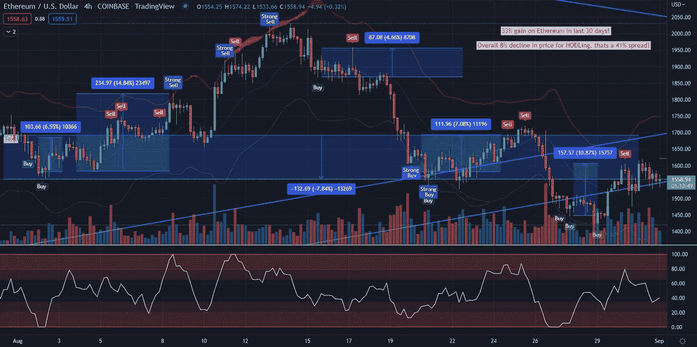

# 阿尔法信号起作用的证明！

> 原文：<https://medium.com/coinmonks/the-proof-that-it-works-9d83864fa90f?source=collection_archive---------37----------------------->

所以，你可能正在阅读关于我们系统的所有内容，并且喜欢这个理论，但是你在想，空谈是没有用的。证据在哪里。这就是了。我们将向您展示最近几个被调用的交易设置的真实例子，以及在 BTC 最近 30 天的横盘和下跌市场中，它们如何导致 27%的上涨。见下文，我们将详细阐述！

如果你放大上面的图像，你会看到在过去的 30 天里，总共有 5 个交易设置在 BTC 的 4 小时内被调用。有 5 种以上的买入/卖出信号，但我们使用了先买入后立即卖出方案，以及先买入后多次卖出方案和买入、买入卖出方案，它们都重申了我们的买入限额和美元成本平均法，为您的资产创建安全网。这里你可以看到，在过去 30 天里，BTC 市场横盘整理，下跌了 13.5%，而持有头寸的投资者的投资组合损失了 13.6%。

这证明该系统运行良好。我将在 Eth 上展示更多的例子来证实我的结论。截至撰写本文的当前日期/时间，我们在过去 30 天内在以太坊上获得了 33%的收益，在整体横盘和下跌的价格结构中，而 HODL 账户下跌了近 8%；对于我们的指标用户来说，这是令人难以置信的 41%的上升幅度！参见下图:

想要两张快照吗？？

这是 BTC·1D 的图表，在过去的 3 个月里，那些刚刚投资 HODL 的人的股票整体下跌了大约 31%。通过这 3 个交易设置，我们的用户的资产获得了惊人的 62%的净收益，相对于那些什么都没做的人，他们获得了 93%的正利差！见下图！

最后，1D 联邦理工学院过去 3 个月的图表可能是最令人印象深刻的，它显示了耐心和遵循更高更准确时间框架的力量。在我们的 3 次交易电话中，用户的投资组合出现了前所未有的 113%的增长，而 HODL 账户的投资组合则下降了 22.3%，与竞争对手相比，净赚了 135.3%。！！见下文…

不要相信我的话…证据就在布丁里。这些不是重画指标，一旦棒线关闭，买入或卖出信号将永远锁定，一旦令牌/生态系统启动，我将演示更多。你真的要亲自检验一下，你会成为一个信徒！

我期待着帮助你们所有人做出更明智的决定，并在鲸鱼/机构自己的游戏中击败它们。愿阿尔法与你同在；)

请访问我们的电报，了解如何拨打这些精彩电话的更多信息:

 [## 阿尔法呼叫入口

### 这是通往阿尔法呼叫电报的通道！

t.me](https://t.me/alphacallsportal) 

*   *免责声明**此内容仅供娱乐，仅反映作者观点，不应构成财务建议。请评估你自己的风险偏好，永远不要用超出你承受能力的钱去交易。

> 交易新手？试试[加密交易机器人](/coinmonks/crypto-trading-bot-c2ffce8acb2a)或者[复制交易](/coinmonks/top-10-crypto-copy-trading-platforms-for-beginners-d0c37c7d698c)