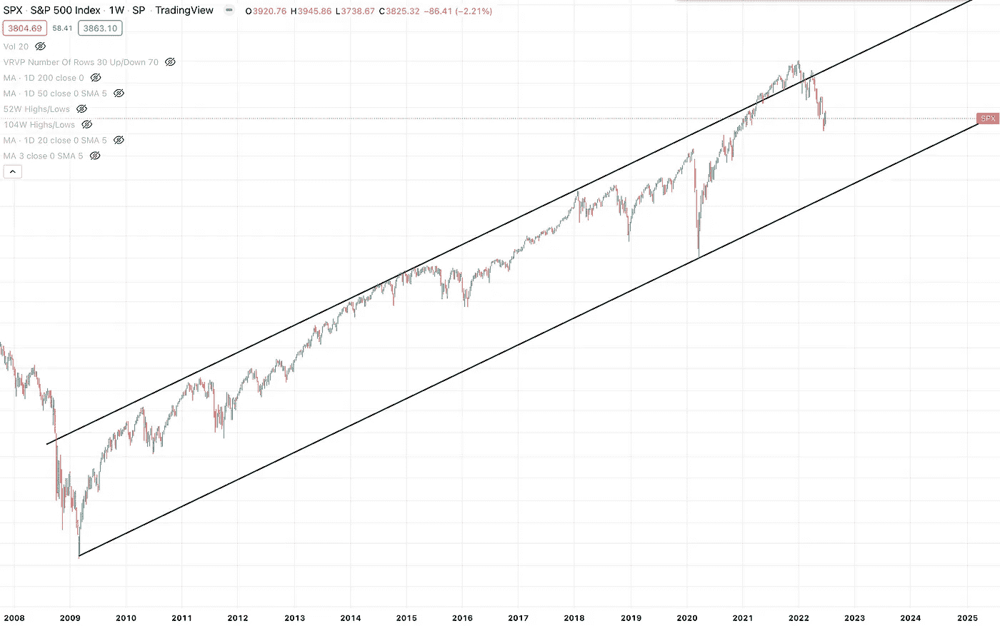
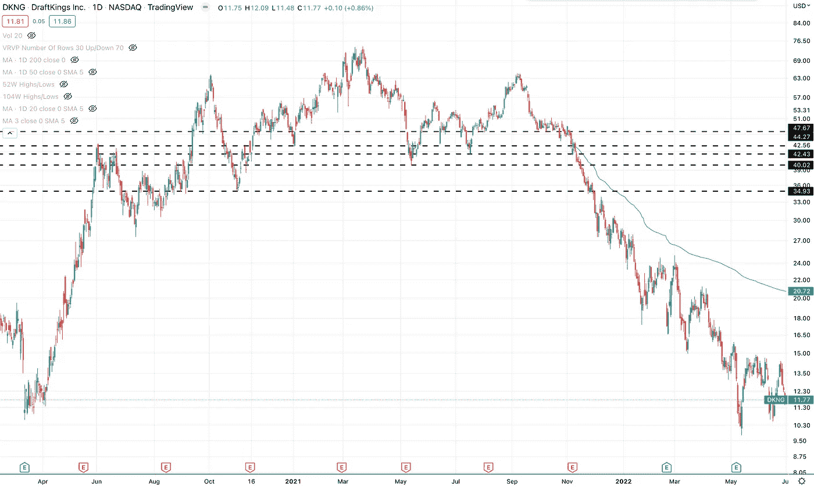
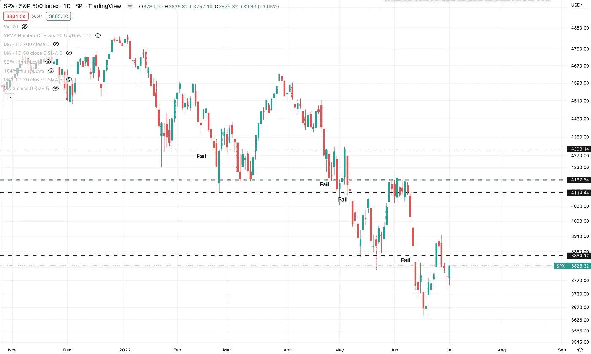
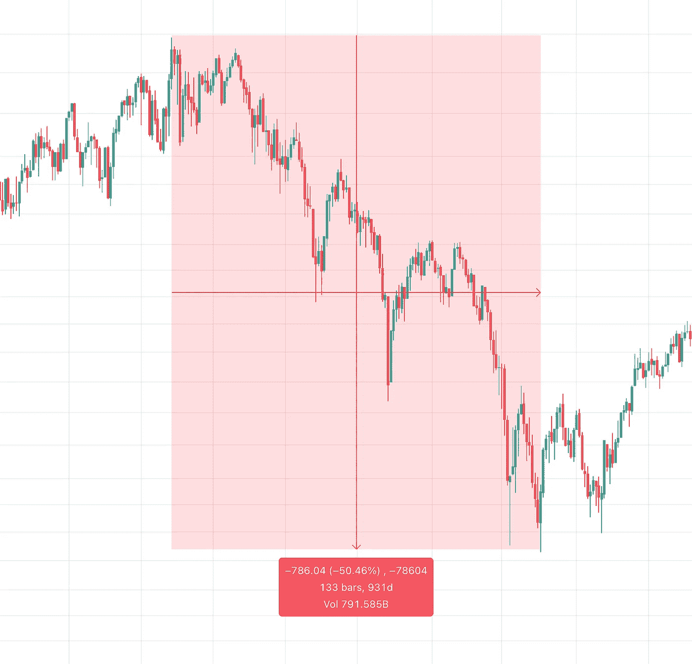

# 这个市场的目的是挫败感

> 原文：<https://medium.com/coinmonks/the-purpose-of-this-market-is-frustration-442bf25fa896?source=collection_archive---------43----------------------->

## 为什么这个市场会让你筋疲力尽

我承认。我有点沮丧。每个周末我都会坐下来做我的市场调查…没有变化。

然后我去查看一些我正在关注的股票，并浏览我的潜在股票购买或做空列表…没有变化。

所以，我认为这是一个很好的时机来指出这次熊市的真正目的——榨干交易的所有激情，尤其是对新交易者来说，让所有没有完全投入专业交易的人退出，永远不要回来。

让我们深入了解市场是如何做到这一点的——以及目前有多少资金(推动市场的力量)在观望，等待重大经济变化(或汉普顿的暑假结束)发生，然后再回来。

## 挫折 1——长期偏见——突破失败

首先，我认为大多数交易的人都有多头偏好。我们大多数人，尤其是新手，在牛市和熊市中有更多的交易经验。

我的意思是，我们刚刚经历了一年半的大规模牛市，我们被困在家里研究股票。

如果我们缩小范围，自 2009 年以来，牛市趋势一直完整而强劲。

2008-Present (Weekly)

我们大多数人都想做多，但美联储正在从市场中撤出流动性，并提高利率，这对长期持有偏见的交易者来说是两个非常大的阻力。

因此，市场的大部分交易量已经靠边站，它正在观望。

## 失败的突破

如果你交易突破，没有大笔资金支持你，那么这些突破每次都会失败。

我看到大部分的突破又回来了。如果你是一个优秀的短线黄牛党，也许你赚了几美元，或者不亏不赚。但是可以肯定地说，突破并不像牛市那样有效。

## 挫败感# 2——做空很难，而且为时已晚

好了，我们不能做多头突破——做空呢？现在是做空的好时机吗？

嗯，也许吧。我的意思是，如果我必须选择，我会选择在这里做空。但是大多数强有力的空头候选人，那些会从英雄到零的人，也就是上一轮牛市中的大投机股票，(RIVN，PTON，DKNG，AFRM)，那些会给你提供干净利落的做空机会而几乎没有投机风险的股票——他们已经过去了。

The Many Easy Entry Short Opportunities (DKNG Daily)

他们的时代已经过去了。

在这个市场上很难找到好的做空机会，尤其是如果我们没有大幅反弹的话。那么，是什么让你如此有信心做空 rip，而不是将其视为牛市反转的确认？很难说那个时刻什么时候到来！

让我们看看你在哪里可以尝试做空 SPY。

基本上，由于这些熊市反弹，每一次 SPX 做空都会让你在某个时候遭受相当大的损失。

当然，肯定有一些有效的方法。我并不是说没有正确的方法，尤其是事后来看。但这个市场上的大多数这类游戏，那些还没有被打败的游戏，通常会跟随间谍，所以在正确的时间做空是很难的。

它可以把你切碎，切碎，继续切碎。用亏损把你的投资组合砍死。

真令人沮丧！

## 挫折 3——时间

这里最后一个挫折是时间。我想我们很多人都觉得这需要很长时间。确实是。而这正是市场想要的。

想想有多少交易者在 2001 年的股灾中遭受重创。

持续 931 天的下跌趋势。

对我们大多数人来说，这是最难接受的。没有欣赏。三年没有市场增长。

> 交易新手？试试[加密交易机器人](/coinmonks/crypto-trading-bot-c2ffce8acb2a)或者[复制交易](/coinmonks/top-10-crypto-copy-trading-platforms-for-beginners-d0c37c7d698c)

# 我们能做什么？

有些事情你可以做…也许吧。

做空 rips？可能有用。

关注商品、外汇和其他领域？可能有用。

日内交易还是改变你的风格？可能有用。

但这些都不容易。就个人而言，寻找好的“出售 rip”条目是我仍在做的事情。我之前做空了，但是我被套住了，造成了一些损失。我意识到我可能知道如何在牛市中买入并赚钱，但我不知道如何在熊市中赚钱。这可能需要一些时间。

但是你也可以这么做。记住，很多人都在赔钱。如果你有现金，或者大部分是现金，你就处于有利地位。每一次市场下跌更多，吸盘被卡住，损失更多的钱。

记住这一点，你什么都不用做，你就赢了。

如果你准备在市场再次好转时参与其中，你就处于一个非常有利的位置。

## 等待好的投球

我听到许多顶级专业交易员说他们持有现金，他们在等待，我们不知道这个市场将走向何方，我们不知道美联储从系统中取钱是什么样子，这是前所未有的。

这是休息的时候了。

所以用你的时间去学习。阅读。休息一下，专注于市场之外的其他项目。

一周或周末花几个小时，继续寻找机会，保持头脑清醒，等待情况好转。

他们会好起来的。

但是不要让这个市场把你分割，给你 FOMO，榨干你的情感和脑力。

这不值得。

球场都很烂，我们需要全垒打。

等到音调变得更好。

祝你好运！

**——**

**由**[**【TradingChampionsDaily.com】**](http://TradingChampionsDaily.com)**带给你，每日交易灵感和教育让你成为更好的交易者……免费！**