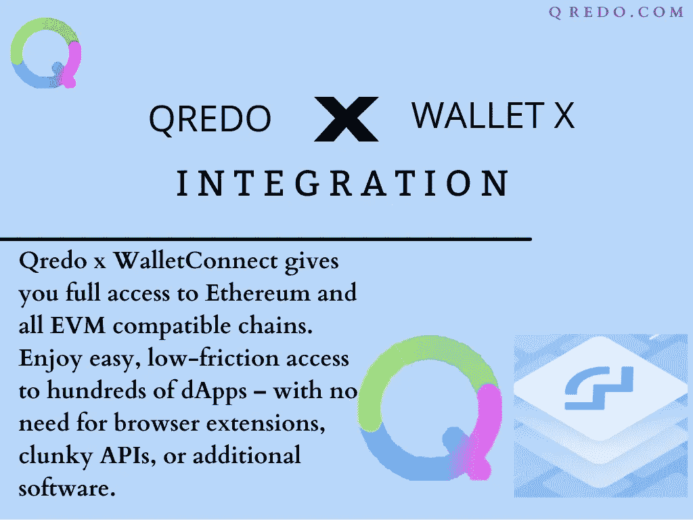

# Qredo Network x Wallet Connect 集成|您需要知道的一切

> 原文：<https://medium.com/coinmonks/the-qredo-network-x-wallet-connect-integration-everything-you-need-to-know-5027175a26c5?source=collection_archive---------40----------------------->

为了保持专注于建立强大的分散托管基础的正确方法，以使机构和个人能够安全地管理数字资产，Qredo 网络团队刚刚发布了更新的 2022 年路线图。

该路线图包含一些关键特性，这些特性将保证一项长期计划能够充分利用下一阶段的加密增长。要查看完整的路线图，请点击 [***此处***](https://www.qredo.com/blog/july-2022-roadmap)

QredoNetwork 路线图中最令人兴奋的一个关键功能是 WalletConnect 和 Qredo wallet 的集成，它利用了 Wallet Connect 开源协议的强大功能，并将其与 Qredo 的安全自保管和交易控制相结合。

这种整合的一个关键结果将是为个人交易者和成长中的投资团队提供一个完整的 DeFi 和 NFT 包。

> 交易新手？尝试[加密交易机器人](/coinmonks/crypto-trading-bot-c2ffce8acb2a)或[复制交易](/coinmonks/top-10-crypto-copy-trading-platforms-for-beginners-d0c37c7d698c)

整合将为个人交易者和机构提供；

*   **安全**
*   **控制**
*   **简单性**

**安全**

在安全性方面，Qredo X WalletConnect 集成将为令牌和 NFT 提供超安全的自保管

这将通过 Qredo 分布式基础设施引入的数字资产安全新模式来实现

这将结合多方计算(MPC)和自己的第二层区块链，Qredo 消除了使用私钥的日常风险和麻烦。

此外，由于所有交易活动都在链上记录，Qredo 还消除了电子表格和集中式数据库的漏洞，提供了防篡改的审计跟踪。

**控制**

此功能让您可以看到并完全控制您的交易。

凭借可见性和控制功能，Qredo 可以完全控制谁批准什么，以及您的资金流向何处。这是通过；

*   定制事务签名以反映您的团队不断发展的结构
*   只需点击几下鼠标，即可指定谁可以发起或批准交易
*   如果有人加入或离开，很容易启用/禁用他们的访问和重新配置签名过程

**简约**

保证你能快速、无缝地获得 web3 机会

Qredo x WalletConnect 让您可以完全访问以太坊和所有 EVM 兼容链。享受对数百个 dApps 的轻松、低摩擦访问，无需浏览器扩展、笨重的 API 或附加软件。

总之，Qredo network X Walletconnect 集成让您乐在其中；

📌快速、无缝地获取 Web3 机会

📌保证完全进入以太坊&所有 EVM 兼容链

📌轻松、低摩擦地访问数百个 dApps，无需浏览器扩展、笨重的 API 或额外的软件

通过注册早期采用者计划，成为第一批使用 Qredo x WalletConnect 功能的 Qredonians 中的一员。

名额有限，不要错过。要开始，请访问[**https://bit.ly/3RCkttJ**](https://t.co/InwmZtOaLc)

成为解锁活动、ama、网络研讨会等独家访问权限的人之一。通过【https://www.qredo.com/events-registration】**注册，抢先了解最新的 Qredo 活动**

**加入上的社区，了解最新动态；**

**[**网站**](http://qredo.com)**

**[**电报社区**](https://t.me/qredonetwork)**

**[**推特**](https://twitter.com/QredoNetwork)**

**[**博客**](https://www.qredo.com/blog)**

**[**公告渠道**](https://t.me/qredoannouncements)**