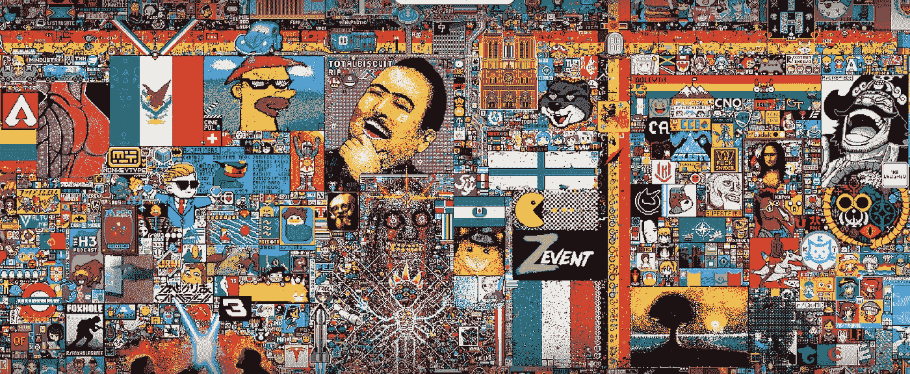
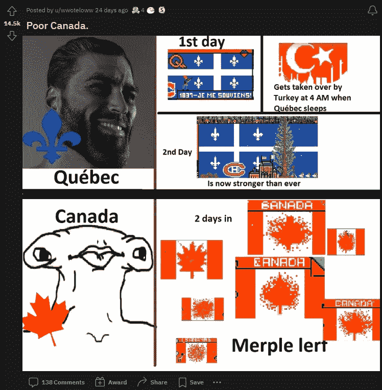

# r/place 起义和元宇宙一瞥

> 原文：<https://medium.com/coinmonks/the-r-place-uprising-and-a-glimpse-into-the-metaverse-aa0179b7ae05?source=collection_archive---------16----------------------->

在一个像脸书/梅塔和风险投资基金这样的私人公司努力打造他们心目中的“元宇宙”的时代，Reddit 社区表明互联网将会走自己的路。

[Source](https://www.washingtonpost.com/technology/2022/04/04/reddit-place-internet-communities/)

今天是 2022 年 4 月 2 日。东部时间晚上 9 点。对于时区之外的许多人来说，这是一个不便，因为他们必须与美国同行协调工作，这需要全神贯注。

“如果我们计时 5 分钟呢？如果我们中的大多数人同时放置我们的像素，我们将更有可能对董事会产生影响。那些参与者的议程是破坏另一个社区努力写 GENSHIN，使单词拼写成 GAYSHIT。

如果有一个时刻可以向外国人描述互联网的荒谬和它的全部意义，那么这可能是最完美的引用。

# 规则

规则很简单:每个用户可以每 5 分钟贡献一个像素。尽管在某些情况下，用户甚至可能需要等待 20 分钟才能贡献下一个像素。

你可以想象，它需要至少几千名用户的协调努力才能形成一幅画面。社区必须一丝不苟。你必须确保你不会因为错误地放置像素(对不起，加拿大)而把画面搞砸。

# r/place 起义

让我们看看这一切是如何展开的。

## 社区聚集在一起讨论他们的战争计划

仔细放置像素以正确绘制图像需要仔细的协调。许多子街道奋起迎接挑战。

我们花了好几个小时来保持一切井然有序。

[Original Thread](http://reddit.com/r/place/comments/tw26nu/my_fouryearold_son_to_whom_i_explained_what/)

有很多时刻无法用语言来解释。

[Original Thread](https://www.reddit.com/r/place/comments/tw1x37/they_actually_managed_to_make_a_fully_functioning/)

“大声喊出来”是我最喜欢的性别之一。

[Original Thread](https://www.reddit.com/r/place/comments/tumg9f/is_it_only_me_or_did_among_us_take_over_star_wars/)

[Original Thread](https://www.reddit.com/r/place/comments/tug2ab/this_is_just_peak_germany/)

小心点，奥普。

[Original Thread](https://www.reddit.com/r/place/comments/62mnok/place_irl/)

[Original Thread](https://www.reddit.com/r/place/comments/tujfbn/they_ruined_the_game/)

## 伟大的艺术产生了

[Original Thread](https://www.reddit.com/r/place/comments/tw9bo0/works_of_art_deserve_a_hall_of_recognition/)

## 到处弥漫着民族主义情绪

令人惊讶的是，土耳其赢得了在画布上占据最多空间的胜利。然而，美国(一如既往)不高兴，不得不干涉。

[Original Thread](https://www.reddit.com/r/place/comments/tuta5g/usa_and_turkey_finally_added_a_nice_drawing_into/)

可悲的是，当加拿大社区努力在国旗上正确绘制枫叶时，加拿大成了笑柄。

[Original Thread](https://www.reddit.com/r/place/comments/ttvrbn/is_canada_doing_ok/)

[Original Thread](https://www.reddit.com/r/place/comments/turtfi/poor_canada/)

然而，老实说，当它成为一个运行的迷因时，一些恶霸积极破坏他们的努力。

[Original Thread](http://reddit.com/r/place/comments/tulbdt/comment/i34c9l3/?utm_source=share&utm_medium=web2x&context=3)

但是嘲讽声不断传来。

[Original Thread](https://www.reddit.com/r/place/comments/tu5vpp/canada_in_case_you_were_wondering_this_is_what/)

[Original Thread](http://reddit.com/r/place/comments/tuejlg/france_literally_made_an_eiffel_tower_while/)

[Original Thread](http://reddit.com/r/place/comments/tucy6s/dear_mr_prime_minister_justin_trudeau_the_world/)

许多人会说，subreddit 的民族主义走得有点太远了(或者说它走得太远了？).

Original Thread

# R/Place，去中心化&为互联网而战

元宇宙起源于互联网还处于萌芽阶段的时候。一部名为《冰雪奇缘》的科幻小说设想了一种“第二数字生活”，在这种生活中，人类可以作为可编程的化身进行互动。虽然在精神上，让·波德里亚 1981 年的[拟像和模拟](https://cla.purdue.edu/academic/english/theory/postmodernism/modules/baudrillardsimulation.html)(黑客帝国的灵感)也提出了这样一个不可避免的现实。

但无论历史如何，这个概念仍然没有被大型科技、华尔街或任何其他同等力量所污染。然而，今天，因为我们拥有超越思想的基础设施，公司都在竞相确保自己仍然是互联网的看门人。

唯一的问题是，这与互联网社区的理念相矛盾。尽管公众对“加密空间”仍有一些分歧，但绝大多数人都同意互联网的去中心化是前进的方向。无论是通过 Web 3.0、比特币还是任何等效的系统，目标仍然是从中央集权中移除权力。

# 最后的想法

在成功地浏览了整篇文章之后，有一点很重要。参与整个事件的大多数人肯定不是为了证明基础设施的有效性。简单地说，目标不是证明 Reddit 有一个真实的用例。这已经是既定事实了。

大多数人只是想在网上找点乐子。最终用户体验之所以成为可能，是因为基础设施(比如互联网、语言、平台等)。)已经发展了多年，让人们习惯了它们，并让它们退居幕后。

因此，无论我们将来看到什么版本的元宇宙，它都不会仅仅因为人们想证明元宇宙可以存在而存在。

> 交易新手？试试[密码交易机器人](/coinmonks/crypto-trading-bot-c2ffce8acb2a)或[复制交易](/coinmonks/top-10-crypto-copy-trading-platforms-for-beginners-d0c37c7d698c)