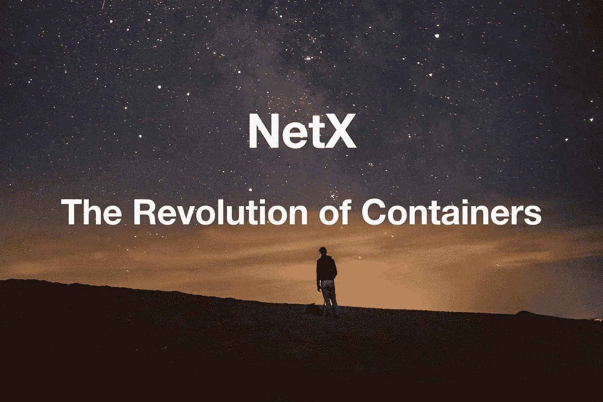
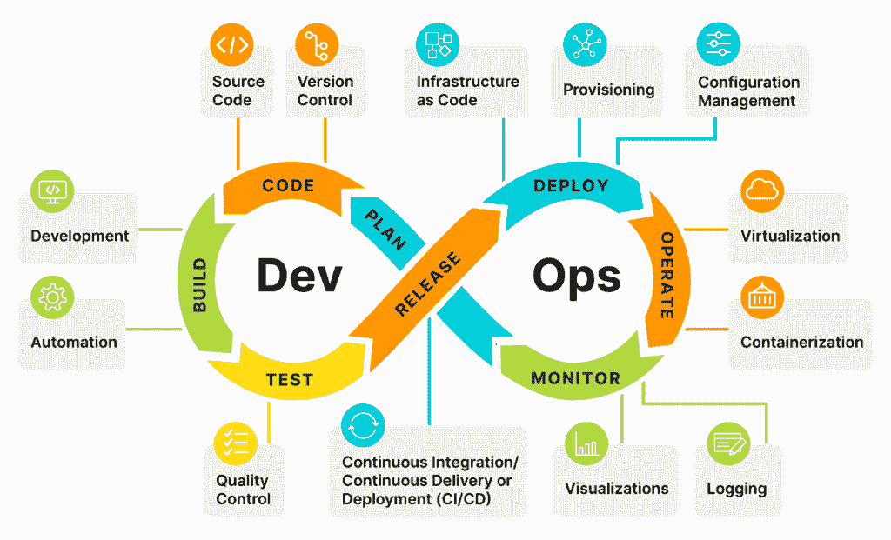

# 容器的革命

> 原文：<https://medium.com/coinmonks/the-revolution-of-containers-bf5f5d559cd1?source=collection_archive---------8----------------------->

第五部分第三章**IT 领域的容器结构**

***TL；博士***

*将 IT 系统比作海运集装箱，操作系统承担了货船的角色，集装箱——货物集装箱，微服务——货物，devo PS——集装箱操作方法和流程。*

**

*随着微服务的兴起，用户更喜欢应用程序全天候可用。新企业不断涌现。应用程序需要不断更新和升级；有时，甚至需要更高频率的释放。“零停机时间”和“零感知”支持**持续集成(CI)** 和持续交付/部署(CD) 应用程序。这些障碍以及应用程序升级的理想解决方案很好地解释了为什么最初要开发 **DevOps** 。*

*DevOps 的概念是在 2009 年提出的，但之前并没有受到太多关注。自从 2014 年提出容器和**微服务**的概念后，DevOps 开始获得发展势头。这种方法带来了实现自动化的工具链，以及组织、过程和技术的组合。该组织雇佣了一个全栈、专业化、自治的团队。技术桥梁开发(Dev)，运营(Ops) &维护。该流程强调端到端方法、可视化、灰度升级、A/B 测试等。*

*微服务对 DevOps 来说并非不可或缺，但却构建了其最优化的架构。组织和流程也是如此。有人将微服务称为 **DevOps 架构**。*

# *DevOps 的哲学*

*它的发展和运作强调 DevOps。与应用程序相关的所有过程都依赖于这两个紧密结合、相互协调的单元。与此同时，DevOps 通过精心维护的渠道得到了很好的实施。这些周期性的阶段跨越了从计划到发布的整个生命周期，包含了交付所需的所有功能。*

**

*DevOps 的特点是敏捷，，而大多数开发实践都很好。在关系密切的工程师、测试人员和管理人员的帮助下，公司将生产力提升到新的高度。开发人员编写一个程序，并将其发送给测试人员进行评估。测试人员写下评论并回复给工程师。工程师在产品部署前进行修改。这些测试不仅在发布前进行。DevOps 在整个生命周期中持续发挥作用。开发人员和设计人员通过观察这些代码(输入)如何在测试环境中运行(输出)来了解应用程序如何准备的细节。*

## ***devo PS 的利弊***

***优点***

*   *更快的发布和更短的上市时间*
*   *更高的生产率*
*   *高效流程*
*   *更短的生产周期*
*   *更强有力的行动支持*
*   *专注而充满活力的团队成员*
*   *管理良好的客户体验*
*   *生动的产品视觉*
*   *成功部署的几率更高*
*   *提高产品质量*
*   *高效团队*
*   *增强的灵活性和支持*
*   *更少的产品故障*
*   *跨职能能力和自我提升*

***缺点***

*   *要求整个公司以正确的态度参与进来。*
*   *外包让企业变得不安全。*
*   *遗留系统仍然是一个挑战。*
*   *为 CI/CD 实施安全保护是另一回事*
*   *合适的 DevOps 专业人才库并不容易获得。*
*   *工具不足；切换工具很棘手。*
*   *转型障碍(组织和技术)*

# ***集装箱的革命***

*在 IT 领域，布局被解释为贯穿整个 IT 系统并实现其自动化操作的工作流。我们曾经认为 IT 行业是一个**集装箱**。在集装箱内部，操作系统承担着货船、集装箱——货物集装箱、微服务——货物、devo PS——集装箱操作方法和流程的角色。这些概念加起来就形成了现代的云原生系统。*

*随着行业的重新洗牌，该领域的每一次结构性改革都蕴含着巨大的机遇和挑战。在过去的 30 到 40 年里，IT 发生了翻天覆地的变化，包括 20 世纪 70 年代和 80 年代从大型机到小型机的转变，20 世纪 90 年代 C/S 架构的流行，以及 21 世纪初互联网的兴起。一个常见的现象一再重演:缓慢的跟风者注定会被重新洗牌。然而，最初的基础软件和硬件公司可能已经实施了强有力的垄断。*

*如果云技术深深扎根于现在冉冉升起的新星**区块链**，激动人心的技术创新可能会出现。区块链可能会弥补去中心化场景下的云原生服务，因为它被广泛应用。此外，区块链减轻了云原生应用程序的安全顾虑。区块链解决方案有助于网络安全、身份管理、身份验证、容器安全和取证审计日志中的云原生使用。*

*分布式系统拥有错误机制。在不平衡的状态下，窥视孔视图只会给人留下**失控**系统的错误印象。但是如果我们仔细想想，我们可能会发现**局部无控制来自上层系统**的有意识控制。那么，系统是有序的还是无序的？这似乎是一个无限的循环。这就解释了 ***失控*** 这本书想要传达的东西，系统进化的原理。**定律【事物如何变化就如何变化】**阐明了进化的终极法则，随着事物的进化而进化。在不久的将来，我们可能有机会访问一个自我进化的分布式云原生系统。*

```
***The Writer says...**NetX aims at building the Web3 organism. We try to figure out solutions confronted by the present IT industry. To do that, we will look into every module of it to find out setbacks. Then we’ll focus on finding solutions through experiments. It’s a dynamic evolving process. To get the best solution, we have to be clear about the problems and this will be the main idea of Chapter Three. It makes me feel excited when thinking about sharing my thoughts and I do invite you to join me in this exploration and contribute to the evolvement of NetX.*
```

# *📚必读*

*[NetX 系列 1.1](/triaslab/rethinking-the-it-industry-d101384e801) | [NetX 系列 1.2](/coinmonks/a-letter-from-satoshi-nakamoto-345a45d012bb) | [NetX 系列 1.3](/coinmonks/out-of-control-the-post-it-evolution-dd64e05ff5bc) | [NetX 系列 2.1](/coinmonks/life-emerges-9ebf26304cd4) | [NetX 系列 2.2](/coinmonks/life-is-out-of-control-9f8e5b7b4b99) | [NetX 系列 2.3](/coinmonks/the-kite-flies-up-and-i-become-the-kite-40678b9dabda) | [NetX 系列 3.1](/coinmonks/the-container-in-the-it-field-21250e3e8b5) | [NetX 系列 3.2](/coinmonks/microservice-architecture-for-new-technologies-d0e37cfccdfa) | [NetX 系列](/coinmonks/from-service-mesh-to-serverless-570ebd69c884)*

****NetX，面向数字生活的可信可靠的智能自治系统的链原生互联网(***[***Trias***](https://www.trias.one/)***)****

*[***铁人三项***](https://www.triathon.space/#/)***|***[***Ethanim***](https://www.ethanim.network/)***|***[***Tusima***](https://www.tusima.network/#/)***| Behemotum | Octavius | leviam | Divina****

> *交易新手？尝试[加密交易机器人](/coinmonks/crypto-trading-bot-c2ffce8acb2a)或[复制交易](/coinmonks/top-10-crypto-copy-trading-platforms-for-beginners-d0c37c7d698c)*