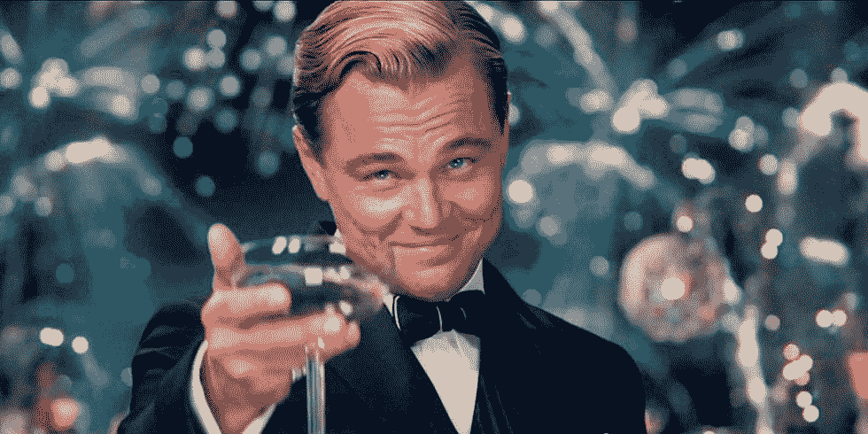
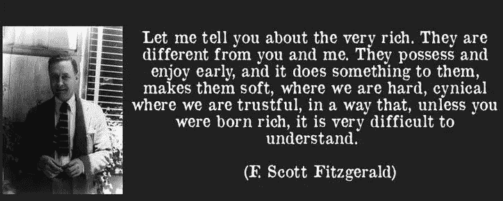
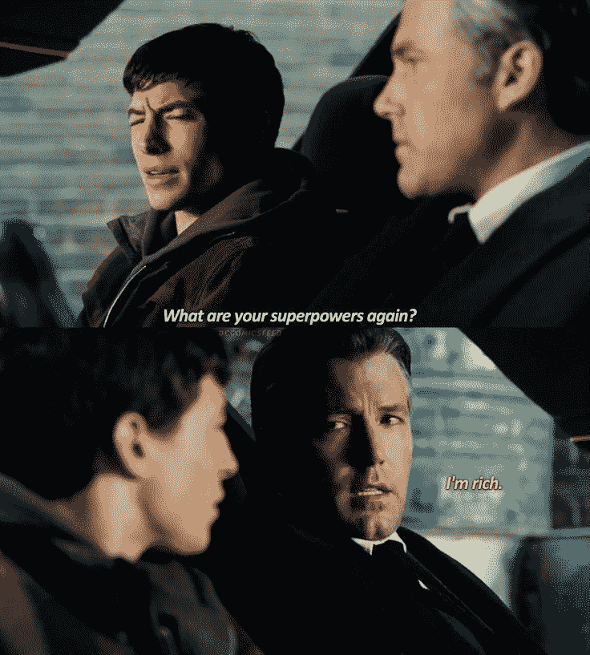

# 富人真的不一样

> 原文：<https://medium.com/coinmonks/the-rich-are-really-different-b8668711f941?source=collection_archive---------39----------------------->

How rich do you really want to be?

“让我告诉你关于非常富有的人。他们不同于你我。他们很早就拥有和享受，这对他们产生了影响，使他们在我们强硬的地方变得软弱，在我们信任的地方变得愤世嫉俗，除非你生来富有，否则这是很难理解的。他们认为，在内心深处，他们比我们更好，因为我们必须为自己找到生活的补偿和避难所。即使当他们深入我们的世界，或者沉入我们之下，他们仍然认为他们比我们优秀。他们不一样。”

> 交易新手？试试[加密交易机器人](/coinmonks/crypto-trading-bot-c2ffce8acb2a)或者[复制交易](/coinmonks/top-10-crypto-copy-trading-platforms-for-beginners-d0c37c7d698c)

斯科特·菲茨杰拉德在他 1926 年的小说《富家子弟》中有一句名言。

将近一个世纪过去了，这句话仍然适用。

你同意富人真的和我们不一样吗？

也许我们永远也不会理解富有是什么感觉。

但毫无疑问，每个人都渴望某种程度的财务自由。

因为不管你同意与否，某种程度的财富可以“买”给你自由、时间、机会、乐趣、经验和杠杆去做你真正想做的事情。

Do you agree?

我们想知道如何到达那里。

无限财富的秘密是什么？

成功和赚钱的最快途径是什么？

我们都处于某种形式的激烈竞争中。

每个人都是。

也许不是直接为了钱。

但是间接的，我们对更多的贪得无厌的需求和对已经拥有的越来越多的不满。

这就是为什么大师和骗子仍然存在。

这就是为什么股票和密码市场每天都在创造赢家和输家。

这就是为什么有彩票。

这就是为什么货币成为占主导地位的通用货币，我们可以用它来“交易”所有其他东西。

我们可能不同意或意识到，但我们都在努力赚更多的钱，以获得它提供的自由。

Don’t we just love Batman’s real superpower?

所以实际上，我们都想变得富有。

我们中的一些人只是在头脑中有不同程度的财富。

或者也许我们只是想成为有钱能让我们得到的人。

那是幸福吗？

买一个美味的芝士汉堡会让我们满意吗？

这意味着和你爱的人一起散步，看美丽的日落吗？

或者我们需要花费数十亿美元购买一个全球社交媒体平台才能感觉良好？

在我们的内心深处，我们不都只是想要幸福和满足于生活吗？

-

你想变得富有还是快乐？

-

#创业#商业#创业#成长#成功#社交媒体#富人与众不同#企业家#斯科特菲茨杰拉德#富人#幸福的#富人快乐的