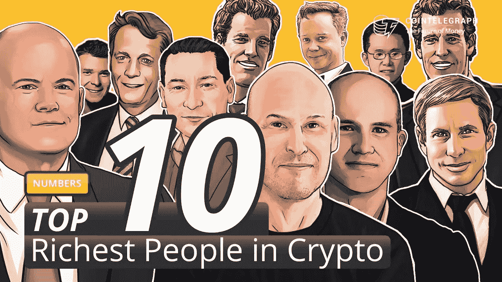
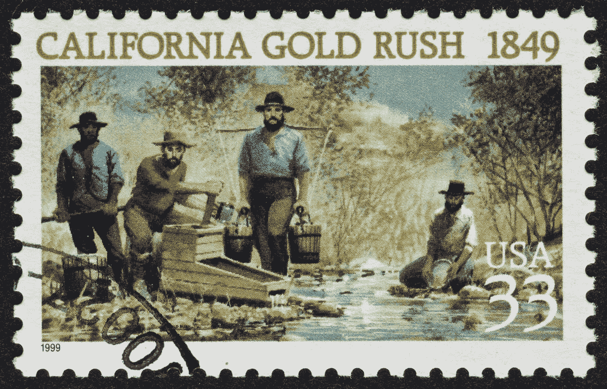
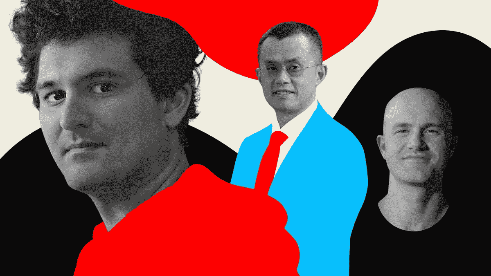

# crypto 最富有的人是卖铲子的人。

> 原文：<https://medium.com/coinmonks/the-richest-people-in-crypto-are-the-ones-selling-the-shovels-597553f2ce31?source=collection_archive---------53----------------------->

Who are the richest people in crypto?

我给你讲一个关于铲子的故事。

但我想你已经知道是什么了。

19 世纪，加州淘金热。

每个人都想从地下挖金子，轻松赚钱。

事实证明，那些寻找黄金的人并没有赚多少钱。

卖挖掘设备的人挖到了真金。

“早在 1849 年加利福尼亚淘金热期间，很少有勘探者发了大财。那时大多数赚钱的人是那些“卖铲子”(以及牛仔裤、帐篷、鹤嘴锄和其他用品和服务)给淘金者的人，他们过着艰苦的淘金生活

Shovels were more of a sure thing, the Gold, not so much.

回到现实。

加密泡沫，NFT 泡沫，郁金香狂热 2.0。

随便你怎么称呼。

但是历史押韵。

当牛市来临的时候，每个人都被引入了加密货币的概念，认为他们可以通过交易、把握市场时机赚快钱，并以最快的方式获得财富。

无论你走到哪里，你都会看到有人告诉你，如果你在那个代币或硬币首次发行时投资，你会赚多少钱。

NFT 的铸造和销售价值数百万。

Crypto 成为快速赚钱和轻松创造财富的狂野西部。

或者看起来是这样。

事实证明，就像淘金热一样，真正赚钱的人是提供交易“工具”的人，而不是交易的人。

世界上最富有的 12 位秘密人物中有 10 位是交易所的创始人。

排名第一的山姆·班克曼·弗里德——FTX 联合创始人，203 亿美元

排名第二的是创始人赵昌鹏，174 亿美元

第三名王微——联合创始人 FTX——58 亿美元

第四名宋驰亨——杜纳姆公司创始人——34 亿美元

排名第五和第六的泰勒和卡梅隆·文克莱沃斯——双子星座的联合创始人——每人 33 亿美元。

这样的例子不胜枚举。

The top 5 richest people in crypto are collectively worth more than $50B, and they all founded crypto exchange/marketplaces.

有一个非常有趣的模式。

当有牛市时，更多的人进入空间，炒作自我销售，导致更多的交易活动。

在熊市期间，仍然会有人试图寻找底部，购买廉价硬币，抛售资产，试图赚钱。

不管怎样，交易所总是赚钱的。

他们说在熊市中最好的事情就是建造。

他们没有真正告诉你的是要造什么。

我说，建立一个更好、更快、更便宜、更好、更酷、更易用的交易所。

不管你对未来看得多远，这是一件永远不会褪色的事情。

客户永远不会想要一个更慢、更贵、更难使用、更笨重和痛苦的交换。

卖更好的铲子。

-

你最近使用过密码交换吗？

-

# startups # business # startupx # growth # success # social media # culture # entrepreneur # strategy # eth # coin # BTC # exchange # ftx #币安# tools #铲子# goldrush # crypto # bearmarket #加密货币

> 交易新手？试试[密码交易机器人](/coinmonks/crypto-trading-bot-c2ffce8acb2a)或者[复制交易](/coinmonks/top-10-crypto-copy-trading-platforms-for-beginners-d0c37c7d698c)