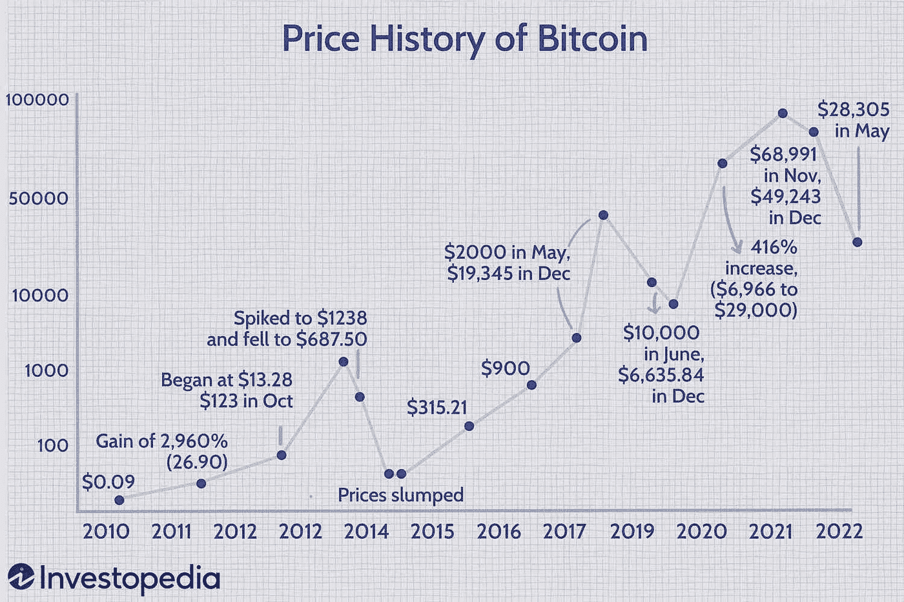

# 比特币的合理价格

> 原文：<https://medium.com/coinmonks/the-right-price-for-bitcoin-4f72aa6a679a?source=collection_archive---------30----------------------->

2021 年 11 月 10 日无疑是大多数比特币制造者和加密货币爱好者生活中最激动人心的一天。这一天，比特币达到了 69k 美元的历史新高。从$ 5，000 到$ 69，000，这是一个令人难以置信的景象，也是达到这一高度的一次大规模奔跑。但是分析家和月球男孩还没有完成。大多数人的软目标是 10 万美元。Ark invest 首席执行官 Cathie Wood 对 50 万美元的目标价格更加乐观。

截至发稿时，比特币的交易价格低于 17k 美元。

发生了什么事？

一年前估值如此之高的资产怎么会跌得这么离谱？

比特币定价过高了吗？比特币的合适价格是多少？

就数字资产而言，在牛市期间，任何东西都可以获得 100 倍的投资回报率。我可以在 Opensea 上放一张我奶奶的微笑照片，然后毫不费力地找到愿意花 200 美元购买它的买家。照片背后的用途或想法并不重要，人们愿意为任何东西支付足够的钱。这使得很难给任何项目赋予价值。在熊市期间，情况正好相反。那些不投降的人非常保守，他们拿着干粉，等待机会装满他们的袋子。这些投资者不会在他们的袋子里装满一些随机的 INU 代币或者我无牙奶奶微笑的照片。这些人以价值为导向，意识到一轮牛市中的热门资产可能在下一轮牛市中消失。

牛市总是强调价格，而熊市强调价值。

比特币的价格不受实体或中央机构的控制。它由需求与供应算法控制。这仅仅意味着，更多的需求会推高价格，而更多的供应会压低价格。大规模采用和更高的机构参与在 2022 年 11 月的高点发挥了巨大作用。

这种大规模领养是怎么回事？

大资金机构去哪了？

Covid 事件后全球经济形势恶化了。在受到经济制裁后，俄罗斯入侵乌克兰让欧洲大部分国家的处境变得非常艰难。通货膨胀正在侵蚀一些主要的全球经济强国。

所有这些都导致了对数字资产需求的下降，因为他们选择了无风险投资，如美联储和央行加息所鼓励的法定储蓄的高利息。

同样值得一提的是房间里明显的大象，这是主要的基于加密货币的公司和项目的崩溃；Terra、3AC、Celcius、Voyager 和最近仍在开发的 FTX。这些实体的崩溃不仅削弱了需求方面，也挫伤了机构和散户投资者对该领域的普遍信心。

今年秋天有起床的吗？肯定！

加密货币领域在之前的熊市中出现过类似的事件，但理解比特币给全球金融掌舵人带来的价值的人仍然坚定不移。

我们都知道比特币的价值等同于财务自由的价值。比特币的正确价格并不像投资者或推特上的影响者所说的那样。比特币已经留了下来，并开始取代它的位置，不仅是货币的未来，也是现在。比特币的真实价格超越了单纯的货币价值，比特币的价格是世界能够为金融自由支付的价格。比特币的价格是在任何给定时间点超过其货币价值的价值。

由于对经济稳定和金融自由的追求推动了比特币的价格，因此有理由说比特币的价值是不可量化的，但其成本可以根据其生产成本进行谈判。

与自金融市场诞生以来的所有熊市周期类似，牛市总是在遭受最大痛苦之后浮出水面。投降的散户和机构投资者将会回来，新的投资者将会加入这个行列，这个空间将会达到一个新的高度，比以前更高的采用水平。

不管市场翻多少倍，最大的赢家是坚持不懈的建设者和钻石手。

> 交易新手？试试[加密交易机器人](/coinmonks/crypto-trading-bot-c2ffce8acb2a)或者[复制交易](/coinmonks/top-10-crypto-copy-trading-platforms-for-beginners-d0c37c7d698c)