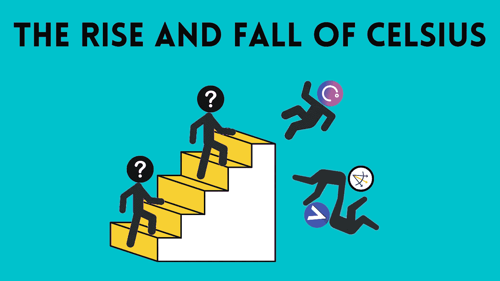

# 摄氏温度的升降

> 原文：<https://medium.com/coinmonks/the-rise-and-fall-of-celsius-e830b4e14649?source=collection_archive---------18----------------------->

就在 Terra LUNA 血案尘埃落定的时候，另一个秘密丑闻取代了它的位置。加密贷款公司 Celsius 的迅速崛起和衰落给每个人都留下了一些亟待解决的问题，最值得注意的是——到底发生了什么，我们能做些什么来确保这种事情不再发生？

## 什么是摄氏度？

Celsius Network 由首席执行官 Alex Mashinsky，Daniel Leon 和 Nuke Goldstein 于 2017 年成立，旨在促进加密领域的银行服务和交易。但是让我们弄清楚一件事，他们不是银行。

相反，可以将 Celsius 视为加密货币世界的集中金融——储户可以从他们的存款中赚取利息，而借款人可以通过支付费用获得加密贷款，就像你对银行一样。但 Celsius 的监管方式不同于传统银行。

该平台被宣传为向整个加密社区提供“透明和公平的服务”，而不是传统的银行系统。

## Celsius 是如何走红的？

Celsius 提供的利率**极高**，在某些情况下**高达 18.63%的年利率**。这些通常用 CEL 代币支付，celus 网络的本地代币。

而借款利率**极低**，有时**低至 4 月 0.01%**。银行很少提供这些水平，这就是为什么人们开始注意到摄氏温度。

总的来说，Celsius 似乎是由一群有前途的企业家支持的，他们热衷于为世界“解禁”。马辛斯基自己也向 Celsius 投资了相当大一部分资金，并主持每周一次的“向马辛斯基提问”直播，支持该公司保持对客户透明的幌子。

那么，这一切到底错在哪里呢？

## 预示最后结果（或败局）的先兆

Stakehound(一个 Ether 2.0 质押解决方案)在 2021 年 6 月宣布，它已经丢失了代表其客户存放的超过 38，000 美元 ETH 的私钥，其中大部分据信属于 Celsius。以今天的美元 ETH 价格计算，这一损失约为 4730 万美元，代表着 Celsius 的基础首次出现裂缝。

在此之后，其他问题也开始浮出水面，例如 2021 年 11 月因洗钱问题逮捕了 Yaron Shalem(Celsius 的首席财务官)。据报道，2021 年 12 月，Celsius 受到了 BadgerDAO 漏洞的影响，黑客从用户那里窃取了数亿美元。据报道，Celsius 因此损失了 5400 万美元。

到 4 月份的时候，Celsius 用户开始套现，因为市场低迷，Celsius 托管的 crypto 的价值已经崩溃。Celsius 用户也开始利用他们的低息贷款来减免债务，在这一点上，很明显 Celsius 没有严格审查他们的借款人。

## 完成交易

对摄氏温度的最后一击来自于地球月神号的坠毁。像 Voyager 和 Three Arrows Capital 这样的中央集权公司申请破产，关于 Celsius 秘密破产的谣言开始传播。这导致数十亿美元的资金流出。

最后，Celsius 在 6 月 12 日冻结了所有客户的提款和交易，并在下个月申请破产。

## 底层裂缝

从表面上看，似乎摄氏温度在 2021 年才开始出现问题。但是更深入的分析表明，从一开始，从风险管理不足到 T2 涉嫌市场操纵，Celsius 就注定要失败。

据 Celsius 前金融犯罪合规总监 Timothy Cradle 称，该公司并未将风险管理放在首位。例如，人力资源团队的一名前高级成员说，他们被明确告知，在前首席财务官亚龙·沙勒姆(Yaron Shalem)加入公司之前，不要对他进行背景调查。Cradle 还提到，风险管理团队的资源有限，只有 3 名全职员工，他们无法应对平台的快速扩张。

说到**成长太快太快**，这也是 Celsius 最终失败的另一大原因。为了跟上快速增长的步伐，Celsius 不顾一切地开始做出更高风险的选择，如在没有进行适当尽职调查的情况下投资高风险的加密货币项目和对冲基金。这开始了公司进入过度杠杆化和部分资本化的危险水平的恶性循环。

前 Celsius 员工还声称，该公司人为夸大了其 CEL 令牌。区块链数据公司 Arkham 估计，多年来 Celsius 已经花费了 3.5 亿美元在交易所收购 CEL 代币。阿卡姆还估计，与马辛斯基有关的账户似乎已经出售或交换了价值 4000 万美元的 CEL 代币。

## 那么，我们能从中学到什么呢？

如果某件事听起来好得不像是真的，那它很可能就是真的。Celsius 模式——向储户提供极高的利率，向借款人收取极低的利率——并非没有高风险。Celsius 对其客户极力淡化这种风险，结果导致他们拖累了无辜的消费者。

Celsius 还在秘密牛市期间提供了这些利率，正如我们所见，这在周期性低迷时期显然是不可持续的。将这种不可能的商业模式与缺乏金融和风险管理专业知识结合起来，你就有了一个灾难的处方。一家公司的弹性和可信度的真正证明是他们是否能够在熊市中幸存下来，并从熊市中变得更加强大。

> 不是你的钥匙，不是你的密码

Celsius 灾难被描述为加密社区的“雷曼兄弟”事件，正如我们当时所了解的那样，去中心化是必要的。保管钱包有一个明显的风险——如果你把你的密码放在一个平台上，而不是钱包上，你遭受损失的可能性更大。作为一个经验法则，只要记住这一点:“不是你的钥匙，不是你的密码”。

展望未来，随着市场上高风险工具和散户投资者越来越多，我们可能会看到监管机构对该行业的打击。在那之前，我们可能会看到这个行业在这个隐秘的冬天里的其他崩溃。

如果你喜欢读这篇文章，请继续关注我的下一篇文章，在这篇文章中，我将仔细观察 FTX 的崩溃。

*免责声明:任何意见表达(如有更改，恕不另行通知)都是我(作者)个人的意见，我(作者)不保证所提供的任何信息或分析的准确性或完整性。*

> 交易新手？试试[密码交易机器人](/coinmonks/crypto-trading-bot-c2ffce8acb2a)或者[复制交易](/coinmonks/top-10-crypto-copy-trading-platforms-for-beginners-d0c37c7d698c)