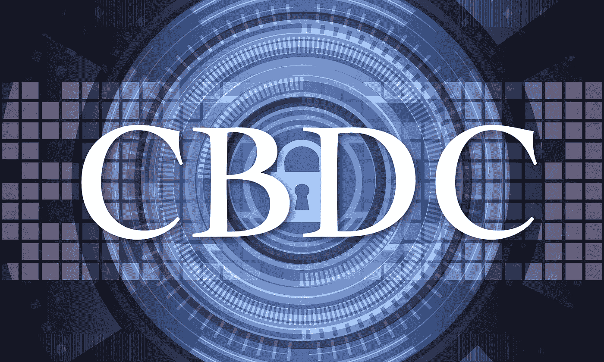

# 中央发展中国家的崛起:欢迎来到……法定货币 2.0

> 原文：<https://medium.com/coinmonks/the-rise-of-cbdcs-welcome-to-fiat-money-2-0-5eb33bdf87ac?source=collection_archive---------9----------------------->

## 我们对 CBD 的崛起准备好了吗？有哪些替代方案？

*Cover Picture by TheDigitalArtist on* [*Pixabay*](https://pixabay.com/illustrations/cyber-security-information-security-3400657/)

凭借 2009 年的 Genesis Block，我们迎来了金融的数字化时代。当时，一种分散的、未经许可的货币是闻所未闻的。

每一个支付处理器，借记卡或信用卡，礼品卡，以及互联网支付选项，如贝宝都是…