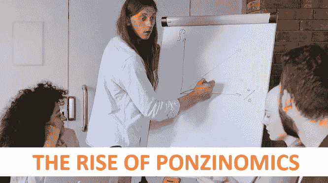

# 庞兹经济学的兴起

> 原文：<https://medium.com/coinmonks/the-rise-of-ponzinomics-68fb983fafb5?source=collection_archive---------7----------------------->

DeFi 加密领域的趋势之一是以某种方式塑造或形成涉及 Ponzinomics 的项目。如果你对这个词不熟悉，请继续读下去，在短短的一两分钟内，它会变得更有意义。

# 什么是庞兹经济学？

我认为庞氏经济学只不过是庞氏骗局或金字塔骗局的最新化身。如果你对它们不熟悉，它们实际上是不同的，尽管大多数人把它们作为可互换的词使用。通常指同一件事。

庞氏是一个承诺繁荣 APY 的人，这是一个疯狂的期望。最近的一个例子是锚协议。承诺固定的 APY，年收益率接近 20%。为了向你们展示这些数字有多高。伯尼·麦道夫是世界上最大的庞氏骗局的策划者，据报道价值约 648 亿美元，他承诺 APY 为 10-20%。所以主播协议 20%甚至让老伯尼·麦道夫自愧不如。

他们能够维持这种高 APY 的方法是不断注入新的资金。在伯尼的案例中，他会把从新投资者那里得到的钱给老投资者。

但是传销和庞氏骗局有什么不同呢？关键在名字里，金字塔。一个人招两个以上的人，反过来他们也各自招两个以上的人，以此类推。通常，每个人都在卖东西。招募你的人会从你的销售中获得 10%的利润，以此类推.

从某种意义上说，这是涓滴经济的反面。在这里，钱反而慢慢流了上来。通常这些类型的计划也有很高的入场费，你必须向上面招募你的人支付。

庞氏骗局依赖于新的现金流入，而金字塔则依赖于无限多的人。正如你可能已经意识到的，这两个前提都是错误的。

*Charles Ponzi, the originator, and namesake of the Ponzi Scheme*

现在我们终于明白什么是庞兹经济学了。我认为，这只是用来描述这类计划的最新术语。为了让人们继续被“欺骗”,欺诈行业必须不断改造自己。因为如果他们一遍又一遍地运行同样的计划，人们就会变得聪明起来，不再上当。

其中一个方法就是不断改变它的名字。历史上使用的一些名称是多层次营销(MLM)，网络营销，或传销。我想把 Ponzinomics 作为最新的条目添加到这个列表中。

# 我们能做些什么呢？

嗯，我认为最重要的事情是让自己保持消息灵通。这样你就能在未来远离 DeFi Ponzinomic 项目。但许多人会认为，从长远来看，Anchor 对高 APY 不可持续持开放态度。而且这只是作为一种“促销”手段。大多数人也意识到了这一点。

如果每个人都知道地基是由流沙构成的，那么为什么会有那么多人被困在废墟和坍塌中呢？我能说的是，当它撞上风扇的时候，很难不把你弄脏。如果你能在它来袭前闻到它，这真的无关紧要。当它碰到风扇时，它会到处跑，而且跑得很快。让你几乎没有时间做出反应或跳到盖子后面。

我所说的自学是指你需要这样做，以便远离这类项目。你没有为了意识到风险和保持安全而教育自己。这在 99/100 的情况下是行不通的。如果这些是我的选择，我知道我正在做一个很有风险的投资，可能会失败，或者什么都不知道。就我个人而言，我会选择无知是福的道路。

# 但是我们肯定可以利用这个系统，对吗？

是的，是的，你可以。但是为了让你能够做到这一点。你需要早点来。我说的是开始日，或者预售。即使这样，也很难衡量一个项目的适应率。在一个项目即将起航的第一天，你就可以跳上它。就为了它，就像瑞典皇家船只瓦萨号。首航约 1300 米后沉没。

*A 1:10 model of the ship Vasa, one of the most lavished ships ever constructed at its time. Sank due to faulty construction.*

简而言之，你真的必须努力向上，这样你才能尝试并从这些事情中有所收获。但是可以肯定的是，如果你是，那么你将会赚很多钱。看看杰西·埃凯尔，一个著名的加密 youtube。他能够提前进入，更多的是出于侥幸和他愿意冒的风险，而不是任何邪恶的交易。

我知道关于他的一些庞氏经济项目有一些指责。但据我所知，他一直对自己的所作所为保持开放，没有试图玩弄体制。但他仍然是一个很好的例子，告诉你为了从这样的项目中赚钱，需要怎样做和做什么。

# 我呢，我有马参加比赛吗？

我向 Titano 和 Libero 投资了大约 300 美元，其中 200 美元在 Titano，100 美元在 Libero。谁是两个更著名的“疯狂”的 APY 项目与通货膨胀象征经济学。也就是说，随着时间的推移，您会赢得越来越多的代币。这两种方法每 30 分钟自动计算一次你的收入。我期望从他们身上赚很多钱吗，不。我希望我会，是的。我愿意用所有的钱去赌博。意思是我不介意失去它。我不需要那笔钱来生存或支付房子或其他重要的东西。我认为这更像是买一张彩票。

我还向 Sphere 投资了 100 美元。一个类似的项目。但是他们的目标不同。如果他们开始尝试的事情能够成功。我认为这将是一个非常好的项目的一部分。但它看起来像是另一个夭折的项目。

如你所见，即使是我也涉足了这个领域。实际上，我仍然保留着这三个项目的所有代币。一点都没卖出去。

# 未来，等待我们的是什么？

在密码领域已经出现了一些令人担忧的趋势，那就是我看到了很多这样的，大多数是短命的庞兹经济学项目，就像雨后春笋般冒出地面。它们几乎无处不在。他们是当前游戏赚钱市场的重要组成部分。大多数节点项目，如果不是全部的话，都沉浸在庞氏经济学，像 Anchor 这样疯狂的贷款协议中，当然，还有承诺疯狂 APY 的通胀令牌项目。我可能错过了一些不同类型的庞氏经济学项目。

我认为，可悲的是，我们将继续看到他们。你为什么这么问。这相当简单。对于人们来说，这是一种快速简单的赚大钱的方法。我说的是现在管理这个项目的人。不是所有的投资者，即使这有时也适用于他们。在加密领域对此有所作为之前，我很遗憾地认为我们必须习惯这种新常态。

Russia having a majority of Ponzi, and Pyramid Schemes for Q1 were crypto-based

如果你看看俄国，最近有一份报告称，Q1 的大多数庞氏骗局和金字塔计划都是基于加密的。当然，俄罗斯现在的情况很独特。但我认为这仍然是更大的加密趋势的一部分。俄罗斯的犯罪分子早就采用了加密技术。看看所有源自俄罗斯的勒索软件攻击就知道了。

也可能有一些项目有一个诚实的方法，并且相信他们会成功实现他们的目标。但我发现他们成功的几率非常小。如果没有别的原因，投资者会把它们当作任何正常的经济项目。作为一个社区，我们能做些什么呢？

很遗憾，这归结于你的美元的“经典”投票。或者我们需要在密码领域制定一些规则。我知道这是一个很多人甚至用 10 英尺高的杆子都不想碰的词。可悲的是，我认为监管至少可以改善目前的状况。我不认为任何监管机构能够很好地实施这些措施。

获得这些项目的一种方法是通过 DEX-和 CEXes。只要让他们把这类项目除名就行了。但因为它们通常会很受欢迎，导致更大的交易量。在可预见的未来，我看不到这种情况会发生。

但是如果我们把加密空间作为一个整体来看。我认为很明显，有些事情必须改变。Ponzinomic 项目像蘑菇一样到处生长，名人用于泵和转储计划，等等。遗憾的是，我对 10%没有任何解决办法.=(但也许你有？如果有，请在下面的评论中与我分享。你对这类项目有什么看法？

如果你觉得这篇文章内容丰富或有趣。请考虑关注我，并阅读我的其他帖子，或者为什么不两者都做呢？

网络上见！

图片提供:[https://www.pexels.com/,](https://www.pexels.com/,)公域提供的查尔斯·庞兹图片，3.0[CC 下](https://creativecommons.org/licenses/by/3.0)[彼得·伊奇塔罗](https://commons.wikimedia.org/wiki/User:Peter_Isotalo)提供的瓦萨图片，[https://pixabay.com/](https://pixabay.com/)

> 交易新手？尝试[加密交易机器人](/coinmonks/crypto-trading-bot-c2ffce8acb2a)或[复制交易](/coinmonks/top-10-crypto-copy-trading-platforms-for-beginners-d0c37c7d698c)