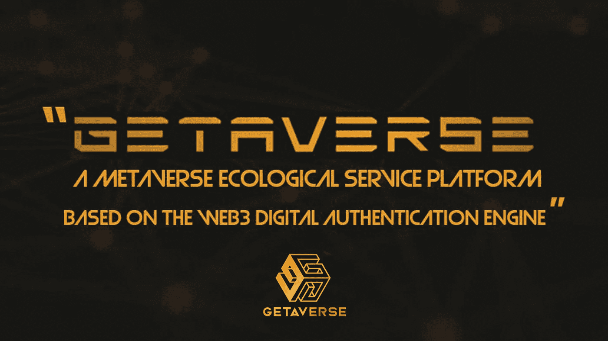

# Getaverse 在元宇宙扮演的角色

> 原文：<https://medium.com/coinmonks/the-role-getaverse-plays-in-metaverse-3dc3b0fc279e?source=collection_archive---------20----------------------->

> 在进入 Web3 中的 Getaverse 和加密世界中的元宇宙的角色之前，让我们先来看看一些基本的想法，它们将为我们将要讨论的内容奠定基础。术语“元宇宙”和“web3”是目前扰乱互联网和加密空间的两个短语。

etaverse 首次出现在史蒂文森 1982 年的小说《雪灾》中。脸书更名为梅塔后，元宇宙的影响力越来越大。

根据维基百科，

***“元宇宙是互联网的一个假想迭代，是一个单一的、通用的、沉浸式的虚拟世界，通过使用虚拟现实(VR)和增强现实(AR)耳机来实现。”*** *简单来说，元宇宙就是一个 3D 虚拟环境的集合，主要用于社交。*

**元宇宙发展概况:**

历史上对元宇宙发展的主张甚至可以追溯到这个术语被创造出来之前。然而，许多在线视频游戏平台已经在游戏开发中融入了元宇宙技术的元素，其中一个平台包括第二人生，这是一个于 2003 年推出的虚拟平台，通常被称为第一个元宇宙，因为它将社交媒体功能结合到一个持久的三维世界中，用户由一个化身代表，而活跃世界和宫殿是首批努力之一。其他被认为是元宇宙一部分的流行视频游戏包括游戏制作平台 Roblox，以及以下游戏:VR hat、《我的世界》、Habbo Hotel、魔兽世界和堡垒之夜。

除了已经讨论过的视频游戏平台，有人可能会问，元宇宙是不是全是视频游戏？

为了不留下含糊不清的余地， ***“元宇宙只是互联网演变的另一个词:比现在更社会化、更沉浸式、更经济的东西。”*** 根据 Getaverse 白皮书。

现在转到另一个短语——web 3。请注意，这不能与蒂姆·伯纳斯·李在 1999 年提出的 Web3.0(语义网)相混淆，web3.0 是 Web1.0 和 Web2.0 的升级版本。他表达了自己对 web 3.0 的愿景，即在这个时代，计算机将能够分析互联网上的所有数据。他在讲话中指出:

“我对网络有一个梦想，在这个梦想中，计算机能够分析网络上的所有数据——人和计算机之间的内容、链接和交易。使这成为可能的“语义网”尚未出现，但当它出现时，贸易、官僚机构和我们日常生活的日常机制将由机器与机器对话来处理。人们吹捧了很久的“智能代理”将最终实现。

鉴于上述情况，人们可能会问，这个 Web3 与蒂姆·伯纳斯·李的 web3.0 愿景有什么不同，web3.0 还没有到来吗？我们已经看到了不同的高科技行业，如谷歌、苹果、Twitter、脸书、微软等，如何改变了互联网的面貌。

根据 cointelegraph.com 的说法

> “Web3 是基于公共区块链的未来版本的互联网，这是一个以促进加密货币交易而闻名的记录系统。Web 3.0 的吸引力在于它是去中心化的，这意味着消费者不是通过谷歌、苹果或脸书等公司中介的服务来访问互联网，而是个人自己拥有并管理互联网的各个部分。

*Web3 不需要“许可”，这意味着中央当局不能决定谁可以访问什么服务，也不需要“信任”，这意味着两方或多方之间的虚拟交易不需要中介。因为这些机构和中介正在进行大部分的数据收集，所以 Web3 在技术上更好地保护了用户隐私。*

*分散金融，通常被称为 DeFi，是 Web3 的一个组成部分，正在获得动力。它需要在没有银行或政府帮助的情况下，在区块链执行真实世界的金融交易。”*

**web 3 开发的重大挫折:**

在 Web3 中，所有行业的经济价值仍然主要集中在人和他们之间形成的关系上。在今天的文化中，来自家庭、宗教、团队、公司、公民、名人等社会机构的集中身份是一个人所有品质和活动的集合。在现实生活中，我们通过诸如身份证、驾驶执照、营业执照或电子身份证等物理介质来验证我们的身份。作为一个比 Web2 更大的基于信任的数字环境，Web3 应该很容易超过集中式的 Web2。然而，由于现有的 Web3 缺乏描述每个人社会身份的关键特征，它现在必须依赖 Web2，这导致了局限性。

**web 3 对 Web2 的依赖有哪些局限？**

Web3 依赖 web2 造成的限制包括:

*   大多数 NFT 依赖像 OpenSea 这样的集中平台进行交易。
*   许多 Dao 希望超越社交媒体平台，依赖 Web2 基础设施的简单投票机制，但这并不能抵御女巫攻击。
*   许多 Web3 参与者依赖于由集中实体托管的钱包，如 coinbase 或币安，而分散的密钥管理系统对用户非常不友好。

由于缺少身份信息，Web3 提供的不安全贷款无法完成。此外，现有的令牌系统不能处理信用(因为没有分离所有权和使用权)。建立 DeSo 的基础也需要 Web3 延伸社交基础。

如何消除这些限制:

**随着分散身份的引入而做了**

# **什么是 Getaverse？**

Getaverse 是一个区块链信用系统，已经在许多区块链公共场所设计和部署。其开发的唯一目的是为基于 Web3 协议的数字认证系统提供一个生态元宇宙服务平台。用户在加入 Getaverse 后将获得一个 DID 身份，他们可以用它来开发自己的支付系统，并参与平台的生态使用、建设和维护。用户可以通过参与资产所有权、股权挖掘、治理投票等活动来提高他们的总体信用评分。创新的 Web3 项目，如 DEX、NFT、Defi、Gamefi、Socialfi 和其他生态应用程序，可以使用 Getaverse 的开放 API 接口访问。

# **为什么要开发 Getaverse 区块链？**

由于分散身份(DID)主张每个人都有权拥有和控制他们自己的数字身份，这可以安全地存储和保存数字身份组件，然而，DID 的实施是困难的，因为它需要身份创建、识别和验证、可信数据存储和处理、身份声明和认证以及信用系统。

必须在几个公共链上开发和部署一个区块链信用系统，其目的是为数字认证系统创建一个基于 Web3 协议的生态元宇宙服务平台，而 Getaverse 就是这样一个区块链。

# 【Getaverse 打算如何实现这一切？

Getaverse 的愿景是通过为 Web3 和元宇宙门户网站建立 DID(去中心化身份)和声誉系统，帮助 Web3 开发者设计更好的产品。构建一个真正的去中心化社会——DeSo(去中心化社会)，允许用户控制他们的身份，强调数字内容的所有权，并确保用户获得价值。

下文将讨论如何实施这些措施；

**1。创建链上 ID 标签-灵魂绑定令牌(SBT):**

除了分散身份，Getaverse 还支持分散节点对个人的验证，将集中身份引入 Getaverse ID 系统。这些个人信誉标签基于用户与项目的链上交互，将由 Getaverse 根据 xxx(工作、活动、技能等)的证明进行认证，这给用户一种荣誉感，使项目能够获得更准确的用户画像。基于用户地址在多个公链中的链上行为，可以创建清晰、细分的用户简档，如“Uniswap 超级交易员”、“复合贷款人”、“OpenSea Artists”、“Bored Ape Holder”等。

**对于 Web3 用户:**灵魂绑定令牌授予用户信誉标签，以代表用户对项目的贡献。这些标签是不可转让的，将永远跟随用户。用户不需要创建这么多的帐户/地址，他们可以通过 Getaverse 一站式登录并与项目互动。

**对于 Web3 项目**:项目可以利用标签来分析&开发产品并开展更有效的营销，如空投。

**2。Getaverse 事件证明:**

Getaverse 允许 Web3 开发人员基于链上行为或链外事件(例如，存在证明)为事件证明定制 NFT。它涵盖了整个过程，从 NFT 创建到分配规则等。例如，对于事件出席 NFTs，Web3 开发者需要上传白名单地址，上传 NFT 图像，并使用以下方法设置薄荷时间。

*   自行上传的地址列表
*   Getaverse bot 收集的地址●与链中的合同交互
*   跟随特定的地址
*   转发帖子/链接等。

**3。Getaverse 做了:**

Getaverse DID 是通过 SBTs(集中式和链上身份标签)和 Getaverse 事件证明结合链上和链下用户数据而形成的。网络身份是一种新型的人在网络上的简历，可以作为链上行为和链下社会之间的纽带。Getaverse 完全支持分散式密钥管理。在传统的加密货币系统中，私钥的丢失会导致资产不可逆转的消失。另一方面，Getaverse 与 SBT 合作，允许用户管理一组监护人，他们可以是个人、机构或其他团体。

成功的康复需要与他们中的大多数建立可靠的联系。与典型的社会康复不同，SBT 康复需要合格多数人(随机子集)的批准。当 Getaverse DID 丢失时，该地址上的 SBTs 链接到所有者的社交网络，然后依赖于社交网络成员之间的相互投票来完成协作恢复。通过社交联系人恢复密钥使用与谷歌邮件和 Twitter 密码恢复相同的原理，即从地址簿中调用熟人来协助密码重置和帐户恢复。

***记住，我们才刚刚入门*** *。*

# 你知道 GETAVERSE 的可信验证节点吗🤔

这在验证身份以授权访问方面增强了信任。发起可验证声明的系统在确认用户的特定特征属性(例如，性别、年龄等)后验证用户身份。)都是正确的。

在注册 DIDs 的过程中，用户不需要在索赔发起节点或验证节点存储任何与其个人信息相关的信息。他们只需要事先在声明发起节点和验证节点之间建立信任，就可以让 DID 系统正常工作。

这是去中心化身份系统的未来。这个 Getaverse 可信验证器节点非常实惠。如果有兴趣，通过[https://t.me/ubeedominic](https://t.me/ubeedominic)发送一份 DM 电报

# *保持与 GETAVERSE 的连接*

*网址:*[*https://getaverses.com/*](https://getaverses.com/)

*推特:*[*https://twitter.com/GetaverseGlobal*](https://twitter.com/GetaverseGlobal)

*电报:*[*https://t.me/Getaverse_Official*](https://t.me/Getaverse_Official)

*不和:*[*https://discord.gg/MKe3YJyQ65*](https://discord.gg/MKe3YJyQ65)

> 交易新手？尝试[加密交易机器人](/coinmonks/crypto-trading-bot-c2ffce8acb2a)或[复制交易](/coinmonks/top-10-crypto-copy-trading-platforms-for-beginners-d0c37c7d698c)