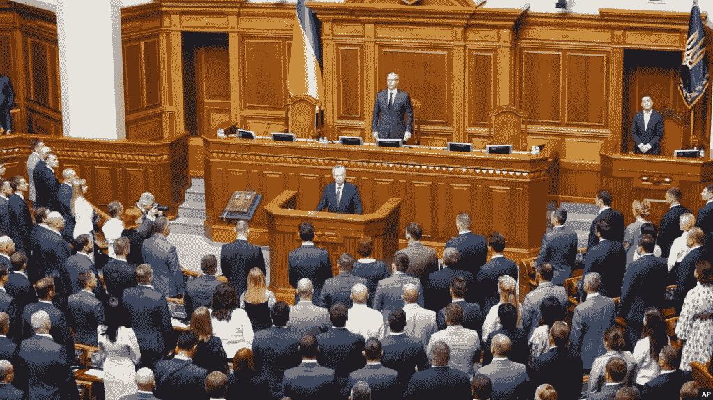
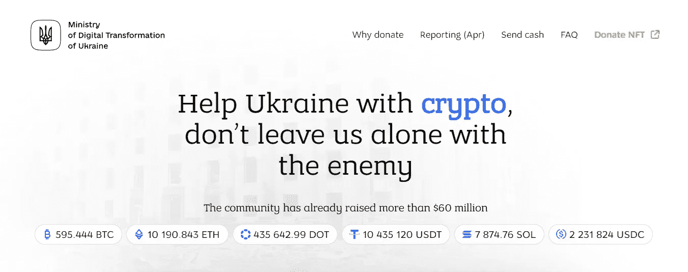
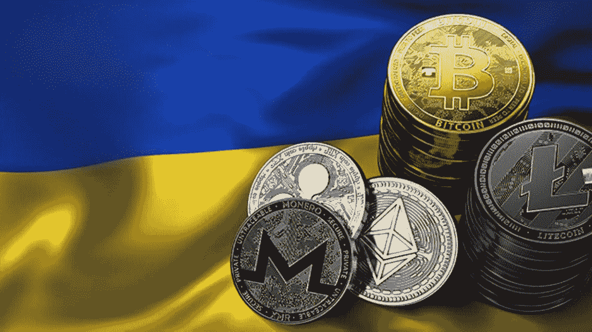
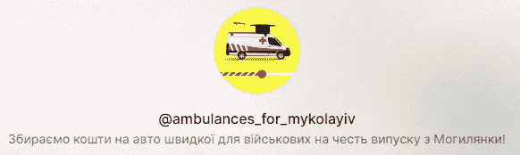

# 加密货币在乌克兰冲突中的作用，以及如何通过加密捐款帮助乌克兰人民

> 原文：<https://medium.com/coinmonks/the-role-of-cryptocurrencies-in-the-conflict-of-ukraine-and-how-it-is-possible-to-help-the-b6ff38af803?source=collection_archive---------46----------------------->

为了应对 2022 年 2 月 24 日发生的俄罗斯入侵，乌克兰正在从各个国家和公民那里获得大量财政支持，其中一些捐款是通过比特币和其他加密货币进行的。就在冲突开始前，乌克兰议会刚刚于 2022 年 2 月 17 日批准了一项关于乌克兰虚拟资产监管和合法化的法律。

The Ukrainian parliament

从数字转型部的官方通知中可以看出，这是乌克兰虚拟资源合法市场启动的重要一步。在这种情况下，除了市场监管机构(乌克兰国家银行和国家证券和股票市场委员会)之外，法律还确定虚拟资产的法律地位、分类和所有权。它还为虚拟资产市场法律领域的进一步形成创造了条件，并规定在虚拟资产领域实施金融监督措施。

2022 年 2 月 26 日，乌克兰政府[在其官方主页上发布了](https://twitter.com/Ukraine/status/1497594592438497282?s=20&t=Ny9lFC02DsUoG9N6tKyZpQ)比特币、以太坊和 USDT 的地址，用于发送捐款。此外，2022 年 3 月 14 日，乌克兰副总统米哈伊洛·费多罗夫通过[推特](https://twitter.com/FedorovMykhailo/status/1503470362641772558?s=20&t=6tPiD1kB0vglJ7TVO_JNQg)宣布开通加密货币捐赠官方网站。据[网站](https://donate.thedigital.gov.ua/)报道，该社区已经筹集了超过 6000 万美元。除了上面提到的加密货币之外，还可以通过 Cardano、Solana、Polkadot、NEAR Protocol、Dogecoin、Algorand、Stellar、Hedera、Monero、ICON、Casper 和 DigitalBits 发送捐款。该倡议的发起人之一是 Mike Chobanian， [KUNA Exchange](https://kuna.io?r=kunaid-9r5u6zkxswdy) 的创始人兼乌克兰*区块链协会*的主席，该协会于 2022 年 6 月[宣布了针对乌克兰的](https://it.finance.yahoo.com/video/kuna-founder-announces-crypto-powered-151300556.html?guccounter=1&guce_referrer=aHR0cHM6Ly93d3cuZ29vZ2xlLmNvbS8&guce_referrer_sig=AQAAAIVB9CtLIgKzF9IPcsprM6YURUPYvreveP-jX8SKn5Pt1RI-PS-PVkNuCqPg85DfglYT29VVJqPMDOSts7wa3T-OoSY-acExEGx3BkbrezknT-8JZGk3oTAyoKjFancfmlgjBSj0o2v-JX2zOU_UuvJ66rYcbwZezR5YOz9UQB9D)基于加密货币的人道主义项目。

[https://donate.thedigital.gov.ua/](https://donate.thedigital.gov.ua/)

对乌援助由 Everstake、 [FTX](https://ftx.com/eu/referrals#a=148928828) 和 [Kuna](https://kuna.io?r=kunaid-9r5u6zkxswdy) 提供支持。乌克兰也可以在 T4 条约上得到帮助。说到 NFT，一位居住在美国的俄罗斯艺术家 [Olive Allen](https://twitter.com/IamOliveAllen/status/1499455701730615296?ref_src=twsrc%5Etfw%7Ctwcamp%5Etweetembed%7Ctwterm%5E1499455701730615296%7Ctwgr%5E03adc826dcef85575a148861a8df494384629b70%7Ctwcon%5Es1_&ref_url=https%3A%2F%2Fcryptonomist.ch%2F2022%2F03%2F07%2Fucraina-donazioni-50-milioni-criptovalu) 焚烧了自己的护照，以示对俄罗斯政府的不满。展示这一场景的视频变成了在 SuperRare 上拍卖的 NFT，为受战争影响的乌克兰人民筹集资金。币安已经捐赠了 1000 万美元来帮助乌克兰的人道主义危机。英国企业家和计算机科学家加文·伍德(Gavin Wood)捐赠了高达 500 万美元，他是以太坊的创始人，也是波尔卡多和草间弥生的创造者。

然而，另一方面，俄罗斯可能会利用加密货币来绕过美国及其合作伙伴决定的严厉制裁。国会也对此进行了讨论，因为比特币和其他加密货币提供的匿名性可能会削弱制裁的有效性。币安试图寻找掩护。事实上，从 2022 年 3 月 9 日起，所有在俄罗斯发行的万事达卡和维萨卡发起的交易在币安都不可用。此外，俄罗斯境外的金融机构使用 Mastercard 和 Visa 卡发起的所有交易也将无法在俄罗斯联邦币安境内进行。

Crypto donations for Ukraine

搜索互联网，还有其他值得注意的秘密捐赠:

*   在意大利救助儿童会(Save the Children Italy)上，也可以用加密货币捐款来帮助乌克兰儿童。您的捐款将被转换为法定货币，并用于确保为乌克兰冲突中的儿童提供紧急保护和援助，如热餐、基本必需品、毛毯、经济和心理支持。点击[这里](https://donaora.savethechildren.it/crypto/?utm_source=other&utm_medium=other&utm_content=alias-cripto&utm_term=redirect&utm_campaign=rf-ef-ucraina&causale=22107)可以捐款；
*   此外，在 Instagram 上，我发现了一个乌克兰女孩 Yulia Babich 的[卷轴](https://www.instagram.com/reel/Cg_00EAgMR0/?igshid=YmMyMTA2M2Y=)，她和慈善基金“хочу допомогти”(意思是“我想帮忙”)的小组成员发起了一个[志愿者倡议](https://linktr.ee/ambulances_for_mykolayiv)将两辆救护车转移到 Mykolayiv 地区。他们想筹集 60 万格里夫纳(约合 1.6 万美元)。在 BTC、瑞士联邦理工学院和 USDT 都可以捐赠。要查看地址，请点击[这里](https://telegra.ph/kriptogamanc%D1%96-08-07)。

Ambulances for Mykolayiv

请在下面留下评论，告诉我你对加密货币在乌克兰冲突中的作用的看法，它们如何有效地帮助乌克兰人民，以及你是否知道其他值得注意的针对乌克兰人的加密捐款举措。把这个空间当成一个没有审查的谈话场所。

胜利者是永不放弃的梦想家。

**免责声明** : *我不知道所用图片的任何第三方权利。如有任何资料来源，我保证予以引用，如有要求，我将调整立场。*

**免责声明** : *交易加密货币具有很高的风险，可能不适合所有投资者。在决定交易加密货币之前，你应该仔细考虑你的投资目标和你的经验水平。自己做研究。此处表达的所有观点归各自作者所有，不应被视为任何形式的财务建议。*

> 加入 Coinmonks [电报频道](https://t.me/coincodecap)和 [Youtube 频道](https://www.youtube.com/c/coinmonks/videos)了解加密交易和投资

# 另外，阅读

*   [瓦济里克斯 NFT 评论](https://coincodecap.com/wazirx-nft-review) | [比茨盖普 vs 皮奥克斯](https://coincodecap.com/bitsgap-vs-pionex) | [坦吉姆评论](https://coincodecap.com/tangem-wallet-review)
*   [如何使用 Solidity 在以太坊上创建 DApp？](https://coincodecap.com/create-a-dapp-on-ethereum-using-solidity)
*   [加密交易机器人](/coinmonks/crypto-trading-bot-c2ffce8acb2a) | [OKEx vs 币安](https://coincodecap.com/okex-vs-binance)
*   [币安 vs FTX](https://coincodecap.com/binance-vs-ftx) | [最佳(SOL)索拉纳钱包](https://coincodecap.com/solana-wallets)
*   [如何在 Uniswap 上交换加密？](https://coincodecap.com/swap-crypto-on-uniswap) | [A-Ads 审查](https://coincodecap.com/a-ads-review)