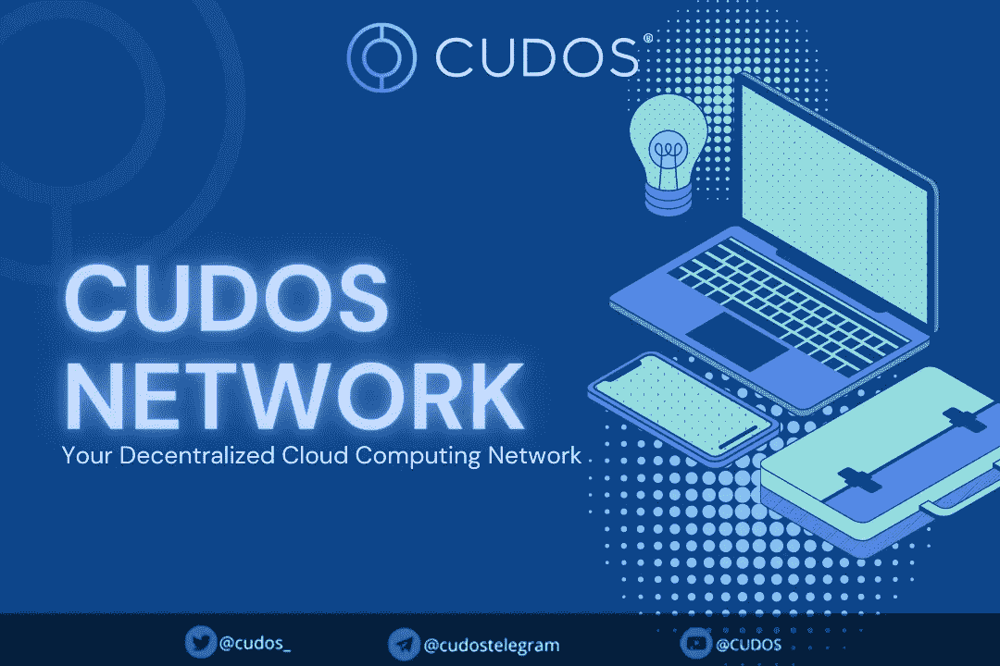

# Rust、WebAssembly (Wasm)和 Cosmos WebAssembly (CosmWasm)在 Cudos 链条中的作用。

> 原文：<https://medium.com/coinmonks/the-role-of-rust-webassembly-wasm-and-cosmos-webassembly-cosmwasm-in-the-cudos-chain-fd932a408060?source=collection_archive---------11----------------------->

在我们的上一篇文章中，我们介绍了 Cudos 作为解决区块链的可伸缩性和互操作性问题的一个可行工具，我们谈到了:“BFT 共识”及其在推动 Tendermint 核心引擎中的作用，tender mint 核心引擎充当了区块链的共识引擎；建立 Cudos 节点的必要性；validator 和 delegator 作为工具来帮助 DAO 的可操作性，以及通过设置私钥或公钥来设置 Cudos 帐户的基础知识，以及许多其他相关问题。在本文中，我们将详细讨论 Rust、WebAssembly (Wasm)和 Cosmos WebAssembly (CosmWasm)在 Cudos 链中的作用。

Cudos 是一个第一层委托利益证明(DPoS)区块链，旨在使分散计算在链上可用。Cudos 网络的架构将共识和执行分开，以提供对高性能计算的大规模、安全、分散和免许可的访问。整个区块链生态系统都可以通过 Cudos 实现。Cosmos 生态系统使用 Cosmos 区块链间通信(IBC)协议来实现令牌、资产、NFT 和数据与其他区块链之间的无缝传输。

# Rust 工具链简介

Cudos Network 支持通过 CosmWasm 创建编译到 Wasm 的智能合约，CosmWasm 是为 Cosmos 生态系统(Cudos 是其中的一个组件)开发的智能合约平台。有几个工具可以让 Rust 开发人员开始工作，包括像 Cudos Blast 这样的开发人员 SDK 和一个完全完整的 testnet。

Rust 是大多数区块链行业的理想编程语言。Rust 中的编程是安全的、并发的和节省内存的，并且为了性能和安全，它是静态类型的。

类似 C++，有语法。它最初是 Mozilla 研究开源项目。它是由 Graydon Hoare 在 2010 年创建的，并已成为构建安全快速应用程序的知名语言。许多知名企业都采用了它，包括丰田、Discord、1Password 和 Dropbox。

Rust 提供了低成本和近乎即时的交易终结，允许开发者构建高度可扩展的 Dapps。Rust 在所有(最常见的)高性能、多平台的情况下都大放异彩，在这些情况下，安全性是不可忽视的。

Cudos 网络利用 CosmWasm 作为创建智能合同和支持链架构的平台。Rust 用于创建这些智能合约。

同样，创建智能合同也需要 Rust 工具链。通过利用 WebAssembly 等现有技术，强化设计原则并降低与智能合约(wasm)相关的风险。

**web assembly 技术** web assembly 基于堆栈，独立于 CPU 和操作系统，是一台小巧、快速、高效且非常安全的虚拟计算机。它旨在以接近本机的速度运行由代码生成的可移植字节码。它可以在任何环境下运行，因为它在沙箱中。对 WASM 编程语言的支持相当多，而且还在不断发展。

**Cosmos web assembly 工具的整体作用** CosmWasm 是一个安全的多链智能合约引擎，由 Confio 的一个开发团队为 Cosmos 生态系统打造。它是使用 WebAssembly (Wasm)的 Cosm 方式，因此得名。

CosmWasm 为其用户提供了大量的好处，并支持产品的可伸缩性。这些好处包括提高安全性、减少碳排放、加快交易速度，以及创建分散应用程序的跨链互操作性。

此外，它提供了更大的灵活性，因为您可以更新您的智能合同，而无需更新整个区块链，从而减少了大量的开销。

CosmWasm 提供 API 和库功能，包括地址验证和更复杂的存储对象。这些使您可以创建强大的智能合约。

# 连接 CUDOS 生态系统

[推特](https://twitter.com/CUDOS_) | [网站](http://www.cudos.org/)|
[不和](https://discord.com/invite/cudos) | [电报](https://t.me/cudostelegram)
[YouTube](https://www.youtube.com/channel/UCbS48Q09D5xMDCVX0T_OeCw)|[LinkedIn](https://www.linkedin.com/company/cudos1/)
[Spotify](https://open.spotify.com/show/2lZuBXJ270g7taK06tnK35)|[媒体](https://medium.com/cudos)
[脸书](https://www.facebook.com/cudos.org/)

> 交易新手？尝试[加密交易机器人](/coinmonks/crypto-trading-bot-c2ffce8acb2a)或[复制交易](/coinmonks/top-10-crypto-copy-trading-platforms-for-beginners-d0c37c7d698c)