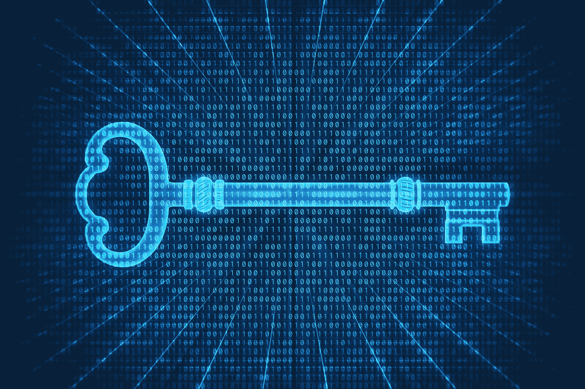
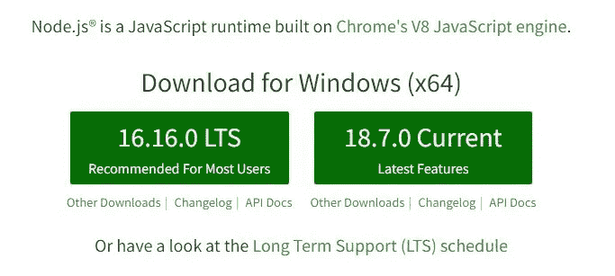
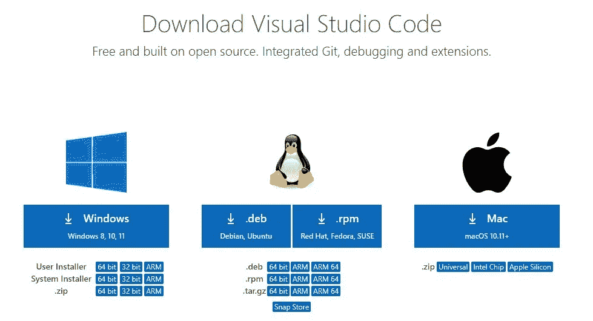
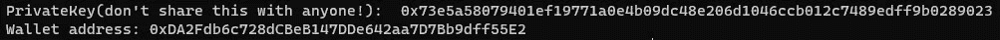

# 有史以来最安全的加密钱包

> 原文：<https://medium.com/coinmonks/the-safest-crypto-wallet-of-all-time-f7d8c749e30b?source=collection_archive---------10----------------------->

嘿，伙计们。我想你是在密码(当然，还有区块链)市场，因此你想降低这个利润丰厚(当然波动很大)市场的风险，让你的资产更安全。



Image credit: CoinDesk.com

(代码包含在 Github repo 中，链接在本文的最后部分)

同样让我提一下，我们正在讨论的钱包是用于 ERC20(和其他以太网克隆网络)令牌的。

所以这篇文章绝对会改变你地穴资产安全的游戏规则。

让我们深入研究一下我们在谈论什么。

我们可以将钱包分为 3 种不同的类型:

1.  **软件钱包**(如元面具、信任钱包、safepall 等……)
2.  **五金钱包**(如莱杰纳、safepall 五金钱包等……)
3.  **纸质钱包**

注意:纸质钱包是一种钱包，在这种钱包中，您将自己的私钥保存在一张纸上(您必须让它对全世界隐藏起来，只有您才能使用它)

在这里，在这个故事中，我们将学习如何拥有有史以来最安全的加密钱包！

这种拥有最安全钱包的解决方案与纸质钱包非常相似，但存在一些重大差异:

当我们想创造纸质钱包，必须使用第三方网站和系统(程序)为我们做这项工作，但是…一个大的 Butttt！

我们如何确保他们不会拥有我们的私钥数据副本？

这就是让我们思考另一种方法来生成尽可能安全的加密钱包的原因。以下是如何做到这一点:

**注意:我们不需要成为一个技术人员，也不需要有很多编程技能等等……最低限度的技能，应用吧！**

您只需要安装 [node.js](https://nodejs.org) (稳定版本)+(可选)安装 VisualStudioCode(VScode)…并轻松完成回购。

我们只需要知道钱包的私钥和公钥是如何生成的。为了解释它，我选择了简短的方式来告诉你。

一切都从一个随机产生的数字开始。是的。就这么简单！

在下一步中，这个随机数的一小部分将被选为我们的钱包私钥，最后，我们将在我们的计算机上拥有我们的钱包地址(不知何故，我们的公钥),并且没有任何第三方访问。

为了使本文更简单，让我们一起来:

1.  前往[https://nodejs.org](https://nodejs.org)，下载并安装 LTS 版本:



2.基于您的操作系统下载并安装 [Visual Studio 代码](https://code.visualstudio.com/download) (vscode)。(可选)( ***** 不是说您可以很容易地使用 cmd 控制台来代替 vscode ***** )



3.创建新文件夹(例如): **walletGenerator**

4.打开 vscode(或 cmd 控制台)中的 walletGenerator 文件夹，从上到下一个一个地写这些代码:

*   `npm init -y`
*   `npm install ethers`

5.创建新文件: **walletgenerator.js**

6.将这些代码复制到 walletgenerator.js 文件中:

```
var ethers = require("ethers");
var crypto = require("crypto");var id = crypto.randomBytes(32).toString('hex'); // generating 32bytes random string 
var privateKey = '0x' + id; // 0x is used to make private key in hexadecimalconsole.log("PrivateKey(don't share this with anyone!): ", privateKey);var wallet = new ethers.Wallet(privateKey);
console.log("Wallet address:", wallet.address);
```

7.最后，输入以下命令:

```
node walletgenerator
```



Here is the result

生成钱包后，您将拥有新生成的钱包的公钥和私钥。要检查您的钱包，您可以测试探索者的资产:

*   从 https://testnet.binance.org/faucet-smart 的(币安智能连锁测试网的水龙头)这样的水龙头给你的钱包充电
*   然后从浏览器查看你的余额如下:https://testnet.bscscan.com/address/{YourWalletAddress}

**一条建议:**

你看过哈利波特电影吗？！多陪我一会儿😉

此外，如果我们想要更高的安全级别，…

如果你认识伏地魔，那么你大概知道怎么做！

你甚至可以通过制作魂器(如《哈利波特》电影系列中所示)来使代码(GitHub repo 在故事的结尾)更安全(将你的私钥分成更小的部分，并将它们的每一部分保存在一个只有你自己的安全地方！只有你能接触到。

感谢你和我一起阅读这篇文章，希望你喜欢。

如果你喜欢我的文章，并认为其中可能有任何价值，请订阅并鼓掌🙂

[Github 回购](https://github.com/BahadorGh/wallet-generator)

> 交易新手？尝试[加密交易机器人](/coinmonks/crypto-trading-bot-c2ffce8acb2a)或[复制交易](/coinmonks/top-10-crypto-copy-trading-platforms-for-beginners-d0c37c7d698c)