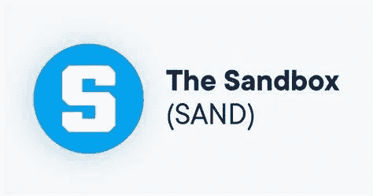

# 沙盒(沙子)价格预测

> 原文：<https://medium.com/coinmonks/the-sandbox-sand-price-prediction-46a6da9bd535?source=collection_archive---------31----------------------->

Source photo [the sandbox crypto LOGO — Bing images](https://www.bing.com/images/search?view=detailV2&ccid=mjJrknYu&id=02AA5489353169622E942A1C3C8D5FB2197F961B&thid=OIP.mjJrknYuh5BPTmm0oSKIGAHaD5&mediaurl=https%3a%2f%2fwww.halakoei.academy%2fwp-content%2fuploads%2f2020%2f10%2fCA22445B-1CF9-40BE-B5D0-99A6DBEB5C94.jpeg&cdnurl=https%3a%2f%2fth.bing.com%2fth%2fid%2fR.9a326b92762e87904f4e69b4a1228818%3frik%3dG5Z%252fGbJfjTwcKg%26pid%3dImgRaw%26r%3d0&exph=632&expw=1200&q=the+sandbox+crypto+LOGO&simid=608052406117606131&FORM=IRPRST&ck=15C7BFB7FE64C7D07879DDEAF8F7311A&selectedIndex=3&ajaxhist=0&ajaxserp=0)

## 沙箱(沙子)是什么？

自推出以来，沙盒已经成为区块链支持的虚拟游乐场，供各种技能水平的游戏玩家享受、创造、交易和赚钱。通过让游戏玩家设计自己的平台，该平台旨在解放他们的想象力。