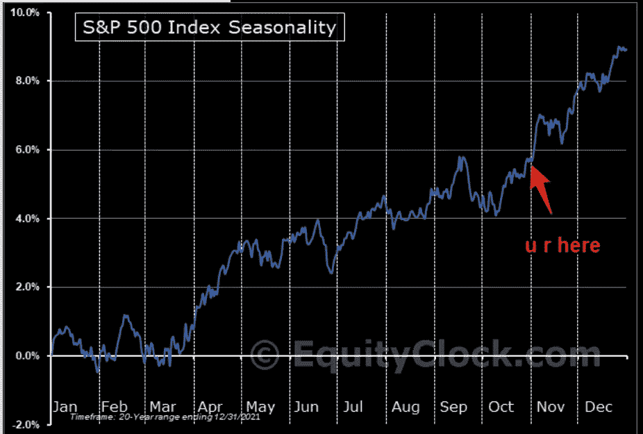
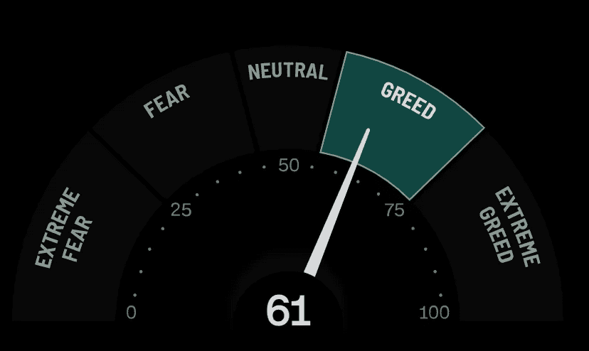
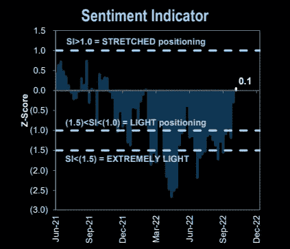
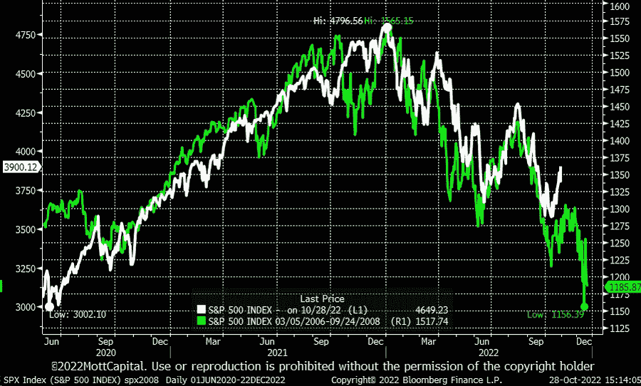
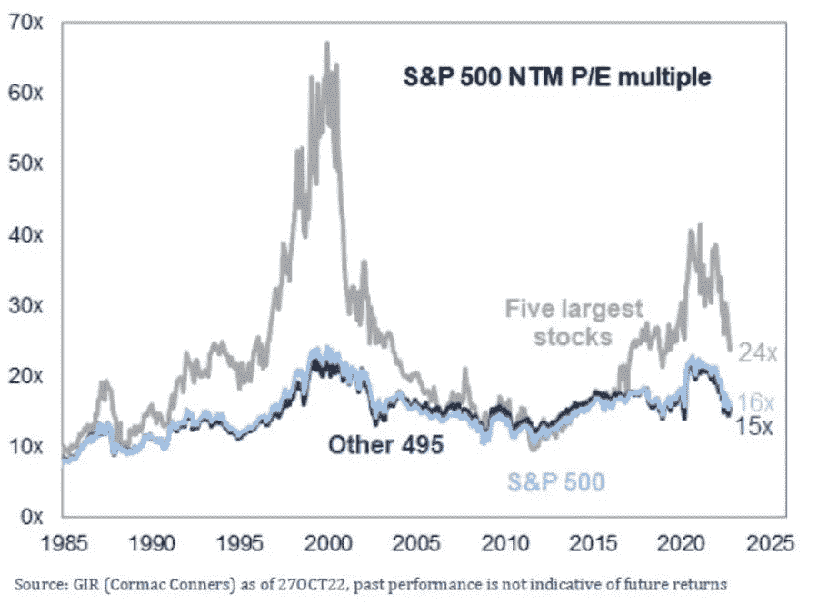
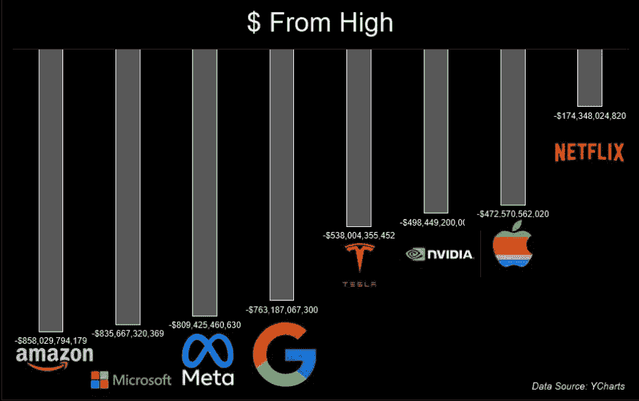
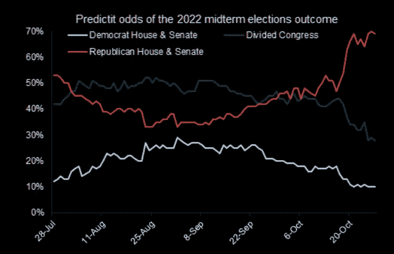

# 圣诞老人集会开始，恐惧和贪婪指数，大型科技股进一步下跌

> 原文：<https://medium.com/coinmonks/the-santa-rally-begins-fear-greed-index-big-tech-to-fall-further-84aa9cac83e?source=collection_archive---------20----------------------->

嘿，我是基兰！市场又将迎来新的一周，以下是需要注意的关键事件，以及来自投资银行的最有趣的宏观研究。我希望能在本周的[贸易挑战](http://www.traderseed.io/)中与你交谈，并且一如既往，如果你有任何问题，请在下面给我留言。

**嘿，我是基兰！**市场又将迎来新的一周，以下是需要注意的关键事件，以及来自投资银行的最有趣的宏观研究。我希望能在本周的贸易节目中与你们交谈。一如既往，如果你有任何问题，只需回复此邮件，我会非常乐意回答任何问题。

# 每周观察列表

本周，我们将从美联储(周三)和 BOE(周四)获得非常重要的加息决定。预计两者都将大幅加息 75 个基点，以继续对抗通胀。周五，我们还将看到 10 月份美国非农就业数据，这将为美联储 12 月加息决定的预期提供信息。

同样在本周，在大型科技股上周遭受重创后，财报季将继续隆隆作响。尽管大型科技公司的业绩不佳，但股票市场对这一消息反应良好，并在周五大幅反弹。

# 宏观视角

圣诞老人集会开始了。标准普尔 500 指数继续密切跟踪过去 20 年的季节性。我们在 10 月份看到了短期底部，并在月底试图突破。如果这种相关性在本周继续，我们应该会看到进一步的上涨。

**恐惧和贪婪指数。**一如既往，我们应该始终以整体的方式看待市场内部。CNN 恐惧&贪婪指数已经上升到贪婪，表明 FOMO 可能开始了，这次反弹可能是一个牛市陷阱。在我们达到“极度贪婪”之前，还有很大的空间，所以我们拭目以待。。

**很多交易者都在玩这个反弹。高盛的“情绪&定位”指标出现了罕见的积极迹象。定位不再做空，市场内部正在发生变化。**

**2008v 2022 模拟..**我们跟踪了一整年的哪个现在出现了小幅分化。这是对类比的拒绝，还是我们只是在年末大崩盘前提前了几周？

**S&p500 大 5。标准普尔 500 指数中最大的五只股票已经出现了大规模的倍数收缩。然而，如果历史是一个指南，我们应该看到在底部到来之前，大 5 倍的市盈率与其他指数成分一致下降。五大银行目前的市盈率为 24 倍，而其他 495 家成份股的市盈率为 15 倍。下行空间更大。**

**科技股从高点下跌。市值缩水超过 8000 亿美元的脸书并不是最大的输家，至少按美元计算是这样。亚马逊和微软的市值都从最近的高点蒸发了更多。**

**美国中期选举正在迅速临近…** 选举结果可能会导致美国财政、经济和外交政策发生重大变化。共和党人在预测市场中非常受青睐，这将使重大地缘政治变化很快发挥作用。保持敏捷！

我希望你觉得这很有趣，很有用。**我每周一写这份简讯**所以**一定要关注我**！像往常一样，把风险管理放在第一位，安全交易，保持敏捷。

祝你一周愉快！
基兰
**www.traderseed.io**

**想交易本周的市场吗？** 100k 程序从 **$75** 开始！！点击这里查看新节目 [**！**](http://www.traderseed.io/)

[**查看节目**](http://www.traderseed.io/)

> 交易新手？尝试[加密交易机器人](/coinmonks/crypto-trading-bot-c2ffce8acb2a)或[复制交易](/coinmonks/top-10-crypto-copy-trading-platforms-for-beginners-d0c37c7d698c)