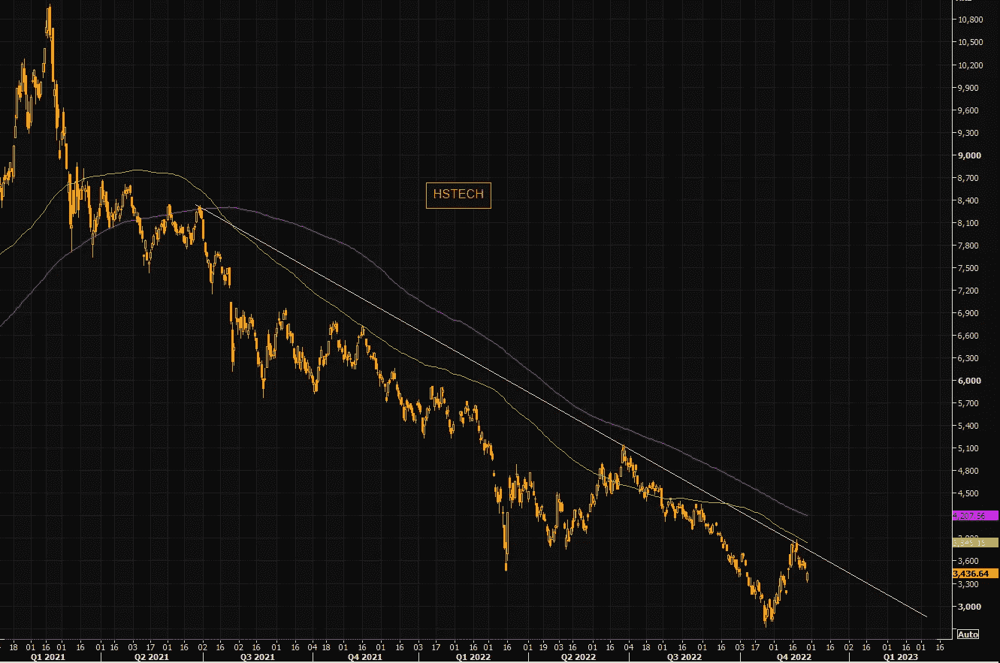

# 与圣诞老人集会相比，暴风雨前的平静，石油和美元必须保持水平

> 原文：<https://medium.com/coinmonks/the-santa-rally-compared-the-calm-before-the-storm-oil-usd-at-must-hold-levels-2fab6a9a21a3?source=collection_archive---------30----------------------->

嘿，我是基兰！市场又将迎来新的一周，以下是需要注意的关键事件，以及来自投资银行的最有趣的宏观研究。我希望能在本周的[贸易挑战](http://www.traderseed.io/)中与你交谈，并且一如既往，如果你有任何问题，请在下面给我留言。

# 每周观察列表

周五的非农就业报告将是本周的亮点，但本周有许多影响市场的事件发生。美联储主席杰罗姆·鲍威尔周三在布鲁金斯学会发表讲话。经济日历还包括 ISM 制造业 PMI 和美联储青睐的通胀指标 PCE 核心价格指数，这两项指标都将于周四公布。欧元区通胀(CPI)和中国 PMI 数据也将于周三公布。

# 宏观视角

**暴跌的石油。随着示威活动蔓延至中国多个城市，布伦特原油跌至 1 月初以来的最低水平。我们现在已经逆转了 2022 年的所有涨幅，回到了 2021 年的水平。**

**DXY 在巨量级。美元是全球宏观经济的中心。上周的反弹并没有成为现实，今天我们期待测试主要水平。创造或打破时间。**

**圣诞老人拉力赛 2021 v 2022。去年的 S & P 500 圣诞老人拉力赛从 10 月初开始，三个月内上涨了 12%。今年的反弹迄今已在两个月内上涨了 12%。**

**中国科技股下跌趋势保持不变。**从 2021 年 1 月开始，亚洲科技指数 HSTECH 一直引领着科技股抛售。尽管在过去的两个月里出现了巨大的反弹，但它逆转了负趋势线，目前下跌趋势仍保持不变。在中国科技股收于趋势线之上之前，我们不能对中国科技股的新一轮牛市感到兴奋。

**比特币的流入问题依然如故。没什么大不了的，但关注机构对低迷行业的出价总是值得的。一旦机构开始再次积累比特币，它就会出现在这里。我会继续监视。**

**中国 Covid 抛物线。**又是一天，Mainland China 又出现了新的本地病例记录。

2022 年 VIX 对 2008 年 VIX…我们处于暴风雨前的平静吗？

我希望你觉得这很有趣，很有用。我每周一都写这份简讯，所以**一定要关注我**！像往常一样，把风险管理放在第一位，安全交易，保持敏捷。

祝你一周愉快！
基兰
**www.traderseed.io**

想交易本周的市场吗？ 100k 节目 **$75** 起！！点击这里查看新节目 [**！**](http://www.traderseed.io/)

[**查看节目**](http://www.traderseed.io/)

> 交易新手？尝试[加密交易机器人](/coinmonks/crypto-trading-bot-c2ffce8acb2a)或[复制交易](/coinmonks/top-10-crypto-copy-trading-platforms-for-beginners-d0c37c7d698c)