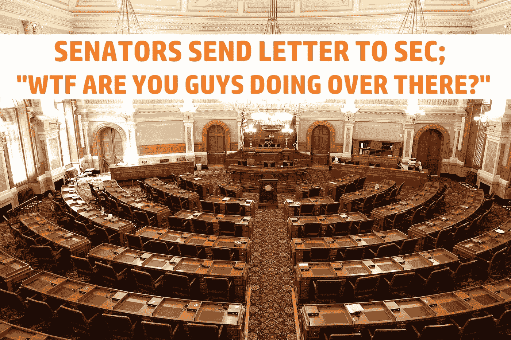

# 美国证券交易委员会有内部问题，这会导致该机构的全面改革吗？

> 原文：<https://medium.com/coinmonks/the-sec-having-internal-trouble-will-this-lead-to-an-overhaul-of-the-agency-1d1df9d3b8bd?source=collection_archive---------51----------------------->

人们不会因为认为证交会陷入混乱而受到指责。它自己的员工正以 10 年来从未见过的速度离职。但是为什么呢？让我们看看能否找到原因。

# 参议院的一封信

这封日期为 10 月 27 日的信由参议员托姆·蒂利斯(共和党)、迈克·克拉波(共和党)、蒂姆·斯科特(共和党)、迈克尔·劳斯(共和党)、比尔·哈格蒂(共和党)和史蒂夫·戴恩斯(共和党)签署。在信中，他们希望证交会解释，为什么他们的员工正以十年来从未有过的速度离开该机构。

共和党参议员引用了 SEC 内部监督机构监察长办公室 10 月 13 日发布的一份公开报告。报告中谈到了诸如员工流失和员工不满等问题。“为撰写报告而接受采访的证交会雇员表示，他们很少收到关于他们所写规则的反馈，强调他们担心由于行业评论期缩短，诉讼会增加”。

> 在没有适当分析、审议或考虑下游负面影响的情况下匆忙通过规则制定的努力无异于监管失当。

*SEC Chair Gary Gensler*

参议员们想知道，SEC 主席加里詹斯勒(Gary Gensler)计划如何解决报告中提出的问题。员工提出的担忧，以及给行业提供反馈规则的时间太少的问题。到目前为止，SEC 今年已经出台了 26 项新规定。这个数字是前一年的两倍多。也是五年来最高的数字。今年我们还有两个月的时间。

Gensler 遭到了很多批评。许多人认为他只是一个渴望权力的监管者。并且不同意他的密码管制策略。更不用说他引诱公司的亲戚“谈话”，然后用强制行动打击他们。给真诚合作的车轮加了一个销。

这似乎是针对他的众多批评中最新的一个。我不会对詹斯勒在下届总统选举中被替换掉感到惊讶。我假设拜登不会竞选第二个任期。但是即使拜登连任。在需要改变之前，只能有这么多的批评。即使只是名义上的交换。但这很可能会导致整个机构的彻底改革。因为它并没有为现任政府描绘一幅美好的图景。

你对此有什么想法？你认为美国证券交易委员会陷入困境，我们会看到该机构的全面改革吗？请在下面的评论区发表意见。如果你想支持我和我制作的内容，请考虑关注我，阅读我的其他帖子，或者为什么不两者都做。

网络上见！

图片提供:[https://www.sec.gov/opa/Article/mediakit.html](https://www.sec.gov/opa/Article/mediakit.html)，[https://www.pexels.com/](https://www.pexels.com/)

> 交易新手？试试[密码交易机器人](/coinmonks/crypto-trading-bot-c2ffce8acb2a)或[复制交易](/coinmonks/top-10-crypto-copy-trading-platforms-for-beginners-d0c37c7d698c)