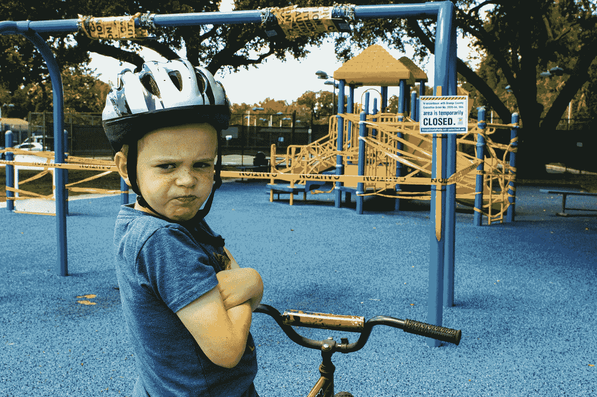
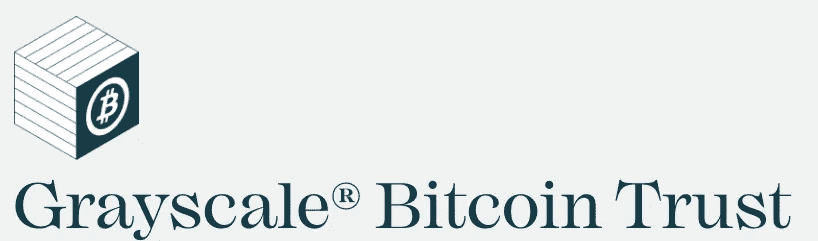
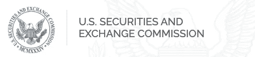

# 在 CFTC 监管比特币之前，美国证券交易委员会不会批准比特币的现货交易

> 原文：<https://medium.com/coinmonks/the-sec-wont-approve-a-spot-bictoin-etf-until-cftc-regulates-bitcoin-d18cf3eeeda5?source=collection_archive---------22----------------------->

## 在此之前，加里·詹斯勒(Gary Gensler)最近表示，比特币很可能是一种商品

Photo by [Mick Haupt](https://unsplash.com/@rocinante_11?utm_source=medium&utm_medium=referral) on [Unsplash](https://unsplash.com?utm_source=medium&utm_medium=referral)

几年来，SEC 一直拒绝批准现货比特币 ETF。

这个话题昨天再次出现在新闻中，因为美国证券交易委员会拒绝了 GBTC 将其灰度比特币信托转换为现货 ETF 的请求。

GBTC 正就这一决定起诉美国证券交易委员会。

Source: Grayscale

迄今为止，仅在过去一年中，SEC 就驳回了十几份申请，其中包括:

*   富达智奥金比特币信托(比特币 ETP)
*   逐位资产管理
*   天桥资本
*   瓦尔基里
*   一条河
*   纽约数字投资集团
*   全球 X
*   巴茨·BZX
*   等等…

与此同时，美国证交会批准了几只未来支持的比特币交易所交易基金。

那么，他们为什么一直拒绝现货 ETF 呢？

# 证交会给出的理由

Source: sec.gov

拒绝的主要原因是申请人缺乏与大规模监管市场的**监督共享协议。**

监督共享协议围绕着有关市场交易活动、清算活动和客户身份的信息共享。

在富达明智起源信托(Fidelity Wise Origin Trust)一案中，美国证交会表示，该交易所未能履行其举证责任，即“**证明该基金旨在防止欺诈和操纵行为**”以及“**保护投资者和公众利益。**

基本上，美国证券交易委员会多年来对市场操纵和缺乏监督也有同样的担忧。

在正式拒绝灰度的 GBTC 转换中，SEC 再次提到灰度未能回答关于市场操纵的担忧以及缺乏保护投资者的适当方法。

那么，他们为什么会批准基于未来的 ETF 呢？

美国证券交易委员会表示，这些交易所交易基金是基于芝加哥商业交易所的比特币期货产品的价格进行交易的，该产品与一个指数挂钩，并由商品期货交易委员会(CFTC)监管。

> 交易新手？尝试[加密交易机器人](/coinmonks/crypto-trading-bot-c2ffce8acb2a)或[复制交易](/coinmonks/top-10-crypto-copy-trading-platforms-for-beginners-d0c37c7d698c)

# 现在加里·詹斯勒的最新声明改变了这个观点

美国证券交易委员会主席加里·詹斯勒发表了一个非常重要的声明，这将改变比特币的游戏。

在接受美国消费者新闻与商业频道 Squawk Box 主持人吉姆·克莱姆的采访时，他说:

> 比特币是唯一可以被归类为商品的数字资产

现在，由于大宗商品受到 CFTC 的监管，这意味着加里·詹斯勒(Gary Gensler)预计比特币将受到 CFTC 的监管，然后他才能批准比特币 ETF。

他告诉英国《金融时报》，他正在与 CFTC 讨论数字资产交易的透明度和投资者保护问题。

因此，一个合理的假设是，我们应该逐渐看到围绕比特币现货 ETF 的辩论开始依赖于 BTC 的 CFTC 监管程序。

这只是把对现货 ETF 的批准往前推了一步。

但是什么都没有改变。我们还处于早期阶段。

这个领域刚刚起步，监管是向前发展的关键。现货 ETF 只是 BTC 完美起飞需要清理的十件事情之一。

 [## 迈克尔·塞勒刚刚列出了阻碍比特币发展的十大因素

### 记下它们，并在它们展开时把它们勾掉

medium.com](/coinmonks/michael-saylor-just-listed-the-top-10-things-holding-bitcoin-back-91fb1cedf49d) 

*如果你喜欢这个故事，并且愿意支持我(和其他成千上万的作家)，那么考虑一个* [*中型*](/subscribe/@John_treadle) [*订阅*](/subscribe/@John_treadle) *只需每月 5 美元或每年 50 美元。*

*或者你也可以决定给我买一个*[*Ko-Fi*](https://ko-fi.com/johntreadle)*。*