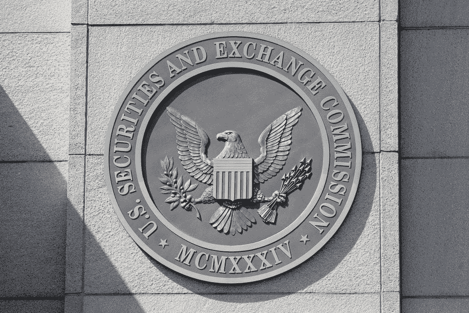

# 证券交易委员会已经认可了加密货币。但是好吗？

> 原文：<https://medium.com/coinmonks/the-securities-and-exchange-commission-has-recognized-cryptocurrencies-but-is-it-good-2a54ff2b01ba?source=collection_archive---------32----------------------->

9 月 9 日，新闻报道充斥着美国证券交易委员会(SEC)已经承认加密货币为证券的报道。市场参与者——投资者和技术创新爱好者——的第一反应是热情洋溢的:数字货币终于可以从半合法贸易的“灰色地带”中退出，并在世界最大的经济体中获得合法地位。

在我看来，现在高兴还为时过早，原因如下。

加密货币是作为传统法定货币的替代品而创建的——它们不应该从属于中央银行这样的中央金融机构。管理分散金融的原则是交易和所有权链的完全透明，允许在任何给定时间跟踪每种货币的每一个动作。从加密货币产生的那一刻起，国家就试图将其挤入现有法律法规和监管机构的框架中。

政府的逻辑很清楚——加密货币作为支付手段的广泛使用破坏了国家对金融系统管理的垄断，并最终破坏了社会的经济生活。

欧盟委员会主席詹斯勒表示，不需要加密货币的新规则，所有必要的“保护投资者的规则已经存在，并且运行良好”，这是欧盟委员会的一个狡猾策略。将加密货币视为一种证券当然会让加密货币走出阴影，并为市场参与者带来一定的优势。例如，加密货币成为合法且受保护的投资和储蓄工具。

但加密货币作为一种证券或股票的正式固定意味着它们现在的使用将受到限制。股票是一种投资工具，而不是支付手段。

迈出这一步，政府就好像把数字货币锁在了一个“金笼子”里。这就像他们对所有市场参与者说:拜托，你想要合法化，你得到了，我们承认加密货币，保护市场参与者免受欺诈者和非法交易的影响。

事实上，在数字爱好者、道德世界和元经文的边缘环境中，加密货币仍然是一种利基交易工具。

# 加密货币的未来

然而，当我想到加密货币的未来时，我很乐观。我有理由这样做:

1.  证券交易委员会不得不考虑加密金融的存在，即使它还没有准备好承认它们。
2.  自 2018 年以来，怀俄明州软化了关于数字资产的立法，并启动了国会听证会。

我认为加密货币制造商和数字金融工具开发商可以与政府机构合作，找到共同点，达成共识。例如，减轻政府对不受控制的加密货币和美国经济可能出现通缩的担忧。如果我们不说无政府主义者的公社，国家是一个统一的系统，其中社会和经济的过程是相互联系的。如果数字资产要在这个系统中找到自己的位置，它们必须为政府找到论据，消除政府的恐惧。

***

如果你喜欢这篇文章，你可以注册我的账户，阅读更多关于元宇宙、加密货币和 UX 研究的有趣材料。

*最初发表于*[*【https://www.linkedin.com】*](https://www.linkedin.com/pulse/securities-exchange-commission-has-recognized-good-kiryl-shcharbinin)*。*

> 交易新手？尝试[加密交易机器人](/coinmonks/crypto-trading-bot-c2ffce8acb2a)或[复制交易](/coinmonks/top-10-crypto-copy-trading-platforms-for-beginners-d0c37c7d698c)