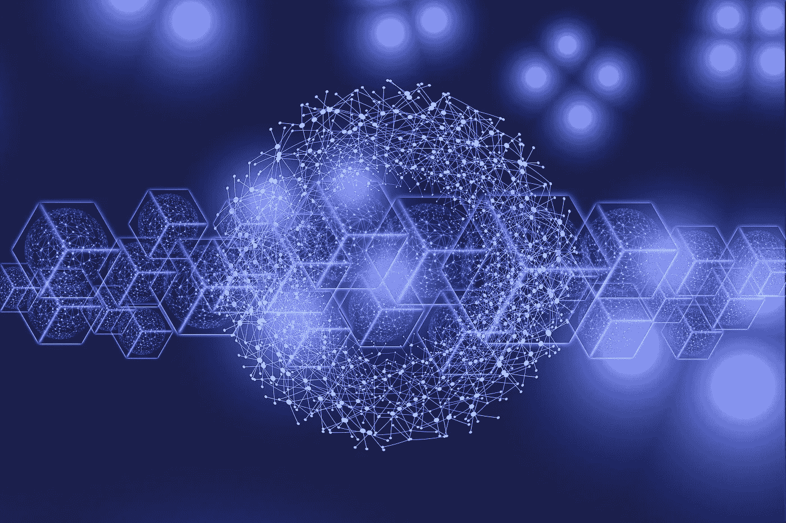

# 熊市中的自我提升机会

> 原文：<https://medium.com/coinmonks/the-self-improvement-opportunities-of-the-bear-market-396d96aebc38?source=collection_archive---------23----------------------->

## 学习并为下一波加密应用做好准备的最佳时机

*Cover Picture by* [*geralt*](https://pixabay.com/users/geralt-9301/) *on* [*Pixabay*](https://pixabay.com/illustrations/blockchain-digitization-digital-7571280/)

熊市到来时损失惨重，机会有限，公众对加密货币兴趣不高。

人们将不再兴奋，这是一个好迹象。